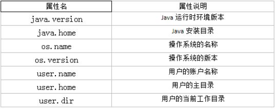

# 1 Object类

## 1.1 Object类的概述

- Object类是所有Java类的根父类
- 如果在类的声明中未使用extends关键字指明其父类，则默认父类为java.lang.Object类

## 1.2 Object类的主要结构

| No.  |         方法名称类型描述          | 类型 |      描述      |
| :--: | :-------------------------------: | :--: | :------------: |
|  1   |          public Object()          | 构造 |   构造构造器   |
|  2   | public boolean equals(Object obj) | 普通 |    对象比较    |
|  3   |       public int hashCode()       | 普通 |   取得Hash码   |
|  4   |     public String toString()      | 普通 | 对象打印时调用 |

- Object类的构造方法有一个，并且是无参构造，这就是子类构造方法默认访问父类的构造是无参构造的原因

## 1.3 ==操作符与equals方法

### 1.3.1 ==

- 基本类型比较值
- 引用类型比较引用，是否指向同一个对象
- 用“==”进行比较时，符号两边的数据类型必须兼容(可自动转换的基本数据类型除外)，否则编译出错

### 1.3.2 equals()

- 所有类都继承了Object，也就获得了equals()方法，还可以重写
- 只能比较引用类型，其作用与“==”相同，比较是否指向同一个对象
- 特例：当用equals()方法进行比较时，对类File、String、Date及包装类来说，是比较类型及内容而不考虑引用的是否是同一个对象
- 原因：在这些类中重写了Object类的equals()方法
- 当自定义使用equals()时，可以重写。用于比较两个对象的“内容”是否都相等

## 1.4 toString()

- 返回对象的字符串表示，默认为类的全路径+'@'+哈希值的十六进制

## 1.5 Objects类

- 在**JDK7**添加了一个java.util.Objects工具类，它提供了一些方法来操作对象
- 它由一些静态的实用方法组成，这些方法是null-save（空指针安全的）或null-tolerant（容忍空指针的），用于计算对象的hashcode、返回对象的字符串表示形式、比较两个对象
- 在比较两个对象的时候，Object的equals方法容易抛出空指针异常，而Objects类中的equals方法就优化了这个问题。`public static boolean equals(Object a, Object b)`:判断两个对象是否相等

# 2 包装类

## 2.1 包装类的使用

- Byte、Short、Integer、Long、Float、Double、Boolean、Character
- 前6个有统一父类：Number
- 支持自动装箱、自动拆箱

## 2.2 与字符串的转换

### 2.2.1 字符串转换成基本数据类型

- 通过包装类的构造器实现：int i = new Integer(“12”);
- 通过包装类的parseXxx(String s)静态方法：Float f = Float.parseFloat(“12.1”);

### 2.2.2 基本数据类型转换成字符串

- 调用字符串重载的valueOf()方法：String fstr = String.valueOf(2.34f);
- 更直接的方式：
  String intStr = 5 + “”

### 2.2.3 常用的基本进制转换

- 十进制到其他进制
  - public static String toBinaryString(int i)
  - public static String toOctalString(int i)
  - public static String toHexString(int i)
  - public static String toString(int i,int radix)
- 其他进制到十进制
  - public static int parseInt(String s,int radix)

## 2.3 -128到127之间的数据缓冲池问题：

- 通过查看源码，我们就知道了，针对-128到127之间的数据，做了一个数据缓冲池，如果数据是该范围内的，每次并不创建新的空间

# 3 字符串相关的类

## 3.1 String类

### 3.1.1 String的特性

- String类：代表字符串
- String是一个final类，代表不可变的字符序列
- 字符串是常量，用双引号引起来表示。它们的值在创建之后不能更改
- String对象的字符内容是存储在一个字符数组value[]中的

### 3.1.2 String对象的创建

```java
String str = "hello";

//本质上this.value = new char[0];
String s1 = new String();

//this.value = original.value;
String s2 = new String(String original);

//this.value = Arrays.copyOf(value, value.length);
String s3 = new String(char[] a);

String s4 = new String(char[] a,int startIndex,int count);
```

### 3.1.3 字符串对象存储方式

- 字符串常量存储在字符串常量池，目的是共享
- 字符串非常量对象存储在堆中
- String
  String str1 = “abc”;与String str2 = new String(“abc”);的区别？如上
- 常量与常量的拼接结果在常量池。且常量池中不会存在相同内容的常量
- 只要其中有一个是变量，结果就在堆中
- 如果拼接的结果调用intern()方法，返回值就在常量池中

### 3.1.4 String常用方法

- int length()：返回字符串的长度：return value.length
- char charAt(int index)：返回某索引处的字符return value[index]
- boolean isEmpty()：判断是否是空字符串：return value.length == 0
- String toLowerCase()：使用默认语言环境，将String 中的所有字符转换为小写
- String toUpperCase()：使用默认语言环境，将String 中的所有字符转换为大写
- String trim()：返回字符串的副本，忽略前导空白和尾部空白
- boolean equals(Object obj)：比较字符串的内容是否相同
- boolean equalsIgnoreCase(String anotherString)：与equals方法类似，忽略大小写
- String concat(String str)：将指定字符串连接到此字符串的结尾。等价于用“+”
- int compareTo(String anotherString)：比较两个字符串的大小
- String substring(int beginIndex)：返回一个新的字符串，它是此字符串的从beginIndex开始截取到最后的一个子字符串
- String substring(int beginIndex, int endIndex) ：返回一个新字符串，它是此字符串从beginIndex开始截取到endIndex(不包含)的一个子字符串
- boolean contains(CharSequence s)：当且仅当此字符串包含指定的char值序列
  时，返回true
- int indexOf(String str)：返回指定子字符串在此字符串中第一次出现处的索引
- int indexOf(String str, int fromIndex)：返回指定子字符串在此字符串中第一次出现处的索引，从指定的索引开始
- int lastIndexOf(String str)：返回指定子字符串在此字符串中最右边出现处的索引
- int lastIndexOf(String str, int fromIndex)：返回指定子字符串在此字符串中最后一次出现处的索引，从指定的索引开始反向搜索
  注：indexOf和lastIndexOf方法如果未找到都是返回-1
- boolean endsWith(String suffix)：测试此字符串是否以指定的后缀结束
- boolean startsWith(String prefix)：测试此字符串是否以指定的前缀开始
- boolean startsWith(String prefix, int toffset)：测试此字符串从指定索引开始的子字符串是否以指定前缀开始
- String replace(char oldChar, char newChar)：返回一个新的字符串，它是通过用newChar 替换此字符串中出现的所有oldChar 得到的
- String replace(CharSequence target, CharSequence replacement)：使用指定的字面值替换序列替换此字符串所有匹配字面值目标序列的子字符串
- String replaceAll(String regex, String replacement) ：使用给定的
  replacement 替换此字符串所有匹配给定的正则表达式的子字符串
- String replaceFirst(String regex, String replacement) ：使用给定的
  replacement 替换此字符串匹配给定的正则表达式的第一个子字符串
- boolean matches(String regex)：告知此字符串是否匹配给定的正则表达式
- String[] split(String regex)：根据给定正则表达式的匹配拆分此字符串
- String[] split(String regex, int limit)：根据匹配给定的正则表达式来拆分此
  字符串，最多不超过limit个，如果超过了，剩下的全部都放到最后一个元素中

### 3.1.5 String与基本数据类型转换

#### 3.1.5.1 字符串=>基本数据类型、包装类

- public static int parseInt(String s)
- Byte、Short、Long、Float、Double类调相应的类方法

#### 3.1.5.2 基本数据类型、包装类=>字符串

- public String valueOf(int n)、valueOf(byte b)、valueOf(long l)、valueOf(float f)、valueOf(double
  d)、valueOf(boolean b)可

#### 3.1.5.3 字符数组=>字符串

- String 类的构造器：String(char[]) 和String(char[]，int offset，int
  length) 

#### 3.1.5.4 字符串=>字符数组

- public char[] toCharArray()
- public void getChars(int srcBegin, int srcEnd, char[] dst,
  int dstBegin)

#### 3.1.5.5 字节数组=>字符串

- String(byte[])：通过使用平台的默认字符集解码指定的byte 数组，构造一个新的String
- String(byte[]，int offset，int length) 

#### 3.1.5.6 字符串=>字节数组

- public byte[] getBytes() ：使用平台的默认字符集将此String 编码为
  byte 序列，并将结果存储到一个新的byte 数组中
- public byte[] getBytes(String charsetName) ：使用指定的字符集

## 3.2 StringBuffer类

- java.lang.StringBuffer代表可变的字符序列，可以对字符串内容进行增删，此时不会产生新的对象

### 3.2.1 StringBuffer的构造器

- StringBuffer类不同于String，其对象必须使用构造器生成
- 有三个构造器
  1. StringBuffer()：初始容量为16的字符串缓冲区
  2. StringBuffer(int size)：构造指定容量的字符串缓冲区
  3. StringBuffer(String str)：将内容初始化为指定字符串内容

### 3.2.2 StringBuffer类的常用方法

- StringBuffer append(xxx)：提供了很多的append()方法，用于进行字符串拼接
- StringBuffer delete(int start,int end)：删除指定位置的内容
- StringBuffer replace(int start, int end, String str)：把[start,end)位置替换为str
- StringBuffer insert(int offset, xxx)：在指定位置插入xxx
- StringBuffer reverse() ：把当前字符序列逆转
- 当append和insert时，如果原来value数组长度不够，可扩容
- 如上这些方法支持方法链操作
- public int indexOf(String str)
- public String substring(int start,int end)
- public int length()
- public char charAt(int n )
- public void setCharAt(int n ,char ch)

## 3.3 StringBuffer类

- StringBuilder 和StringBuffer 非常类似，均代表可变的字符序列，而且提供相关功能的方法也一样
- 对比String、StringBuffer、StringBuilder
  - String(JDK1.0)：不可变字符序列
  - StringBuffer(JDK1.0)：可变字符序列、效率低、线程安全
  - StringBuilder(JDK 5.0)：可变字符序列、效率高、线程不安全
- 注意：作为参数传递的话，方法内部String不会改变其值，StringBuffer和StringBuilder
  会改变其值

# 4 JDK8中新日期时间API

## 4.1 概述

- 新的java.time 中包含了所有关于本地日期（LocalDate）、本地时间（LocalTime）、本地日期时间（LocalDateTime）、时区（ZonedDateTime）和持续时间（Duration）的类
- 历史悠久的Date 类新增了toInstant() 方法，用于把Date转换成新的表示形式

## 4.2 LocalDate、LocalTime、LocalDateTime的新API

- LocalDate、LocalTime、LocalDateTime 类是其中较重要的几个类，它们的实例是不可变的对象，分别表示使用ISO-8601日历系统的日期、时间、日期和时间
- 它们提供了简单的本地日期或时间，并不包含当前的时间信息，也不包含与时区
    相关的信息
  - LocalDate代表IOS格式（yyyy-MM-dd）的日期，可以存储生日、纪念日等日期
  - LocalTime表示一个时间，而不是日期
  - LocalDateTime是用来表示日期和时间的，这是一个最常用的类之一

|                             方法                             |                             描述                             |
| :----------------------------------------------------------: | :----------------------------------------------------------: |
|                  now() / * now(ZoneId zone)                  |        静态方法，根据当前时间创建对象/指定时区的对象         |
|                             of()                             |             静态方法，根据指定日期/时间创建对象              |
|                getDayOfMonth()/getDayOfYear()                |           获得月份天数(1-31) /获得年份天数(1-366)            |
|                        getDayOfWeek()                        |             获得星期几(返回一个DayOfWeek 枚举值)             |
|                          getMonth()                          |                获得月份, 返回一个Month 枚举值                |
|                 getMonthValue() / getYear()                  |                   获得月份(1-12) /获得年份                   |
|              getHour()/getMinute()/getSecond()               |               获得当前对象对应的小时、分钟、秒               |
|   withDayOfMonth()/withDayOfYear()/withMonth()/withYear()    | 将月份天数、年份天数、月份、年份修改为指定的值并返回新的对象 |
| plusDays()/plusWeeks()/plusMonths()/plusYears()/plusHours()  |        向当前对象添加几天、几周、几个月、几年、几小时        |
| minusMonths()/minusWeeks()/minusDays()/minusYears()/minusHours() |         从当前对象减去几月、几周、几天、几年、几小时         |

## 4.3 瞬时Instant的新API

- Instant：时间线上的一个瞬时点。这可能被用来记录应用程序中的事件时间戳

|             方法              |                             描述                             |
| :---------------------------: | :----------------------------------------------------------: |
|             now()             |          静态方法，返回默认UTC时区的Instant类的对象          |
| ofEpochMilli(long epochMilli) | 静态方法，返回在1970-01-01 00:00:00基础上加上指定毫秒数之后的Instant类的对象 |
|  atOffset(ZoneOffset offset)  |            结合即时的偏移来创建一个OffsetDateTime            |
|        toEpochMilli()         |    返回1970-01-01 00:00:00到当前时间的毫秒数，即为时间戳     |

## 4.4 格式化与解析日期或时间

- java.time.format.DateTimeFormatter 类：该类提供了三种格式化方法：
  1. 预定义的标准格式。如：ISO_LOCAL_DATE_TIME;ISO_LOCAL_DATE;ISO_LOCAL_TIME
  2. 本地化相关的格式。如：ofLocalizedDateTime(FormatStyle.LONG)
  3. 自定义的格式。如：ofPattern(“yyyy-MM-dd hh:mm:ss”)

|            方法            |                        描述                         |
| :------------------------: | :-------------------------------------------------: |
| ofPattern(String pattern)  | 静态方法，返回一个指定字符串格式的DateTimeFormatter |
| format(TemporalAccessor t) |          格式化一个日期、时间，返回字符串           |
|  parse(CharSequence text)  |      将指定格式的字符序列解析为一个日期、时间       |

## 4.5 其它API

- ZoneId：该类中包含了所有的时区信息，一个时区的ID，如Europe/Paris

- ZonedDateTime：一个在ISO-8601日历系统时区的日期时间，如2007-12-
    03T10:15:30+01:00 Europe/Paris。其中每个时区都对应着ID，地区ID都为“{区域}/{城市}”的格式，例如：
    Asia/Shanghai等
- Clock：使用时区提供对当前即时、日期和时间的访问的时钟
- 持续时间：Duration，用于计算两个“时间”间隔
- 日期间隔：Period，用于计算两个“日期”间隔
- TemporalAdjuster : 时间校正器。有时我们可能需要获取例如：将日期调整到“下一个工作日”等操作
- TemporalAdjusters : 该类通过静态方法
    (firstDayOfXxx()/lastDayOfXxx()/nextXxx())提供了大量的常用TemporalAdjuster 的实现

# 5 Java比较器

- 在Java中经常会涉及到对象数组的排序问题，那么就涉及到对象之间的比较问题
- Java实现对象排序的方式有两种：
  1. 自然排序：java.lang.Comparable
  2. 定制排序：java.util.Comparator

## 5.1 方式一：自然排序 java.lang.Comparable

- Comparable接口强行对实现它的每个类的对象进行整体排序。这种排序被称为类的自然排序
- 实现Comparable 的类必须实现compareTo(Object obj) 方法，两个对象即通过compareTo(Object obj) 方法的返回值来比较大小。如果当前对象this大于形参对象obj，则返回正整数，如果当前对象this小于形参对象obj，则返回负整数，如果当前对象this等于形参对象obj，则返回零
- 实现Comparable接口的对象列表（和数组）可以通过Collections.sort 或
    Arrays.sort进行自动排序
- 实现此接口的对象可以用作有序映射中的键或有序集合中的元素，无需指定比较器
- 对于类C 的每一个e1 和e2 来说，当且仅当e1.compareTo(e2) == 0 与
    e1.equals(e2) 具有相同的boolean 值时，类C 的自然排序才叫做与equals一致。建议（虽然不是必需的）最好使自然排序与equals 一致
- Comparable 的典型实现：(默认都是从小到大排列的)
  1. String：按照字符串中字符的Unicode值进行比较
  2. Character：按照字符的Unicode值来进行比较
  3. 数值类型对应的包装类以及BigInteger、BigDecimal：按照它们对应的数值大小进行比较
  4. Boolean：true 对应的包装类实例大于false 对应的包装类实例
  5. Date、Time等：后面的日期时间比前面的日期时间大

## 5.2 方式二：定制排序 java.util.Comparator

- 当元素的类型没有实现java.lang.Comparable接口而又不方便修改代码，或者实现了java.lang.Comparable接口的排序规则不适合当前的操作，那么可以考虑使用Comparator的对象来排序，强行对多个对象进行整体排序的比较
- 重写compare(Object o1,Object o2)方法，比较o1和o2的大小：如果方法返回正整数，则表示o1大于o2；如果返回0，表示相等；返回负整数，表示o1小于o2
- 可以将Comparator 传递给sort 方法（如Collections.sort 或Arrays.sort），从而允许在排序顺序上实现精确控制
- 还可以使用Comparator来控制某些数据结构（如有序set或有序映射）的顺序，或者为那些没有自然顺序的对象collection 提供排序

# 6 System类

- java.lang.System类代表系统，系统级的很多属性和控制方法都放置在该类的内部

- 由于该类的构造器是private的，所以无法创建该类的对象，也就是无法实例化该类。其内部的成员变量和成员方法都是static的，所以也可以很方便的进行调用

- 成员变量：System类内部包含in、out和err三个成员变量，分别代表标准输入流
    (键盘输入)，标准输出流(显示器)和标准错误输出流(显示器)

- 成员方法

  - native long currentTimeMillis()： 该方法的作用是返回当前的计算机时间，时间的表达格式为当前计算机时间和GMT时间(格林威治时间)1970年1月1号0时0分0秒所差的毫秒数

  - void arraycopy(Object src, int srcPos, Object dest, int destPos, int length)：将数组中指定的数据拷贝到另一个数组中

  - void exit(int status)：该方法的作用是退出程序。其中status的值为0代表正常退出，非零代表
      异常退出。使用该方法可以在图形界面编程中实现程序的退出功能等

  - void gc()：该方法的作用是请求系统进行垃圾回收。至于系统是否立刻回收，则取决于系统中垃圾回收算法的实现以及系统执行时的情况

  - String getProperty(String key)：该方法的作用是获得系统中属性名为key的属性对应的值。系统中常见的属性名以及属性的作用如下

    

# 7 Math类

- java.lang.Math提供了一系列静态方法用于科学计算。其方法的参数和返回值类型一般为double型
- abs 绝对值
- acos,asin,atan,cos,sin,tan 三角函数
- sqrt 平方根
- pow(double a,doble b) a的b次幂
- log 自然对数
- exp e为底指数
- max(double a,double b)
- min(double a,double b)
- random() 返回0.0到1.0的随机数
- long round(double a) double型数据a转换为long型（四舍五入）
- toDegrees(double angrad) 弧度—>角度
- toRadians(double angdeg) 角度—>弧度

# 8 BigInteger与BigDecimal

## 8.1 BigInteger类

- java.math包的BigInteger可以表示不可变的任意精度的整数
- 构造器：BigInteger(String val)：根据字符串构建BigInteger对象
- 常用方法
  - public BigInteger abs()：返回此BigInteger 的绝对值的BigInteger
  - BigInteger add(BigInteger val) ：返回其值为(this + val) 的BigInteger
  - BigInteger subtract(BigInteger val) ：返回其值为(this - val) 的BigInteger
  - BigInteger multiply(BigInteger val) ：返回其值为(this * val) 的BigInteger
  - BigInteger divide(BigInteger val) ：返回其值为(this / val) 的BigInteger。整数相除只保留整数部分
  - BigInteger remainder(BigInteger val) ：返回其值为(this % val) 的BigInteger
  - BigInteger[] divideAndRemainder(BigInteger val)：返回包含(this / val) 后跟
      (this % val) 的两个BigInteger 的数组
  - BigInteger pow(int exponent) ：返回其值为(thisexponent) 的BigInteger

## 8.2 BigDecimal类

- 一般的Float类和Double类可以用来做科学计算或工程计算，但在商业计算中，要求数字精度比较高，故用到java.math.BigDecimal类
- BigDecimal类支持不可变的、任意精度的有符号十进制定点数
- 构造器
  - public BigDecimal(double val)
  - public BigDecimal(String val)
- 常用方法
  - public BigDecimal add(BigDecimal augend)
  - public BigDecimal subtract(BigDecimal subtrahend)
  - public BigDecimal multiply(BigDecimal multiplicand)
  - public BigDecimal divide(BigDecimal divisor, int scale, int roundingMode)
    

# 9 Arrays

- toString()：数组转换
- sort()：排序
- binarySearch()：二分查找

# 10 正则表达式

## 10.1 常见规则

### 10.1.1 字符

- x 字符 x。举例：'a'表示字符a
- \\ 反斜线字符
- \n 新行（换行）符 ('\u000A') 
- \r 回车符 ('\u000D')

### 10.1.2 字符类

- [abc] a、b 或 c（简单类） 
- [^abc] 任何字符，除了 a、b 或 c（否定） 
- [a-zA-Z] a到 z 或 A到 Z，两头的字母包括在内（范围） 
- [0-9] 0到9的字符都包括

### 10.1.3 预定义字符类

- . 任何字符。我的就是.字符本身，怎么表示呢? \.
- \d 数字：[0-9]
- \w 单词字符：[a-zA-Z_0-9]

### 10.1.4 边界匹配器

- ^ 行的开头 
- $ 行的结尾 
- \b 单词边界

### 10.1.5 Greedy 数量词 

- X? X，一次或一次也没有
- X* X，零次或多次
- X+ X，一次或多次
- X{n} X，恰好 n 次 
- X{n,} X，至少 n 次 
- X{n,m} X，至少 n 次，但是不超过 m 次 

## 10.2 常见功能

- 判断功能：String类的public boolean matches(String regex)
- 分割功能：String类的public String[] split(String regex)

​            String类的public String[] split(String regex)

- 替换功能：String类的public String replaceAll(String regex,String replacement)

​            String类的public String replaceAll(String regex,String replacement)

# 11 Random

- 用于产生随机数的类
- 构造方法
  1. Random() 默认种子，每次产生的随机数不同
  2. Random(long seed) 指定种子，每次种子相同，随机数就相同
- 成员方法
  - int nextInt() 返回int范围内的随机数
  - int nextInt(int n) 返回[0,n)范围内的随机数