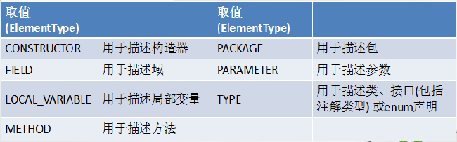
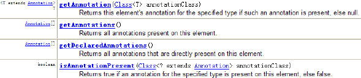
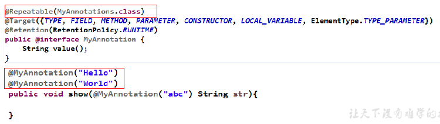

# 1 枚举类的使用

## 1.1 枚举类的使用

- enum关键字用于定义枚举类
- 若枚举只有一个对象，则可以作为一种单例模式的实现方式
- 枚举类对象的属性不应允许被改动，所以应该使用private final修饰
- 枚举类的使用private final 修饰的属性应该在构造器中为其赋值
- 若枚举类显式的定义了带参数的构造器，则在列出枚举值时也必须对应的传入参数

## 1.2 使用enum定义枚举类

### 1.2.1 使用说明

- 使用enum 定义的枚举类默认继承了java.lang.Enum类，因此不能再继承其他类
- 枚举类的构造器只能使用private 权限修饰符
- 枚举类的所有实例必须在枚举类中显式列出(, 分隔 ; 结尾)。列出的
  实例系统会自动添加public static final 修饰
- 必须在枚举类的第一行声明枚举类对象
- JDK5中可以在switch表达式中使用Enum定义的枚举类的对象作为表达式，case子句可以直接使用枚举值的名字，无需添加枚举类作为限定

```java
public enum SeasonEnum {
	SPRING("春天","春风又绿江南岸"),
	SUMMER("夏天","映日荷花别样红"),
	AUTUMN("秋天","秋水共长天一色"),
	WINTER("冬天","窗含西岭千秋雪");
    
    private final String seasonName;
    private final String seasonDesc;
    private SeasonEnum(String seasonName, String seasonDesc) {
   		this.seasonName = seasonName;
    	this.seasonDesc = seasonDesc;
    }
    public String getSeasonName() {
    	return seasonName;
    }
    public String getSeasonDesc() {
    	return seasonDesc;
    }
}
```

### 1.2.2 Enum类的主要方法

- values()方法：返回枚举类型的对象数组。该方法可以很方便地遍历所有的枚举值
- valueOf(String str)：可以把一个字符串转为对应的枚举类对象。要求字符串必须是枚举类对象的“名字”。如不是，会有运行时异常：
  IllegalArgumentException
- toString()：返回当前枚举类对象常量的名称

### 1.2.3 实现接口的枚举类

- 和普通Java 类一样，枚举类可以实现一个或多个接口
- 若每个枚举值在调用实现的接口方法呈现相同的行为方式，则只要统一实现该方法即可
- 若需要每个枚举值在调用实现的接口方法呈现出不同的行为方式，则可以让每个枚举值分别来实现该方法

# 2 注解(Annotation)

## 2.1 注解的概述

- Annotation其实就是代码里的特殊标记，这些标记可以在编译、类加载、运行时被读取，并执行相应的处理。通过使用Annotation，程序员可以在不改变原有逻辑的情况下，在源文件中嵌入一些补充信息。代码分析工具、开发工具和部署工具可以通过这些补充信息进行验证或者进行部署
- Annotation 可以像修饰符一样被使用，可用于修饰包、类、构造器、方法、成员变量、参数、局部变量的声明，这些信息被保存在Annotation的“name=value” 对中

## 2.2 常见的Annotation示例

- 使用Annotation 时要在其前面增加@符号，并把该Annotation 当成
  一个修饰符使用。用于修饰它支持的程序元素

- 示例一：生成文档相关的注解

  1. @author 标明开发该类模块的作者，多个作者之间使用,分割
  2. @version 标明该类模块的版本
  3. @see 参考转向，也就是相关主题
  4. @since 从哪个版本开始增加的
  5. @param 对方法中某参数的说明，如果没有参数就不能写
  6. @return 对方法返回值的说明，如果方法的返回值类型是void就不能写
  7. @exception 对方法可能抛出的异常进行说明，如果方法没有用throws显式抛出的异常就不能写其中

  - @param @return 和@exception 这三个标记都是只用于方法的
  - @param的格式要求：@param 形参名形参类型形参说明
  - @return 的格式要求：@return 返回值类型返回值说明、
  - @exception的格式要求：@exception 异常类型异常说明
  - @param和@exception可以并列多个

- 示例二：在编译时进行格式检查(JDK内置的三个基本注解)

  1. @Override：限定重写父类方法，该注解只能用于方法
  2. @Deprecated: 用于表示所修饰的元素(类、方法等)已过时。通常是因为所修饰的结构危险或存在更好的选择
  3. @SuppressWarnings：抑制编译器警告

- 示例三：跟踪代码依赖性，实现替代配置文件功能

  - Servlet3.0提供了@WebServlet，使得不再需要在web.xml文件中进行Servlet的部署
  - spring框架中关于“事务”的管理：@Transactional(propagation=Propagation.REQUIRES_NEW,
    isolation=Isolation.READ_COMMITTED,readOnly=false,timeout=3)

## 2.3 自定义Annotation

- 定义新的Annotation 类型使用@interface 关键字

  ```java
  public @interface 注解名称{
  	属性列表;
  }
  ```

- 自定义注解自动继承了java.lang.annotation.Annotation接口

- Annotation 的成员变量在Annotation 定义中以无参数方法的形式来声明。其方法名和返回值定义了该成员的名字和类型。称为配置参数。类型只能是八种基本数据类型、String类型、Class类型、enum类型、Annotation类型、
  以上所有类型的数组

- 可以在定义Annotation 的成员变量时为其指定初始值，指定成员变量的初始值可使用default 关键字

- 如果只有一个参数成员，建议使用参数名为value

- 如果定义的注解含有配置参数，那么使用时必须指定参数值，除非它有默认值。格式是“参数名= 参数值”，如果只有一个参数成员，且名称为value，可以省略“value=”

- 没有成员定义的Annotation 称为标记；包含成员变量的Annotation 称为元数据Annotation

```java
@Retention(RetentionPolicy.RUNTIME)
@Target(ElementType.TYPE)
@interface MyAnnotation{
	String value() default "auguigu";
}
```

## 2.4 JDK中的元注解

- JDK的元Annotation用于修饰其他Annotation定义
- JDK5.0提供了4个标准的meta-annotation类型，分别是：
  - @Retention
  - @Target
  - @Documented
  - @Inherited
- @Retention: 只能用于修饰一个Annotation 定义，用于指定该Annotation 的生命周期, @Rentention 包含一个RetentionPolicy 类型的成员变量，使用
  @Rentention 时必须为该value 成员变量指定值:
  - RetentionPolicy.SOURCE：在源文件中有效（即源文件保留），编译器直接丢弃这种策略的
    注释
  - RetentionPolicy.CLASS：在class文件中有效（即class保留），当运行Java 程序时，JVM
    不会保留注解。这是默认值
  - RetentionPolicy.RUNTIME：在运行时有效（即运行时保留），当运行Java 程序时， JVM 
    保留注释。程序可以通过反射获取该注释
- @Target：用于修饰Annotation 定义，用于指定被修饰的Annotation能用于修饰哪些程序元素。@Target 也包含一个名为value的成员变量



- @Documented：用于指定被该元Annotation修饰的Annotation类将被
  javadoc具提取成文档。默认情况下，javadoc是不包括注解的。定义为Documented的注解必须设置Retention值为RUNTIME
- @Inherited：被它修饰的Annotation将具有继承性。如果某个类使用了被@Inherited修饰的Annotation，则其子类将自动具有该注解。实际应用中，使用较少

## 2.5 利用反射获取注解信息

- JDK5在java.lang.reflect 包下新增了AnnotatedElement接口，该接口代表程序中可以接受注解的程序元素
- 当一个Annotation类型被定义为运行时Annotation后，该注解才是运行时可见，当class 文件被载入时保存在class 文件中的Annotation 才会被虚拟机读取
- 程序可以调用AnnotatedElement对象的如下方法来访问Annotation 信息



## 2.6 JDK8中注解的新特性

### 2.6.1 可重复的注解



### 2.6.2 可用于类型的注解

- JDK1.8之后，关于元注解@Target的参数类型ElementType枚举值多了两个：
  TYPE_PARAMETER、TYPE_USE
- 在Java 8之前，注解只能是在声明的地方所使用，Java8开始，注解可以应用在任何地方
  - ElementType.TYPE_PARAMETER 表示该注解能写在类型变量的声明语句中（如：泛型声明）
  - ElementType.TYPE_USE 表示该注解能写在使用类型的任何语句中