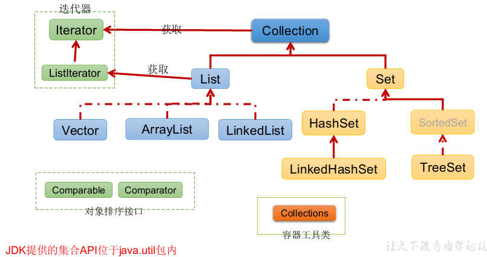
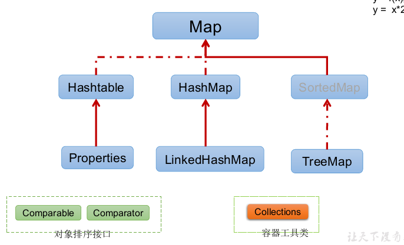
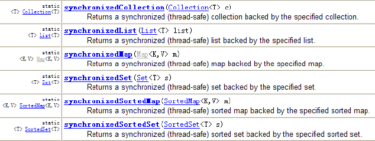

# 1 集合概述

## 1.1 数组的特点和弊端

- 数组在内存存储方面的特点
  - 数组初始化以后，长度就确定了
  - 数组声明的类型，就决定了进行元素初始化时的类型
- 数组在存储数据方面的弊端：
  - 数组初始化以后，长度就不可变了，不便于扩展
  - 数组中提供的属性和方法少，不便于进行添加、删除、插入等操作，且效率不高
  - 无法直接获取存储元素的个数
  - 数组存储的数据是有序的、可以重复的。存储数据的特点单一

## 1.2 Java集合体系

### 1.2.1 分类概述

- Collection接口：单列数据，定义了存取一组对象的方法的集合
  - List：元素有序、可重复的集合
  - Set：元素无序、不可重复的集合
- Map接口：双列数据，保存具有映射关系“key-value对”的集合

### 1.2.2 Collection接口继承树



### 1.2.3 Map接口继承树



# 2 Collection接口

## 2.1 Collection接口概述

- Collection接口是List、Set和Queue接口的父接口，该接口里定义的方法既可用于操作Set集合，也可用于操作List和Queue集合
- JDK不提供此接口的任何直接实现，而是提供更具体的子接口(如：Set和List)
  实现
- JDK5增加了泛型以后，Java集合可以记住容器中对象的数据类型

## 2.2 Collection接口方法

1. 添加
   - `public boolean add(E e)`
   - `public boolean addAll(Collection coll)`
2. 获取有效元素的个数
   - `public int size()`
3. 清空集合
   - `public void clear()`
4. 是否是空集合
   - `public boolean isEmpty()`
5. 是否包含某个元素
   - `public boolean contains(Object obj)`：是通过元素的equals方法来判断是否是同一个对象
   - `public boolean containsAll(Collection c)`：也是调用元素的equals方法来比较的。拿两个集合的元素挨个比较
6. 删除
   - `public boolean remove(Object obj)`：通过元素的equals方法判断是否是要删除的那个元素。只会删除找到的第一个元素
   - `public boolean removeAll(Collection coll)`：取当前集合的差集
7. 取两个集合的交集
   - `public boolean retainAll(Collection c)`：把交集的结果存在当前集合中，不影响c
8. 集合是否相等
   - `public boolean equals(Object obj)`
9. 转成对象数组
   - `public Object[] toArray()`
10. 获取集合对象的哈希值
    - `public hashCode()`
11. 遍历
    - `public iterator()`：返回迭代器对象，用于集合遍历

# 3 Iterator迭代器接口

## 3.1 使用Iterator接口遍历集合元素

- Iterator对象称为迭代器(设计模式的一种)，主要用于遍历Collection集合中的元素
- Collection接口继承了java.lang.Iterable接口，该接口有一个iterator()方法，那么所有实现了Collection接口的集合类都有一个iterator()方法，用以返回一个实现了Iterator接口的对象
- Iterator仅用于遍历集合，Iterator本身并不提供承装对象的能力。如果需要创建Iterator对象，则必须有一个被迭代的集合
- 集合对象每次调用iterator()方法都得到一个全新的迭代器对象，默认游标都在集合的第一个元素之前

## 3.2 Iterator接口的方法

- boolean hasNext()
- E next()
- void remove()

- 在调用it.next()方法之前必须要调用it.hasNext()进行检测。若不调用，且
  下一条记录无效，直接调用it.next()会抛出NoSuchElementException异常
- Iterator可以删除集合的元素，但是是遍历过程中通过迭代器对象的remove方法，不是集合对象的remove方法
- 如果还未调用next()或在上一次调用next方法之后已经调用了remove方法，
  再调用remove都会报IllegalStateException

```java
Iteratoriter=coll.iterator();//回到起点
while(iter.hasNext()){
	Objectobj=iter.next();
	if(obj.equals("Tom")){
        iter.remove();
	}
}
```

## 3.3 foreach循环

- Java5提供了foreach循环迭代访问Collection和数组
- 遍历操作不需获取Collection或数组的长度，无需使用索引访问元素
- 遍历集合的底层调用Iterator完成操作
- foreach还可以用来遍历数组

```java
for(元素的数据类型  变量 : Collection集合or数组){ 
  	//写操作代码
}
```

# 4 Collection子接口之一：List接口

## 4.1 List接口概述

- 鉴于Java中数组用来存储数据的局限性，通常使用List替代数组
- List集合类中元素有序、且可重复，集合中的每个元素都有其对应的顺序索引
- List容器中的元素都对应一个整数型的序号记载其在容器中的位置，可以根据序号存取容器中的元素
- JDKAPI中List接口的实现类常用的有：ArrayList、LinkedList和Vector

## 4.2 List接口方法

- void add(int index，Object ele)：在index位置插入ele元素
- boolean addAll(intindex，Collectioneles)：从index位置开始将eles中的所有元素添加进来
- Object get(int index)：获取指定index位置的元素
- int indexOf(Object obj)：返回obj在集合中首次出现的位置
- int lastIndexOf(Object obj)：返回obj在当前集合中末次出现的位置
- Object remove(int index)：移除指定index位置的元素，并返回此元素
- Object set(int index, Object ele)：设置指定index位置的元素为ele
- List subList(int fromIndex, int toIndex):返回从fromIndex到toIndex位置的子集合

## 4.3 List实现类之一：ArrayList

- 本质上，ArrayList是对象引用的一个”变长”数组
- ArrayList的JDK1.8之前与之后的实现区别？
  - JDK1.7：ArrayList像饿汉式，直接创建一个初始容量为10的数组
  - JDK1.8：ArrayList像懒汉式，一开始创建一个长度为0的数组，当添加第一个元素时再创建一个始容量为10的数组
- Arrays.asList(…)返回值是一个固定长度的List集合

## 4.4 List实现类之二：LinkedList

- 新增方法：
  - void addFirst(Object obj)
  - void addLast(Object obj)
  - Object getFirst()
  - Object getLast()
  - Object removeFirst()
  - Object removeLast()

- LinkedList：双向链表，内部没有声明数组，而是定义了Node类型的first和last，用于记录首末元素。同时，定义内部类Node，作为LinkedList中保存数据的基本结构
- Node除了保存数据，还定义了两个变量：
  - prev变量记录前一个元素的位置
  - next变量记录下一个元素的位置

## 4.5 List实现类之三：Vector

- Vector大多数操作与ArrayList
  相同，区别之处在于Vector是线程安全的
- 在各种list中，最好把ArrayList作为缺省选择
- 当插入、删除频繁时，
  使用LinkedList
- Vector总是比ArrayList慢，所以尽量避免使用
- 新增方法：
  - void addElement(Object obj)
  - void insert ElementAt(Object obj，int index)
  - void setElementAt(Object obj，int index)
  - void removeElement(Object obj)
  - void removeAllElements()

## 4.6 问题：ArrayList/LinkedList/Vector的异同

- ArrayList和LinkedList的异同
  - 二者都线程不安全，相对线程安全的Vector，执行效率高
  - 此外，ArrayList是实现了基于动态数组的数据结构，LinkedList基于链表的数据结构
  - 对于随机访问get和set，ArrayList性能优于LinkedList，因为LinkedList要移动指针
  - 对于新增和删除操作add(特指插入)和remove，LinkedList比较占优势，因为ArrayList要移动数据
- ArrayList和Vector的区别
  - Vector和ArrayList几乎是完全相同的，唯一的区别在于Vector是同步类(synchronized)，属于强同步类。因此开销就比ArrayList要大，访问要慢
  - 正常情况下，大多数的Java程序员使用ArrayList而不是Vector，因为同步完全可以由程序员自己来控制
  - Vector每次扩容请求其大小的2倍空间，而ArrayList是1.5倍
  - Vector还有一个子类Stack

# 5 Collection子接口之二：Set接口

## 5.1 Set接口概述

- Set接口是Collection的子接口，set接口没有提供额外的方法
- Set集合不允许包含相同的元素，如果试把两个相同的元素加入同一个Set集合中，则添加操作失败
- Set判断两个对象是否相同不是使用==运算符，而是根据equals()方法

## 5.2 Set实现类之一：HashSet

- 大多数时候使用Set集合时都使用这个实现类
- HashSet按Hash算法来存储集合中的元素，因此具有很好的存取、查找、删除性能
- HashSet具有以下特点：
  - 不能保证元素的排列顺序
  - HashSet不是线程安全的
  - 集合元素可以是null
- HashSet集合判断两个元素相等的标准：两个对象通过hashCode()方法比较相等，并且两个对象的equals()方法返回值也相等
- 对于存放在Set容器中的对象，对应的类一定要重写equals()和hashCode(Object
  obj)方法，以实现对象相等规则。即：“相等的对象必须具有相等的散列码”
- HashSet底层也是数组，初始容量为16，当如果使用率超过0.75，（16\*0.75=12）
  就会扩大容量为原来的2倍。（16扩容为32，依次为64，128....等）
- 为什么用Eclipse/IDEA复写hashCode方法，有31这个数字？
  - 选择系数的时候要选择尽量大的系数。因为如果计算出来的hash地址越大，所谓的
    “冲突”就越少，查找起来效率也会提高。（减少冲突）
  - 并且31只占用5bits，相乘造成数据溢出的概率较小
  - 31可以由i\*31==(i\<\<5)-1来表示，现在很多虚拟机里面都有做相关优化。（提高算法效率）
  - 31是一个素数，素数作用就是如果我用一个数字来乘以这个素数，那么最终出来的结
    果只能被素数本身和被乘数还有1来整除！(减少冲突)

## 5.3 Set实现类之二：LinkedHashSet

- LinkedHashSet是HashSet的子类
- LinkedHashSet根据元素的hashCode值来决定元素的存储位置，
  但它同时使用双向链表维护元素的次序，这使得元素看起来是以插入顺序保存的
- LinkedHashSet插入性能略低于HashSet，但在迭代访问Set里的全部元素时有很好的性能
- LinkedHashSet不允许集合元素重复

## 5.4 Set实现类之三：TreeSet

- TreeSet是SortedSet接口的实现类，TreeSet可以确保集合元素处于排序状态
- TreeSet底层使用红黑树结构存储数据
- 新增的方法如下：
  - Comparator comparator()
  - Object first()
  - Object last()
  - Object lower(Object e)
  - Object higher(Object e)
  - SortedSet subSet(fromElement，toElement)
  - SortedSet headSet(toElement)
  - SortedSet tailSet(fromElement)
- TreeSet两种排序方法：自然排序和定制排序。默认情况下，TreeSet采用自然排序
  - 自然排序：TreeSet会调用集合元素的compareTo(Objectobj)方法来比较元
    之间的大小关系，然后将集合元素按升序(默认情况)排列
  - 如果试图把一个对象添加到TreeSet时，则该对象的类必须实现Comparable
    接口，实现Comparable的类必须实现compareTo(Object obj)方法，两个对象即通过该方法的返回值来比较大小
  - 定制排序：如果元素所属的类没有实现Comparable接口，或不希望按照升序(默认情况)的方式排列元素或希望按照其它属性大小进行排序，则考虑使用定制排序
  - 定制排序，通过Comparator接口来实现。需要重写compare(To1，To2)方法。
  - 利用int compare(To1，To2)方法，比较o1和o2的大小
  - 要实现定制排序，需要将实现Comparator接口的实例作为形参传递给TreeSet的构造器。
    练习：在List内去除重复数字值，要求尽量简单

# 6 Map接口

## 6.1 Map接口概述

- Map与Collection并列存在。用于保存具有映射关系的数据:key-value
- Map中的key和value都可以是任何引用类型的数据
- Map中的key用Set来存放，不允许重复，即同一个Map对象所对应的类，须重写hashCode()和equals()方法
- 常用String类作为Map的“键”
- key和value之间存在单向一对一关系，即通过指定的key总能找到
  唯一的、确定的value
- Map接口的常用实现类：HashMap、TreeMap、LinkedHashMap和
  Properties

## 6.2 Map接口常用方法

### 6.2.1 添加、删除、修改操作

- Object put(Object key,Object value)：将指定key-value添加到(或修改)当前map对象中
- void putAll(Map m):将m中的所有key-value对存放到当前map中
- Object remove(Object key)：移除指定key的key-value对，并返回value
- void clear()：清空当前map中的所有数据

### 6.2.2 元素查询的操作

- Object get(Object key)：获取指定key对应的value
- boolean containsKey(Object key)：是否包含指定的key
- boolean containsValue(Object value)：是否包含指定的value
- int size()：返回map中key-value对的个数
- boolean isEmpty()：判断当前map是否为空
- boolean equals(Object obj)：判断当前map和参数对象obj是否相等

### 6.2.3 元视图操作的方法

- Set keySet()：返回所有key构成的Set集合
- Collection values()：返回所有value构成的Collection集合
- Set entrySet()：返回所有key-value对构成的Set集合

## 6.3 Map实现类之一：HashMap

### 6.3.1 HashMap的概述

- HashMap是Map接口使用频率最高的实现类
- 允许使用null键和null值，与HashSet一样，不保证映射的顺序
- 所有的key构成的集合是Set:无序的、不可重复的。所以，key所在的类要重写：
  equals()和hashCode()
- 所有的value构成的集合是Collection:无序的、可以重复的。所以，value所在的类要重写：equals()
- 一个key-value构成一个entry
- 所有的entry构成的集合是Set:无序的、不可重复的
- HashMap判断两个key相等的标准是：两个key通过equals()方法返回true，
  hashCode值也相等
- HashMap判断两个value相等的标准是：两个value通过equals()方法返回tru
- HashMap的存储结构
  - JDK7及以前版本：HashMap是数组+链表结构(即为链地址法)
  - JDK8版本发布以后：HashMap是数组+链表+红黑树实现。链表数量大于8时，转红黑树

### 6.3.2 HashMap源码中的重要常量

- DEFAULT_INITIAL_CAPACITY:HashMap的默认容量，16
- MAXIMUM_CAPACITY：HashMap的最大支持容量，2^30
- DEFAULT_LOAD_FACTOR：HashMap的默认加载因子
- TREEIFY_THRESHOLD：Bucket中链表长度大于该默认值，转化为红黑树
- UNTREEIFY_THRESHOLD：Bucket中红黑树存储的Node小于该默认值，转化为链表
- MIN_TREEIFY_CAPACITY：桶中的Node被树化时最小的hash表容量。（当桶中Node的数量大到需要变红黑树时，若hash表容量小于MIN_TREEIFY_CAPACITY时，此时应执行
  resize扩容操作这个MIN_TREEIFY_CAPACITY的值至少是TREEIFY_THRESHOLD的4
  倍）
- table：存储元素的数组，总是2的n次幂
- entrySet：存储具体元素的集
- size：HashMap中存储的键值对的数量
- modCount：HashMap扩容和结构改变的次数
- threshold：扩容的临界值，=容量\*填充因子
- loadFactor：填充因子

### 6.3.3 HashMap的存储结构：JDK 1.8之前

- HashMap的内部存储结构其实是数组和链表的结合。当实例化一个HashMap时，
  系统会创建一个长度为Capacity的Entry数组，这个长度在哈希表中被称为容量
  (Capacity)，在这个数组中可以存放元素的位置我们称之为“桶”(bucket)，每个
  bucket都有自己的索引，系统可以根据索引快速的查找bucket中的元素。
- 每个bucket中存储一个元素，即一个Entry对象，但每一个Entry对象可以带一个引
  用变量，用于指向下一个元素，因此，在一个桶中，就有可能生成一个Entry链。
  而且新添加的元素作为链表的head
- 添加元素的过程：
  向HashMap中添加entry1(key，value)，需要首先计算entry1中key的哈希值(根据
  key所在类的hashCode()计算得到)，此哈希值经过处理以后，得到在底层Entry[]数
  组中要存储的位置i。如果位置i上没有元素，则entry1直接添加成功。如果位置i上
  已经存在entry2(或还有链表存在的entry3，entry4)，则需要通过循环的方法，依次
  比较entry1中key和其他的entry。如果彼此hash值不同，则直接添加成功。如果
  hash值不同，继续比较二者是否equals。如果返回值为true，则使用entry1的value
  去替换equals为true的entry的value。如果遍历一遍以后，发现所有的equals返回都
  为false，则entry1仍可添加成功。entry1指向原有的entry元素。
- HashMap的扩容：当HashMap中的元素越来越多的时候，hash冲突的几率也就越来越高，因为数组的
  长度是固定的。所以为了提高查询的效率，就要对HashMap的数组进行扩容，而在
  HashMap数组扩容之后，最消耗性能的点就出现了：原数组中的数据必须重新计算
  其在新数组中的位置，并放进去，这就是resize。
- 那么HashMap什么时候进行扩容呢？
  当HashMap中的元素个数超过数组大小(数组总大小length，不是数组中个数
  size)\*loadFactor时，就会进行数组扩容，loadFactor的默认值
  (DEFAULT_LOAD_FACTOR)为0.75，这是一个折中的取值。也就是说，默认情况
  下，数组大小(DEFAULT_INITIAL_CAPACITY)为16，那么当HashMap中元素个数
  超过16\*0.75=12（这个值就是代码中的threshold值，也叫做临界值）的时候，就把
  数组的大小扩展为2\*16=32，即扩大一倍，然后重新计算每个元素在数组中的位置，
  而这是一个非常消耗性能的操作，所以如果我们已经预知HashMap中元素的个数，
  那么预设元素的个数能够有效的提高HashMap的性能

### 6.3.4 HashMap的存储结构：JDK1.8

- HashMap的内部存储结构其实是数组+链表+树的结合。当实例化一个
  HashMap时，会初始化initialCapacity和loadFactor，在put第一对映射关系
  时，系统会创建一个长度为initialCapacity的Node数组，这个长度在哈希表
  中被称为容量(Capacity)，在这个数组中可以存放元素的位置我们称之为
  “桶”(bucket)，每个bucket都有自己的索引，系统可以根据索引快速的查
  找bucket中的元素
- 每个bucket中存储一个元素，即一个Node对象，但每一个Node对象可以带
  一个引用变量next，用于指向下一个元素，因此，在一个桶中，就有可能
  生成一个Node链。也可能是一个一个TreeNode对象，每一个TreeNode对象
  可以有两个叶子结点left和right，因此，在一个桶中，就有可能生成一个
  TreeNode树。而新添加的元素作为链表的last，或树的叶子结点
- 那么HashMap什么时候进行扩容和树形化呢？
  当HashMap中的元素个数超过数组大小(数组总大小length，不是数组中个数
  size)\*loadFactor时，就会进行数组扩容，loadFactor的默认值
  (DEFAULT_LOAD_FACTOR)为0.75，这是一个折中的取值。也就是说，默认
  情况下，数组大小(DEFAULT_INITIAL_CAPACITY)为16，那么当HashMap中
  元素个数超过16\*0.75=12（这个值就是代码中的threshold值，也叫做临界值）
  的时候，就把数组的大小扩展为2*16=32，即扩大一倍，然后重新计算每个元
  素在数组中的位置，而这是一个非常消耗性能的操作，所以如果我们已经预知
  HashMap中元素的个数，那么预设元素的个数能够有效的提高HashMap的性能。
  当HashMap中的其中一个链的对象个数如果达到了8个，此时如果capacity没有
  达到64，那么HashMap会先扩容解决，如果已经达到了64，那么这个链会变成
  树，结点类型由Node变成TreeNode类型。当然，如果当映射关系被移除后，
  下次resize方法时判断树的结点个数低于6个，也会把树再转为链表
- 关于映射关系的key是否可以修改？answer：不要修改。映射关系存储到HashMap中会存储key的hash值，这样就不用在每次查找时重新计算
  每一个Entry或Node（TreeNode）的hash值了，因此如果已经put到Map中的映射关
  系，再修改key的属性，而这个属性又参与hashcode值的计算，那么会导致匹配不上

### 6.3.5 总结：JDK1.8相较于之前的变化

1. HashMapmap=newHashMap();//默认情况下，先不创建长度为16的数组
2. 当首次调用map.put()时，再创建长度为16的数组
3. 数组为Node类型，在jdk7中称为Entry类型
4. 形成链表结构时，新添加的key-value对在链表的尾部（七上八下）
5. 当数组指定索引位置的链表长度>8时，且map中的数组的长度>64时，此索引位置
   上的所有key-value对使用红黑树进行存储。

### 6.3.6 负载因子值的大小，对HashMap有什么影响

- -负载因子的大小决定了HashMap的数据密度
- 负载因子越大密度越大，发生碰撞的几率越高，数组中的链表越容易长，
  造成查询或插入时的比较次数增多，性能会下降
- 负载因子越小，就越容易触发扩容，数据密度也越小，意味着发生碰撞的
  几率越小，数组中的链表也就越短，查询和插入时比较的次数也越小，性能会更高。但是会浪费一定的内容空间。而且经常扩容也会影响性能，建
  议初始化预设大一点的空间
- 按照其他语言的参考及研究经验，会考虑将负载因子设置为0.7~0.75，此时平均检索长度接近于常数

## 6.4 Map实现类之二：LinkedHashMap

- LinkedHashMap是HashMap的子类
- 在HashMap存储结构的基础上，使用了一对双向链表来记录添加元素的顺序
- 与LinkedHashSet类似，LinkedHashMap可以维护Map的迭代顺序：迭代顺序与Key-Value对的插入顺序一致

## 6.5 Map实现类之三：TreeMap

- TreeMap存储Key-Value对时，需要根据key-value对进行排序。
  TreeMap可以保证所有的Key-Value对处于有序状态
- TreeSet底层使用红黑树结构存储数据
- TreeMap的Key的排序：
  - 自然排序：TreeMap的所有的Key必须实现Comparable接口，而且所有
    的Key应该是同一个类的对象，否则将会抛出ClasssCastException
  - 定制排序：创建TreeMap时，传入一个Comparator对象，该对象负责对
    TreeMap中的所有key进行排序。此时不需要Map的Key实现
    Comparable接口
- TreeMap判断两个key相等的标准：两个key通过compareTo()方法或
  者compare()方法返回0

## 6.6 Map实现类之四：Hashtable

- Hashtable是个古老的Map实现类
- 不同于HashMap，
  Hashtable是线程安全的
- Hashtable实现原理和HashMap相同，功能相同。底层都使用哈希表结构，查询速度快，很多情况下可以互用
- 与HashMap不同，Hashtable不允许使用null作为key和value
  与HashMap一样，Hashtable也不能保证其中Key-Value对的顺序
- Hashtable判断两个key相等、两个value相等的标准，与HashMap一致

## 6.7 Map实现类之五：Properties

- Properties类是Hashtable的子类，该对象用于处理属性文件

- 由于属性文件里的key、value都是字符串类型，所以Properties里的key
  和value都是字符串类型

- 存取数据时，建议使用setProperty(Stringkey，Stringvalue)方法和
  getProperty(Stringkey)方法

  ```java
  Propertiespros=newProperties();
  pros.load(newFileInputStream("jdbc.properties"));
  Stringuser=pros.getProperty("user");
  System.out.println(user);
  ```

# 7 Collections工具类

## 7.1 排序操作（均为static方法）

- reverse(List)：反转List中元素的顺序
- shuffle(List)：对List集合元素进行随机排序
- sort(List)：根据元素的自然顺序对指定List集合元素按升序排序
- sort(List，Comparator)：根据指定的Comparator产生的顺序对List集合元素进行排序
- swap(List，int，int)：将指定list集合中的i处元素和j处元素进行交换

## 7.2 查找、替换

- Object max(Collection)：根据元素的自然顺序，返回给定集合中的最大元素
- Objectmax(Collection，Comparator)：根据Comparator指定的顺序，返回给定集合中的最大元素
- Object min(Collection)
- Object min(Collection，Comparator)
- int frequency(Collection，Object)：返回指定集合中指定元素的出现次数
- void copy(Listdest，Listsrc)：将src中的内容复制到dest中
- boolean replaceAll(Listlist，Object oldVal，Object newVal)：使用新值替换List对象的所有旧值

## 7.3 同步控制

- Collections类中提供了多个synchronizedXxx()方法，该方法可使将指定集合包装成线程同步的集合，从而可以解决多线程并发访问集合时的线程安全问题



