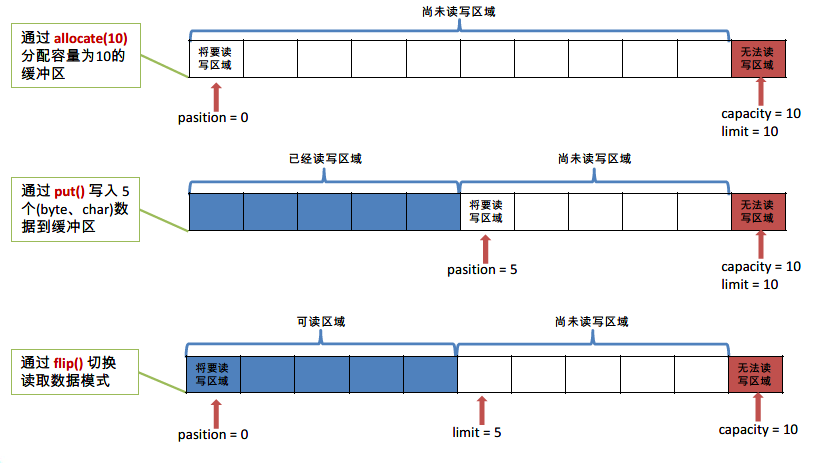

# 1 File类

## 1.1 概述

- `java.io.File` 类是文件和目录路径名的抽象表示
- File能新建、删除、重命名文件和目录，但File不能访问文件内容本身。如果需要访问文件内容本身，则需要使用输入/输出流
- 想要在Java程序中表示一个真实存在的文件或目录，那么必须有一个File对象，但是Java程序中的一个File对象，可能没有一个真实存在的文件或目录
- File对象可以作为参数传递给流的构造器

## 1.2 常用构造方法

- `public File(String pathname) ` ：以pathname为路径创建File对象，可以是绝对路径或者相对路径，如果pathname是相对路径，则默认的当前路径在系统属性user.dir中存储
- `public File(String parent, String child) ` ：从**父路径名字符串和子路径名字符串**创建新的File实例
- `public File(File parent, String child)` ：从**父抽象路径名和子路径名字符串**创建新的 File实例

## 1.3 路径分隔符

- 路径中的每级目录之间用一个路径分隔符隔开

- 路径分隔符和系统有关

  - windows和DOS系统默认使用“\”来表示
  - UNIX和URL使用“/”来表示

- Java程序支持跨平台运行，因此路径分隔符要慎用，为了解决这个隐患，File类提供了一个常量：
  `public static final String separator`根据操作系统，动态的提供分隔符

- 举例

  ```java
  File file1 = new File("d:\\atguigu\\info.txt");
  File file2 = new File("d:" + File.separator + "atguigu" + File.separator + "info.txt");
  File file3 = new File("d:/atguigu");
  ```

## 1.4 常用方法

### 1.4.1 获取功能的方法

- `public String getAbsolutePath() ` ：返回此File的绝对路径名字符串
- ` public String getPath() ` ：将此File转换为路径名字符串
- `public String getName()`  ：返回由此File表示的文件或目录的名称
- `public String getParent()` ：获取上层文件目录路径。若无，返回null
- `public long lastModified()` ：获取最后一次修改时间，毫秒值
- `public long length()`  ：返回由此File表示的文件的长度（即：字节数），不能获取目录的长度
- `public String[] list()` ：获取指定目录下的所有文件或者文件目录的名称数组
- `public File[] listFiles()` ：获取指定目录下的所有文件或者文件目录的File数组
- `public boolean renameTo(File dest)` :把文件重命名为指定的文件路径

### 1.4.2 判断功能的方法

- `public boolean exists()` ：此File表示的文件或目录是否实际存在
- `public boolean isDirectory()` ：此File表示的是否为目录
- `public boolean isFile()` ：此File表示的是否为文件
- `public boolean canRead()` ：判断是否可读
- `public boolean canWrite()` ：判断是否可写
- `public boolean isHidden()` ：判断是否隐藏

### 1.4.3 创建删除功能的方法

- `public boolean createNewFile()` ：当且仅当具有该名称的文件尚不存在时，创建一个新的空文件。
- `public boolean delete()` ：删除由此File表示的文件或目录
- `public boolean mkdir()` ：创建由此File表示的目录
- `public boolean mkdirs()` ：创建由此File表示的目录，包括任何必需但不存在的父目录

> API中说明：delete方法，如果此File表示目录，则目录必须为空才能删除。  

# 2 综合案例	

## 2.1 文件搜索	

### 2.1.1 需求

- 搜索`D:\aaa` 目录中的`.java` 文件。

### 2.1.2 分析

1. 目录搜索，无法判断多少级目录，所以使用递归，遍历所有目录。
2. 遍历目录时，获取的子文件，通过文件名称，判断是否符合条件。

### 2.1.3 代码实现

```java
public class DiGuiDemo3 {
    public static void main(String[] args) {
        // 创建File对象
        File dir  = new File("D:\\aaa");
      	// 调用打印目录方法
        printDir(dir);
    }

    public static void printDir(File dir) {
      	// 获取子文件和目录
        File[] files = dir.listFiles();
      	
      	// 循环打印
        for (File file : files) {
            if (file.isFile()) {
              	// 是文件，判断文件名并输出文件绝对路径
                if (file.getName().endsWith(".java")) {
                    System.out.println("文件名:" + file.getAbsolutePath());
                }
            } else {
                // 是目录，继续遍历,形成递归
                printDir(file);
            }
        }
    }
}
```

## 2.2 文件过滤器优化

### 2.2.1 需求

`java.io.FileFilter`是一个接口，是File的过滤器。 该接口的对象可以传递给File类的`listFiles(FileFilter)` 作为参数， 接口中只有一个方法。

`boolean accept(File pathname)  ` ：测试pathname是否应该包含在当前File目录中，符合则返回true。

### 2.2.2 分析

1. 接口作为参数，需要传递子类对象，重写其中方法。我们选择匿名内部类方式，比较简单。
2. `accept`方法，参数为File，表示当前File下所有的子文件和子目录。保留住则返回true，过滤掉则返回false。保留规则：
   1. 要么是.java文件。
   2. 要么是目录，用于继续遍历。
3. 通过过滤器的作用，`listFiles(FileFilter)`返回的数组元素中，子文件对象都是符合条件的，可以直接打印。

### 2.2.3 代码实现

```java
public class DiGuiDemo4 {
    public static void main(String[] args) {
        File dir = new File("D:\\aaa");
        printDir2(dir);
    }
  
    public static void printDir2(File dir) {
      	// 匿名内部类方式,创建过滤器子类对象
        File[] files = dir.listFiles(new FileFilter() {
            @Override
            public boolean accept(File pathname) {
                return pathname.getName().endsWith(".java")||pathname.isDirectory();
            }
        });
      	// 循环打印
        for (File file : files) {
            if (file.isFile()) {
                System.out.println("文件名:" + file.getAbsolutePath());
            } else {
                printDir2(file);
            }
        }
    }
}      
```

## 2.3 Lambda优化

### 2.3.1 分析

`FileFilter`是只有一个方法的接口，因此可以用lambda表达式简写

```java
()->{ }
```

### 2.3.2 代码实现

```java
public static void printDir3(File dir) {
  	// lambda的改写
    File[] files = dir.listFiles(f ->{ 
      	return f.getName().endsWith(".java") || f.isDirectory(); 
    });
  	
	// 循环打印
    for (File file : files) {
        if (file.isFile()) {
            System.out.println("文件名:" + file.getAbsolutePath());
      	} else {
        	printDir3(file);
      	}
    }
}
```

# 3 IO概述

## 3.1 IO原理

- I/O是Input/Output的缩写，I/O技术是非常实用的技术，用于
  处理设备之间的数据传输。如读/写文件，网络通讯等
- Java程序中，对于数据的输入/输出操作以“流(stream)”的方式进行
- java.io包下提供了各种“流”类和接口，用以获取不同种类的数据，并通过标准的方法输入或输出数据

## 3.2 IO的分类

- 根据数据的流向分为：**输入流**和**输出流**。
  - **输入流** ：把数据从`其他设备`上读取到`内存`中的流
  - **输出流** ：把数据从`内存` 中写出到`其他设备`上的流

- 根据数据的类型分为：**字节流**和**字符流**。
  - **字节流** ：以字节为单位，读写数据的流
  - **字符流** ：以字符为单位，读写数据的流

## 3.3 IO流体系


# 4 字节流

## 4.1 字节输出流【OutputStream】

- `java.io.OutputStream `抽象类是表示字节输出流的所有类的超类，将指定的字节信息写出到目的地。它定义了字节输出流的基本共性功能方法
  - `public void close()` ：关闭此输出流并释放与此流相关联的任何系统资源
  - `public void flush() ` ：刷新此输出流并强制任何缓冲的输出字节被写出
  - `public void write(byte[] b)`：将 b.length字节从指定的字节数组写入此输出流
  - `public void write(byte[] b, int off, int len)` ：从指定的字节数组写入 len字节，从偏移量 off开始输出到此输出流
  - `public abstract void write(int b)` ：将指定的字节输出流

> close方法，当完成流的操作时，必须调用此方法，释放系统资源。

## 4.2 FileOutputStream类

- `java.io.FileOutputStream `类是文件输出流，用于将数据写出到文件

### 4.2.1 构造方法

- `public FileOutputStream(File file)`：创建文件输出流以写入由指定的File对象表示的文件
- `public FileOutputStream(String name)`： 创建文件输出流以指定的名称写入文件

- 当你创建一个流对象时，必须传入一个文件路径。该路径下，如果没有这个文件，会创建该文件。如果有这个文件，会清空这个文件的数据

- 构造举例，代码如下：

```java
public class FileOutputStreamConstructor throws IOException {
    public static void main(String[] args) {
   	 	// 使用File对象创建流对象
        File file = new File("a.txt");
        FileOutputStream fos = new FileOutputStream(file);
      
        // 使用文件名称创建流对象
        FileOutputStream fos = new FileOutputStream("b.txt");
    }
}
```

### 4.2.2 写出字节数据

1. **写出字节**：`write(int b)` 方法，每次可以写出一个字节数据，代码使用演示：

```java
public class FOSWrite {
    public static void main(String[] args) throws IOException {
        // 使用文件名称创建流对象
        FileOutputStream fos = new FileOutputStream("fos.txt");     
      	// 写出数据
      	fos.write(97); // 写出第1个字节
      	fos.write(98); // 写出第2个字节
      	fos.write(99); // 写出第3个字节
      	// 关闭资源
        fos.close();
    }
}
输出结果：
abc
```

> 1. 虽然参数为int类型四个字节，但是只会保留一个字节的信息写出。
> 2. 流操作完毕后，必须释放系统资源，调用close方法，千万记得。

2. **写出字节数组**：`write(byte[] b)`，每次可以写出数组中的数据，代码使用演示：

```java
public class FOSWrite {
    public static void main(String[] args) throws IOException {
        // 使用文件名称创建流对象
        FileOutputStream fos = new FileOutputStream("fos.txt");     
      	// 字符串转换为字节数组
      	byte[] b = "黑马程序员".getBytes();
      	// 写出字节数组数据
      	fos.write(b);
      	// 关闭资源
        fos.close();
    }
}
输出结果：
黑马程序员
```

3. **写出指定长度字节数组**：`write(byte[] b, int off, int len)` ,每次写出从off索引开始，len个字节，代码使用演示：

```java
public class FOSWrite {
    public static void main(String[] args) throws IOException {
        // 使用文件名称创建流对象
        FileOutputStream fos = new FileOutputStream("fos.txt");     
      	// 字符串转换为字节数组
      	byte[] b = "abcde".getBytes();
		// 写出从索引2开始，2个字节。索引2是c，两个字节，也就是cd。
        fos.write(b,2,2);
      	// 关闭资源
        fos.close();
    }
}
输出结果：
cd
```

### 4.2.3 数据追加续写

- `public FileOutputStream(File file, boolean append)`： 创建文件输出流以写入由指定的File对象表示的文件
- `public FileOutputStream(String name, boolean append)`： 创建文件输出流以指定的名称写入文件

- 这两个构造方法，`true` 表示追加数据，`false` 表示清空原有数据

```java
public class FOSWrite {
    public static void main(String[] args) throws IOException {
        // 使用文件名称创建流对象
        FileOutputStream fos = new FileOutputStream("fos.txt"，true);     
      	// 字符串转换为字节数组
      	byte[] b = "abcde".getBytes();
		// 写出从索引2开始，2个字节。索引2是c，两个字节，也就是cd。
        fos.write(b);
      	// 关闭资源
        fos.close();
    }
}
文件操作前：cd
文件操作后：cdabcde
```

### 4.2.4 写出换行

```java
public class FOSWrite {
    public static void main(String[] args) throws IOException {
        // 使用文件名称创建流对象
        FileOutputStream fos = new FileOutputStream("fos.txt");  
      	// 定义字节数组
      	byte[] words = {97,98,99,100,101};
      	// 遍历数组
        for (int i = 0; i < words.length; i++) {
          	// 写出一个字节
            fos.write(words[i]);
          	// 写出一个换行, 换行符号转成数组写出
            fos.write("\r\n".getBytes());
        }
      	// 关闭资源
        fos.close();
    }
}

输出结果：
a
b
c
d
e
```

> - 回车符`\r`和换行符`\n` ：
>   - 回车符：回到一行的开头（return）。
>   - 换行符：下一行（newline）。
> - 系统中的换行：
>   - Windows系统里，每行结尾是 `回车+换行` ，即`\r\n`；
>   - Unix系统里，每行结尾只有 `换行` ，即`\n`；
>   - Mac系统里，每行结尾是 `回车` ，即`\r`。从 Mac OS X开始与Linux统一。

## 4.3 字节输入流【InputStream】

- `java.io.InputStream `抽象类是表示字节输入流的所有类的超类，可以读取字节信息到内存中。它定义了字节输入流的基本共性功能方法
  - `public void close()` ：关闭此输入流并释放与此流相关联的任何系统资源。    
  - `public abstract int read()`： 从输入流读取数据的下一个字节。 
  - `public int read(byte[] b)`： 从输入流中读取一些字节数，并将它们存储到字节数组 b中 。

## 4.4 FileInputStream类

### 4.4.1 构造方法

- `FileInputStream(File file)`： 通过打开与实际文件的连接来创建一个 FileInputStream ，该文件由文件系统中的 File对象 file命名
- `FileInputStream(String name)`： 通过打开与实际文件的连接来创建一个 FileInputStream ，该文件由文件系统中的路径名 name命名

- 当你创建一个流对象时，必须传入一个文件路径。该路径下，如果没有该文件，会抛出`FileNotFoundException` 。

- 构造举例，代码如下：

```java
public class FileInputStreamConstructor throws IOException{
    public static void main(String[] args) {
   	 	// 使用File对象创建流对象
        File file = new File("a.txt");
        FileInputStream fos = new FileInputStream(file);
      
        // 使用文件名称创建流对象
        FileInputStream fos = new FileInputStream("b.txt");
    }
}
```

### 4.4.1 读取字节数据

1. **读取字节**：`read`方法，每次可以读取一个字节的数据，提升为int类型，读取到文件末尾，返回`-1`，代码使用演示：

```java
public class FISRead {
    public static void main(String[] args) throws IOException{
      	// 使用文件名称创建流对象
       	FileInputStream fis = new FileInputStream("read.txt");
      	// 定义变量，保存数据
        int b ；
        // 循环读取
        while ((b = fis.read())!=-1) {
            System.out.println((char)b);
        }
		// 关闭资源
        fis.close();
    }
}
输出结果：
a
b
c
d
e
```

> 1. 虽然读取了一个字节，但是会自动提升为int类型。
> 2. 流操作完毕后，必须释放系统资源，调用close方法，千万记得。

2. **使用字节数组读取**：`read(byte[] b)`，每次读取b的长度个字节到数组中，返回读取到的有效字节个数，读取到末尾时，返回`-1` ，代码使用演示：

```java
public class FISRead {
    public static void main(String[] args) throws IOException{
      	// 使用文件名称创建流对象.
       	FileInputStream fis = new FileInputStream("read.txt"); // 文件中为abcde
      	// 定义变量，作为有效个数
        int len ；
        // 定义字节数组，作为装字节数据的容器   
        byte[] b = new byte[2];
        // 循环读取
        while (( len= fis.read(b))!=-1) {
           	// 每次读取后,把数组变成字符串打印
            System.out.println(new String(b));
        }
		// 关闭资源
        fis.close();
    }
}

输出结果：
ab
cd
ed
```

错误数据`d`，是由于最后一次读取时，只读取一个字节`e`，数组中，上次读取的数据没有被完全替换，所以要通过`len` ，获取有效的字节，代码使用演示：

```java
public class FISRead {
    public static void main(String[] args) throws IOException{
      	// 使用文件名称创建流对象.
       	FileInputStream fis = new FileInputStream("read.txt"); // 文件中为abcde
      	// 定义变量，作为有效个数
        int len ；
        // 定义字节数组，作为装字节数据的容器   
        byte[] b = new byte[2];
        // 循环读取
        while (( len= fis.read(b))!=-1) {
           	// 每次读取后,把数组的有效字节部分，变成字符串打印
            System.out.println(new String(b，0，len));//  len 每次读取的有效字节个数
        }
		// 关闭资源
        fis.close();
    }
}

输出结果：
ab
cd
e
```

> 使用数组读取，每次读取多个字节，减少了系统间的IO操作次数，从而提高了读写的效率，建议开发中使用。

# 5 字符流

- 当使用字节流读取文本文件时，可能会有一个小问题。就是遇到中文字符时，可能不会显示完整的字符，那是因为一个中文字符可能占用多个字节存储。所以Java提供一些字符流类，以字符为单位读写数据，专门用于处理文本文件

## 5.1 字符输入流【Reader】

- `java.io.Reader`抽象类是表示用于读取字符流的所有类的超类，可以读取字符信息到内存中。它定义了字符输入流的基本共性功能方法。
  - `public void close()` ：关闭此流并释放与此流相关联的任何系统资源。    
  - `public int read()`： 从输入流读取一个字符。 
  - `public int read(char[] cbuf)`： 从输入流中读取一些字符，并将它们存储到字符数组 cbuf中 。

## 5.2 FileReader类  

- `java.io.FileReader `类是读取字符文件的便利类。构造时使用系统默认的字符编码和默认字节缓冲区。

> 1. 字符编码：字节与字符的对应规则。Windows系统的中文编码默认是GBK编码表，idea中UTF-8
>
> 2. 字节缓冲区：一个字节数组，用来临时存储字节数据。

### 5.2.1 构造方法

- `FileReader(File file)`： 创建一个新的 FileReader ，给定要读取的File对象。   
- `FileReader(String fileName)`： 创建一个新的 FileReader ，给定要读取的文件的名称。  

- 构造举例，代码如下：

```java
public class FileReaderConstructor throws IOException{
    public static void main(String[] args) {
   	 	// 使用File对象创建流对象
        File file = new File("a.txt");
        FileReader fr = new FileReader(file);
      
        // 使用文件名称创建流对象
        FileReader fr = new FileReader("b.txt");
    }
}
```

### 5.2.2 读取字符数据

1. **读取字符**：`read`方法，每次可以读取一个字符的数据，提升为int类型，读取到文件末尾，返回`-1`，循环读取，代码使用演示：

```java
public class FRRead {
    public static void main(String[] args) throws IOException {
      	// 使用文件名称创建流对象
       	FileReader fr = new FileReader("read.txt");
      	// 定义变量，保存数据
        int b ；
        // 循环读取
        while ((b = fr.read())!=-1) {
            System.out.println((char)b);
        }
		// 关闭资源
        fr.close();
    }
}
输出结果：
黑
马
程
序
员
```

> 小贴士：虽然读取了一个字符，但是会自动提升为int类型。

2. **使用字符数组读取**：`read(char[] cbuf)`，每次读取b的长度个字符到数组中，返回读取到的有效字符个数，读取到末尾时，返回`-1` ，代码使用演示：

```java
public class FISRead {
    public static void main(String[] args) throws IOException {
      	// 使用文件名称创建流对象
       	FileReader fr = new FileReader("read.txt");
      	// 定义变量，保存有效字符个数
        int len ；
        // 定义字符数组，作为装字符数据的容器
        char[] cbuf = new char[2];
        // 循环读取
        while ((len = fr.read(cbuf))!=-1) {
            System.out.println(new String(cbuf,0,len));
        }
    	// 关闭资源
        fr.close();
    }
}

输出结果：
黑马
程序
员
```

## 5.3 字符输出流【Writer】

- `java.io.Writer `抽象类是表示用于写出字符流的所有类的超类，将指定的字符信息写出到目的地。它定义了字节输出流的基本共性功能方法
  - `void write(int c)` 写入单个字符
  - `void write(char[] cbuf) `写入字符数组
  - `abstract  void write(char[] cbuf, int off, int len) `写入字符数组的某一部分,off数组的开始索引,len写的字符个数
  - `void write(String str) `写入字符串。 
  - `void write(String str, int off, int len)` 写入字符串的某一部分,off字符串的开始索引,len写的字符个数。
  - `void flush() `刷新该流的缓冲。  
  - `void close()` 关闭此流，但要先刷新它。 

## 5.4 FileWriter类

- `java.io.FileWriter `类是写出字符到文件的便利类。构造时使用系统默认的字符编码和默认字节缓冲区

### 5.4.1 构造方法

- `FileWriter(File file)`： 创建一个新的 FileWriter，给定要读取的File对象。   
- `FileWriter(String fileName)`： 创建一个新的 FileWriter，给定要读取的文件的名称

- 构造举例，代码如下：

```java
public class FileWriterConstructor {
    public static void main(String[] args) throws IOException {
   	 	// 使用File对象创建流对象
        File file = new File("a.txt");
        FileWriter fw = new FileWriter(file);
      
        // 使用文件名称创建流对象
        FileWriter fw = new FileWriter("b.txt");
    }
}
```

### 5.4.2 基本写出数据

1. **写出字符**：`write(int b)` 方法，每次可以写出一个字符数据，代码使用演示：

```java
public class FWWrite {
    public static void main(String[] args) throws IOException {
        // 使用文件名称创建流对象
        FileWriter fw = new FileWriter("fw.txt");     
      	// 写出数据
      	fw.write(97); // 写出第1个字符
      	fw.write('b'); // 写出第2个字符
      	fw.write('C'); // 写出第3个字符
      	fw.write(30000); // 写出第4个字符，中文编码表中30000对应一个汉字。
      
      	/*
        【注意】关闭资源时,与FileOutputStream不同。
      	 如果不关闭,数据只是保存到缓冲区，并未保存到文件。
        */
        // fw.close();
    }
}
输出结果：
abC田
```

> 1. 虽然参数为int类型四个字节，但是只会保留一个字符的信息写出。
> 2. 未调用close方法，数据只是保存到了缓冲区，并未写出到文件中。

### 5.4.3 关闭和刷新

- 因为内置缓冲区的原因，如果不关闭输出流，无法写出字符到文件中。但是关闭的流对象，是无法继续写出数据的。如果我们既想写出数据，又想继续使用流，就需要`flush` 方法了
  - `flush` ：刷新缓冲区，流对象可以继续使用。
  - `close `:先刷新缓冲区，然后通知系统释放资源。流对象不可以再被使用了。

代码使用演示：

```java
public class FWWrite {
    public static void main(String[] args) throws IOException {
        // 使用文件名称创建流对象
        FileWriter fw = new FileWriter("fw.txt");
        // 写出数据，通过flush
        fw.write('刷'); // 写出第1个字符
        fw.flush();
        fw.write('新'); // 继续写出第2个字符，写出成功
        fw.flush();
      
      	// 写出数据，通过close
        fw.write('关'); // 写出第1个字符
        fw.close();
        fw.write('闭'); // 继续写出第2个字符,【报错】java.io.IOException: Stream closed
        fw.close();
    }
}
```

> 小贴士：即便是flush方法写出了数据，操作的最后还是要调用close方法，释放系统资源。

### 5.4.4 写出其他数据

1. **写出字符数组** ：`write(char[] cbuf)` 和 `write(char[] cbuf, int off, int len)` ，每次可以写出字符数组中的数据，用法类似FileOutputStream，代码使用演示：

```java
public class FWWrite {
    public static void main(String[] args) throws IOException {
        // 使用文件名称创建流对象
        FileWriter fw = new FileWriter("fw.txt");     
      	// 字符串转换为字节数组
      	char[] chars = "黑马程序员".toCharArray();
      
      	// 写出字符数组
      	fw.write(chars); // 黑马程序员
        
		// 写出从索引2开始，2个字节。索引2是'程'，两个字节，也就是'程序'。
        fw.write(b,2,2); // 程序
      
      	// 关闭资源
        fos.close();
    }
}
```

2. **写出字符串**：`write(String str)` 和 `write(String str, int off, int len)` ，每次可以写出字符串中的数据，更为方便，代码使用演示：

```java
public class FWWrite {
    public static void main(String[] args) throws IOException {
        // 使用文件名称创建流对象
        FileWriter fw = new FileWriter("fw.txt");     
      	// 字符串
      	String msg = "黑马程序员";
      
      	// 写出字符数组
      	fw.write(msg); //黑马程序员
      
		// 写出从索引2开始，2个字节。索引2是'程'，两个字节，也就是'程序'。
        fw.write(msg,2,2);	// 程序
      	
        // 关闭资源
        fos.close();
    }
}
```

3. **续写和换行**：操作类似于FileOutputStream。

```java
public class FWWrite {
    public static void main(String[] args) throws IOException {
        // 使用文件名称创建流对象，可以续写数据
        FileWriter fw = new FileWriter("fw.txt"，true);     
      	// 写出字符串
        fw.write("黑马");
      	// 写出换行
      	fw.write("\r\n");
      	// 写出字符串
  		fw.write("程序员");
      	// 关闭资源
        fw.close();
    }
}
输出结果:
黑马
程序员
```

> 小贴士：字符流，只能操作文本文件，不能操作图片，视频等非文本文件。
>
> 当我们单纯读或者写文本文件时  使用字符流 其他情况使用字节流

# 6 IO异常的处理

### 6.1 JDK7前处理

```java  
public class HandleException1 {
    public static void main(String[] args) {
      	// 声明变量
        FileWriter fw = null;
        try {
            //创建流对象
            fw = new FileWriter("fw.txt");
            // 写出数据
            fw.write("黑马程序员"); //黑马程序员
        } catch (IOException e) {
            e.printStackTrace();
        } finally {
            try {
                if (fw != null) {
                    fw.close();
                }
            } catch (IOException e) {
                e.printStackTrace();
            }
        }
    }
}
```

### 6.2 JDK7的处理

- 还可以使用JDK7优化后的`try-with-resource` 语句，该语句确保了每个资源在语句结束时关闭。所谓的资源（resource）是指在程序完成后，必须关闭的对象

```java
try (创建流对象语句，如果多个,使用';'隔开) {
	// 读写数据
} catch (IOException e) {
	e.printStackTrace();
}
```

- 代码使用演示：

```java
public class HandleException2 {
    public static void main(String[] args) {
      	// 创建流对象
        try ( FileWriter fw = new FileWriter("fw.txt"); ) {
            // 写出数据
            fw.write("黑马程序员"); //黑马程序员
        } catch (IOException e) {
            e.printStackTrace();
        }
    }
}
```

### 6.3 JDK9的改进

```java
// 被final修饰的对象
final Resource resource1 = new Resource("resource1");
// 普通对象
Resource resource2 = new Resource("resource2");

// 引入方式：直接引入
try (resource1; resource2) {
     // 使用对象
}
```

# 7 属性集

## 7.1 概述

- `java.util.Properties ` 继承于` Hashtable` ，来表示一个持久的属性集。它使用键值结构存储数据，每个键及其对应值都是一个字符串。该类也被许多Java类使用，比如获取系统属性时，`System.getProperties` 方法就是返回一个`Properties`对象

## 7.2 Properties类

### 7.2.1 构造方法

- `public Properties()` :创建一个空的属性列表。

### 7.2.2 基本的存储方法

- `public Object setProperty(String key, String value)` ： 保存一对属性。  
- `public String getProperty(String key) ` ：使用此属性列表中指定的键搜索属性值。
- `public Set<String> stringPropertyNames() ` ：所有键的名称的集合。

### 7.2.3 与流相关的方法

- `public void load(InputStream inStream)`： 从字节输入流中读取键值对。 

- 文本数据格式:

```
filename=a.txt
length=209385038
location=D:\a.txt
```

- 加载代码演示：

```java
public class ProDemo2 {
    public static void main(String[] args) throws FileNotFoundException {
        // 创建属性集对象
        Properties pro = new Properties();
        // 加载文本中信息到属性集
        pro.load(new FileInputStream("read.txt"));
        // 遍历集合并打印
        Set<String> strings = pro.stringPropertyNames();
        for (String key : strings ) {
          	System.out.println(key+" -- "+pro.getProperty(key));
        }
     }
}
输出结果：
filename -- a.txt
length -- 209385038
location -- D:\a.txt
```

> 小贴士：文本中的数据，必须是键值对形式，可以使用空格、等号、冒号等符号分隔。

# 8 缓冲流

## 8.1 概述

- 缓冲流,也叫高效流，是对4个基本的`FileXxx` 流的增强，所以也是4个流，按照数据类型分类：
  - **字节缓冲流**：`BufferedInputStream`，`BufferedOutputStream` 
  - **字符缓冲流**：`BufferedReader`，`BufferedWriter`

- 缓冲流的基本原理，是在创建流对象时，会创建一个内置的默认大小的缓冲区数组，通过缓冲区读写，减少系统IO次数，从而提高读写的效率

## 8.2 字节缓冲流

### 8.2.1 构造方法

- `public BufferedInputStream(InputStream in)` ：创建一个 新的缓冲输入流。 
- `public BufferedOutputStream(OutputStream out)`： 创建一个新的缓冲输出流。

```java
// 创建字节缓冲输入流
BufferedInputStream bis = new BufferedInputStream(new FileInputStream("bis.txt"));
// 创建字节缓冲输出流
BufferedOutputStream bos = new BufferedOutputStream(new FileOutputStream("bos.txt"));
```

- 使用数组的方式，代码如下：

```java
public class BufferedDemo {
    public static void main(String[] args) throws FileNotFoundException {
      	// 记录开始时间
        long start = System.currentTimeMillis();
		// 创建流对象
        try (
			BufferedInputStream bis = new BufferedInputStream(new FileInputStream("jdk9.exe"));
		 BufferedOutputStream bos = new BufferedOutputStream(new FileOutputStream("copy.exe"));
        ){
          	// 读写数据
            int len;
            byte[] bytes = new byte[8*1024];
            while ((len = bis.read(bytes)) != -1) {
                bos.write(bytes, 0 , len);
            }
        } catch (IOException e) {
            e.printStackTrace();
        }
		// 记录结束时间
        long end = System.currentTimeMillis();
        System.out.println("缓冲流使用数组复制时间:"+(end - start)+" 毫秒");
    }
}
缓冲流使用数组复制时间:666 毫秒
```

## 8.3 字符缓冲流

### 8.3.1 构造方法

- `public BufferedReader(Reader in)` ：创建一个 新的缓冲输入流。 
- `public BufferedWriter(Writer out)`： 创建一个新的缓冲输出流。

```java
// 创建字符缓冲输入流
BufferedReader br = new BufferedReader(new FileReader("br.txt"));
// 创建字符缓冲输出流
BufferedWriter bw = new BufferedWriter(new FileWriter("bw.txt"));
```

### 8.3.2 特有方法

- BufferedReader：`public String readLine()`: 读一行文字。 
- BufferedWriter：`public void newLine()`: 写一行行分隔符,由系统属性定义符号。 

- `readLine`方法演示，代码如下：

```java
public class BufferedReaderDemo {
    public static void main(String[] args) throws IOException {
      	 // 创建流对象
        BufferedReader br = new BufferedReader(new FileReader("in.txt"));
		// 定义字符串,保存读取的一行文字
        String line  = null;
      	// 循环读取,读取到最后返回null
        while ((line = br.readLine())!=null) {
            System.out.print(line);
            System.out.println("------");
        }
		// 释放资源
        br.close();
    }
}
```

- `newLine`方法演示，代码如下：

```java
public class BufferedWriterDemo throws IOException {
    public static void main(String[] args) throws IOException  {
      	// 创建流对象
		BufferedWriter bw = new BufferedWriter(new FileWriter("out.txt"));
      	// 写出数据
        bw.write("黑马");
      	// 写出换行
        bw.newLine();
        bw.write("程序");
        bw.newLine();
        bw.write("员");
        bw.newLine();
		// 释放资源
        bw.close();
    }
}
输出效果:
黑马
程序
员
```

# 9 转换流

## 9.1 InputStreamReader类  

- 转换流`java.io.InputStreamReader`，是Reader的子类，是从字节流到字符流的桥梁。它读取字节，并使用指定的字符集将其解码为字符。它的字符集可以由名称指定，也可以接受平台的默认字符集。 

### 9.1.1 构造方法

- `InputStreamReader(InputStream in)`: 创建一个使用默认字符集的字符流。 
- `InputStreamReader(InputStream in, String charsetName)`: 创建一个指定字符集的字符流。

```java
InputStreamReader isr = new InputStreamReader(new FileInputStream("in.txt"));
InputStreamReader isr2 = new InputStreamReader(new FileInputStream("in.txt") , "GBK");
```

### 9.1.2 指定编码读取

```java
public class ReaderDemo2 {
    public static void main(String[] args) throws IOException {
      	// 定义文件路径,文件为gbk编码
        String FileName = "E:\\file_gbk.txt";
      	// 创建流对象,默认UTF8编码
        InputStreamReader isr = new InputStreamReader(new FileInputStream(FileName));
      	// 创建流对象,指定GBK编码
        InputStreamReader isr2 = new InputStreamReader(new FileInputStream(FileName) , "GBK");
		// 定义变量,保存字符
        int read;
      	// 使用默认编码字符流读取,乱码
        while ((read = isr.read()) != -1) {
            System.out.print((char)read); // ��Һ�
        }
        isr.close();
      
      	// 使用指定编码字符流读取,正常解析
        while ((read = isr2.read()) != -1) {
            System.out.print((char)read);// 大家好
        }
        isr2.close();
    }
}
```

## 9.2 OutputStreamWriter类

- 转换流`java.io.OutputStreamWriter` ，是Writer的子类，是从字符流到字节流的桥梁。使用指定的字符集将字符编码为字节。它的字符集可以由名称指定，也可以接受平台的默认字符集。 

### 9.2.1 构造方法

- `OutputStreamWriter(OutputStream in)`: 创建一个使用默认字符集的字符流。 
- `OutputStreamWriter(OutputStream in, String charsetName)`: 创建一个指定字符集的字符流。

```java
OutputStreamWriter isr = new OutputStreamWriter(new FileOutputStream("out.txt"));
OutputStreamWriter isr2 = new OutputStreamWriter(new FileOutputStream("out.txt") , "GBK");
```

### 9.2.2 指定编码写出

```java
public class OutputDemo {
    public static void main(String[] args) throws IOException {
      	// 定义文件路径
        String FileName = "E:\\out.txt";
      	// 创建流对象,默认UTF8编码
        OutputStreamWriter osw = new OutputStreamWriter(new FileOutputStream(FileName));
        // 写出数据
      	osw.write("你好"); // 保存为6个字节
        osw.close();
      	
		// 定义文件路径
		String FileName2 = "E:\\out2.txt";
     	// 创建流对象,指定GBK编码
        OutputStreamWriter osw2 = new OutputStreamWriter(new FileOutputStream(FileName2),"GBK");
        // 写出数据
      	osw2.write("你好");// 保存为4个字节
        osw2.close();
    }
}
```

# 10 序列化

## 10.1 概述

- Java 提供了一种对象**序列化**的机制。用一个字节序列可以表示一个对象，该字节序列包含该`对象的数据`、`对象的类型`和`对象中存储的属性`等信息。字节序列写出到文件之后，相当于文件中**持久保存**了一个对象的信息。 

## 10.2 ObjectOutputStream类

- `java.io.ObjectOutputStream ` 类，将Java对象的原始数据类型写出到文件,实现对象的持久存储。

### 10.2.1 构造方法

- `public ObjectOutputStream(OutputStream out) `： 创建一个指定OutputStream的ObjectOutputStream

```java
FileOutputStream fileOut = new FileOutputStream("employee.txt");
ObjectOutputStream out = new ObjectOutputStream(fileOut);
```

### 10.2.2 序列化操作

1. 一个对象要想序列化，必须满足两个条件:

- 该类必须实现`java.io.Serializable ` 接口，`Serializable` 是一个标记接口，不实现此接口的类将不会使任何状态序列化或反序列化，会抛出`NotSerializableException` 。
- 该类的所有属性必须是可序列化的。如果有一个属性不需要可序列化的，则该属性必须注明是瞬态的，使用`transient` 关键字修饰。

```java
public class Employee implements java.io.Serializable {
    public String name;
    public String address;
    public transient int age; // transient瞬态修饰成员,不会被序列化
    public void addressCheck() {
      	System.out.println("Address  check : " + name + " -- " + address);
    }
}
```

2.写出对象方法

- `public final void writeObject (Object obj)` : 将指定的对象写出。

```java
public class SerializeDemo{
   	public static void main(String [] args)   {
    	Employee e = new Employee();
    	e.name = "zhangsan";
    	e.address = "beiqinglu";
    	e.age = 20; 
    	try {
      		// 创建序列化流对象
          ObjectOutputStream out = new ObjectOutputStream(new FileOutputStream("employee.txt"));
        	// 写出对象
        	out.writeObject(e);
        	// 释放资源
        	out.close();
        	fileOut.close();
        	System.out.println("Serialized data is saved"); // 姓名，地址被序列化，年龄没有被序列化。
        } catch(IOException i)   {
            i.printStackTrace();
        }
   	}
}
输出结果：
Serialized data is saved
```

## 10.3 ObjectInputStream类

### 10.3.1 构造方法

- `public ObjectInputStream(InputStream in) `： 创建一个指定InputStream的ObjectInputStream。

### 10.3.2 反序列化操作1

如果能找到一个对象的class文件，我们可以进行反序列化操作，调用`ObjectInputStream`读取对象的方法：

- `public final Object readObject ()` : 读取一个对象。

```java
public class DeserializeDemo {
   public static void main(String [] args)   {
        Employee e = null;
        try {		
             // 创建反序列化流
             FileInputStream fileIn = new FileInputStream("employee.txt");
             ObjectInputStream in = new ObjectInputStream(fileIn);
             // 读取一个对象
             e = (Employee) in.readObject();
             // 释放资源
             in.close();
             fileIn.close();
        }catch(IOException i) {
             // 捕获其他异常
             i.printStackTrace();
             return;
        }catch(ClassNotFoundException c)  {
        	// 捕获类找不到异常
             System.out.println("Employee class not found");
             c.printStackTrace();
             return;
        }
        // 无异常,直接打印输出
        System.out.println("Name: " + e.name);	// zhangsan
        System.out.println("Address: " + e.address); // beiqinglu
        System.out.println("age: " + e.age); // 0
    }
}
```

- **对于JVM可以反序列化对象，它必须是能够找到class文件的类。如果找不到该类的class文件，则抛出一个 `ClassNotFoundException` 异常。**  

### 10.3.3 反序列化操作2

**另外，当JVM反序列化对象时，能找到class文件，但是class文件在序列化对象之后发生了修改，那么反序列化操作也会失败，抛出一个`InvalidClassException`异常。**发生这个异常的原因如下：

- 该类的序列版本号与从流中读取的类描述符的版本号不匹配 
- 该类包含未知数据类型 
- 该类没有可访问的无参数构造方法 

- `Serializable` 接口给需要序列化的类，提供了一个序列版本号。`serialVersionUID` 该版本号的目的在于验证序列化的对象和对应类是否版本匹配。

```java
public class Employee implements java.io.Serializable {
     // 加入序列版本号
     private static final long serialVersionUID = 1L;
     public String name;
     public String address;
     // 添加新的属性 ,重新编译, 可以反序列化,该属性赋为默认值.
     public int eid; 

     public void addressCheck() {
         System.out.println("Address  check : " + name + " -- " + address);
     }
}
```

# 11 打印流

## 11.1 概述

平时我们在控制台打印输出，是调用`print`方法和`println`方法完成的，这两个方法都来自于`java.io.PrintStream`类，该类能够方便地打印各种数据类型的值，是一种便捷的输出方式。

## 11.2 PrintStream类

### 11.2.1 构造方法

- `public PrintStream(String fileName)  `： 使用指定的文件名创建一个新的打印流。 

```java
PrintStream ps = new PrintStream("ps.txt")；
```

### 11.2.2 改变打印流向

- `System.out`就是`PrintStream`类型的，只不过它的流向是系统规定的，打印在控制台上。不过，既然是流对象，我们就可以玩一个"小把戏"，改变它的流向。

```java
public class PrintDemo {
    public static void main(String[] args) throws IOException {
		// 调用系统的打印流,控制台直接输出97
        System.out.println(97);
      
		// 创建打印流,指定文件的名称
        PrintStream ps = new PrintStream("ps.txt");
      	
      	// 设置系统的打印流流向,输出到ps.txt
        System.setOut(ps);
      	// 调用系统的打印流,ps.txt中输出97
        System.out.println(97);
    }
}
```

# 12 NIO

## 12.1 Java NIO简介

- NIO支持面向缓冲区的、基于通道的IO操作
- NIO将以更加高效的方式进行文件的读写操作

## 12.2 Java NIO与IO的主要区别

|   IO   |    NIO     |
| :----: | :--------: |
| 面向流 | 面向缓冲区 |
| 阻塞IO |  非阻塞IO  |
|   无   |   选择器   |

## 12.3 缓冲区(Buffer)和通道(Channel)

- Java NIO系统的核心在于：通道和缓冲区
- **通道**表示打开到IO设备(例如：文件、
  套接字)的连接
- 若需要使用NIO系统，需要获取用于连接IO设备的通道以及用于容纳数据的缓冲区，然后操作缓冲区，对数据进行处理
- **简而言之**，Channel负责传输，Buffer负责存储

### 12.3.1 缓冲区(Buffer)

- 缓冲区：一个用于特定基本数据类型的容器。由java.nio包定义的，所有缓冲区都是Buffer抽象类的子类

- Java NIO中的Buffer主要用于与NIO通道进行交互，数据是从通道读入缓冲区，从缓冲区写入通道中的

- Buffer就像一个数组，可以保存多个相同类型的数据

- 根据数据类型不同(boolean除外) ，有以下Buffer常用子类：ByteBuffer、CharBuffer、ShortBuffer、IntBuffer、LongBuffer、FloatBuffer、DoubleBuffer

- 创建一个容量为capacity的XxxBuffer对象并获取：`static XxxBuffer allocate(int capacity) `

- Buffer中的重要概念：

  - **容量(capacity)** ：表示Buffer最大数据容量，缓冲区容量不能为负，并且创建后不能更改
  - **限制(limit)**：第一个不应该读取或写入的数据的索引，即位于limit后的数据不可读写。缓冲区的限制不能为负，并且不能大于其容量
  - **位置(position)**：下一个要读取或写入的数据的索引。缓冲区的位置不能为负，并且不能大于其限制
  - **标记(mark)与重置(reset)**：标记是一个索引，通过Buffer中的mark()方法指定Buffer中一个特定的position，之后可以通过调用reset()方法恢复到这个position

  

- Buffer的常用方法
  - Buffer clear()：清空缓冲区并返回对缓冲区的引用
  - Buffer flip()：将缓冲区的界限设置为当前位置，并将当前位置充值为0
  - int capacity()：返回Buffer 的capacity大小
  - boolean hasRemaining()：判断缓冲区中是否还有元素
  - int limit()：返回Buffer 的界限(limit) 的位置
  - Buffer limit(int n)：将设置缓冲区界限为n, 并返回一个具有新limit 的缓冲区对象
  - Buffer mark()：对缓冲区设置标记
  - int position()：返回缓冲区的当前位置
  - Buffer position(int n)：将设置缓冲区的当前位置为n , 并返回修改后的Buffer 对象
  - int remaining()：返回position 和limit 之间的元素个数
  - Buffer reset()：将位置position 转到以前设置的mark 所在的位置
  - Buffer rewind()：将位置设为为0，取消设置的mark
- 缓冲区的数据操作
  - 获取Buffer 中的数据
    - get()：读取单个字节
    - get(byte[] dst)：批量读取多个字节到dst 中
    - get(int index)：读取指定索引位置的字节(不会移动position)
  - 放入数据到Buffer 中
    - put(byte b)：将给定单个字节写入缓冲区的当前位置
    - put(byte[] src)：将src 中的字节写入缓冲区的当前位置
    - put(int index, byte b)：将指定字节写入缓冲区的索引位置(不会移动position)

### 12.3.2 通道（Channel）

- 通道（Channel）：由java.nio.channels包定义
  的。Channel 表示IO源与目标打开的连接。Channel 类似于传统的“流”。只不过Channel
  本身不能直接访问数据，Channel 只能与
  Buffer 进行交互
- Java为Channel 接口提供的最主要实现类如下
  - FileChannel：用于读取、写入、映射和操作文件的通道
  - DatagramChannel：通过UDP 读写网络中的数据通道
  - SocketChannel：通过TCP 读写网络中的数据
  - ServerSocketChannel：可以监听新进来的TCP 连接，对每一个新进来
    的连接都会创建一个SocketChannel
- 获取通道
  - getChannel() 方法
  - 使用Files 类的静态方法newByteChannel() 获取字节通道
  - 通过通道的静态方法open() 打开并返回指定通道
- 通道的数据传输
  - 将Buffer 中数据写入Channel：`int bytesWritten = inChannel.write(buf);`
  - 从Channel 读取数据到Buffer：`int bytesRead = inChannel.read(buf);`
- 分散(Scatter)和聚集(Gather)
  - 分散读取（Scattering Reads）是指从Channel 中读取的数据“分散”到多个Buffer 中。
    按照缓冲区的顺序，从Channel 中读取的数据依次将Buffer 填满
  - 聚集写入（Gathering Writes）是指将多个Buffer 中的数据“聚集”
    到Channel。按照缓冲区的顺序，写入position 和limit 之间的数据到Channel
- 将数据从源通道传输到其他Channel 中：
  transferFrom()

## 12.4 文件通道(FileChannel)常用方法

- int read(ByteBuffer dst) 从Channel 中读取数据到ByteBuffer
- long read(ByteBuffer[] dsts) 将Channel 中的数据“分散”到ByteBuffer[]
- int write(ByteBuffer src) 将ByteBuffer 中的数据写入到Channel
- long write(ByteBuffer[] srcs) 将ByteBuffer[] 中的数据“聚集”到Channel
- long position() 返回此通道的文件位置
- FileChannel position(long p) 设置此通道的文件位置
- long size() 返回此通道的文件的当前大小
- FileChannel truncate(long s) 将此通道的文件截取为给定大小
- void force(boolean metaData) 强制将所有对此通道的文件更新写入到存储设备中

## 12.5 NIO 的非阻塞式网络通信

### 12.5.1 阻塞与非阻塞

- 完成网络通信进行IO操作时，由于线程会阻塞，所以服务器端必须为每个客户端都提供一个独立的线程进行处理，
  当服务器端需要处理大量客户端时，性能急剧下降
- Java NIO是非阻塞模式的。线程通常将非阻塞IO的空闲时间用于在其他通道上执行IO操作，所以单独的线程可以管理多个输入和输出通道。因此，NIO可以让服务器端使用一个或有限几个线程来同时处理连接到服务器端的所有客户端

### 12.5.2 选择器(Selector)

- 选择器（Selector）是SelectableChannle 对象的多路复用器
- Selector可以同时监控多个SelectableChannel 的IO状况，也就是说，利用Selector
  可使一个单独的线程管理多个Channel
- Selector 是非阻塞IO 的核心

## 12.6 管道(Pipe)

- Java NIO管道是2个线程之间的单向数据连接
- Pipe有一个source通道和一个sink通道。数据会被写到sink通道，从source通道读取
- 向管道写数据

```java
@Tests
public void test1() throws IOException{
	String str = "测试数据"；

	//创建管道妒
	Pipe pipe = Pipe.open();
	
	//向管道写输儿
	Pipe.SinkChanne1 sinkChanne1 = pipe.sink();

	//通过SinkChanne1的write()方法写数据
	ByteBuffer buf = ByteBuffer.allocate(1924);
	buf.clear();
	buf．put(str.getBytes());
	buf.flip();
	
	while(buf.hasRemaining()){
		sinkChanne1.write(buf);
	}
}
```

- 从管道读取数据

```java
//从管道读取数据
Pipe.SourceChanne1 sourceChanne1 = pipe.source();
//调用sourcechannel的read()方法读取数据
ByteBuffer buf = ByteBuffer.allocate(1024)；
sourceChanne1.read(buf)；
```

## 12.7 Java NIO2 (Path、Paths与Files)

### 12.7.1 Path与Paths

- java.nio.file.Path接口代表一个平台无关的平台路径，描述了目录结构中文件的位置
- Paths提供的get()方法用来获取Path对象
  - Path get(String first, String … more) : 用于将多个字符串串连成路径
- Path常用方法
  - boolean endsWith(String path) : 判断是否以path路径结束
  - boolean startsWith(String path) : 判断是否以path路径开始
  - boolean isAbsolute() : 判断是否是绝对路径
  - Path getFileName() : 返回与调用Path 对象关联的文件名
  - Path getName(int idx) : 返回的指定索引位置idx 的路径名称
  - int getNameCount() : 返回Path 根目录后面元素的数量
  - Path getParent() ：返回Path对象包含整个路径，不包含Path 对象指定的文件路径
  - Path getRoot() ：返回调用Path 对象的根路径
  - Path resolve(Path p) :将相对路径解析为绝对路径
  - Path toAbsolutePath() : 作为绝对路径返回调用Path 对象
  - String toString() ：返回调用Path 对象的字符串表示形式

### 12.7.2 Files 类

- java.nio.file.Files用于操作文件或目录的工具类
- Files常用方法
  - Path copy(Path src, Path dest, CopyOption … how) : 文件的复制
  - PathcreateDirectory(Path path, FileAttribute<?> … attr) : 创建一个目录
  - Path createFile(Path path, FileAttribute<?> … arr) : 创建一个文件
  - void delete(Path path) : 删除一个文件
  - Path move(Path src, Path dest, CopyOption…how) : 将src 移动到dest 位置
  - long size(Path path) : 返回path 指定文件的大小
    Files 类
- Files常用方法：用于判断
  - boolean exists(Path path, LinkOption … opts) : 判断文件是否存在
  - boolean isDirectory(Path path, LinkOption … opts) : 判断是否是目录
  - boolean isExecutable(Path path) : 判断是否是可执行文件
  - boolean isHidden(Path path) : 判断是否是隐藏文件
  - boolean isReadable(Path path) : 判断文件是否可读
  - boolean isWritable(Path path) : 判断文件是否可写
  - boolean notExists(Path path, LinkOption … opts) : 判断文件是否不存在
  - public static <A extends BasicFileAttributes> A readAttributes(Path path,Class<A> type,LinkOption... options) : 获取与path 指定的文件相关联的属性
- Files常用方法：用于操作内容
  - SeekableByteChannel newByteChannel(Path path, OpenOption…how) : 获取与指定文件的连接，
    how 指定打开方式
  - DirectoryStream newDirectoryStream(Path path) : 打开path 指定的目录
  - InputStream newInputStream(Path path, OpenOption…how):获取InputStream 对象
  - OutputStream newOutputStream(Path path, OpenOption…how) : 获取OutputStream 对象

### 12.7.3 自动资源管理

- J自动关闭文件的特性被称为自动资源管理
  (Automatic Resource Management, ARM)
- 该特性以try 语句的扩展版为基础。自动资源管理主要用于，当不再需要文件（或其他资源）时，
  可以防止无意中忘记释放它们

```java
try(需要关闭的资源声明){
	//可能发生异常的语句
}catch(异常类型变量名){
	//异常的处理语句
}
……
finally{
	//一定执行的语句
}
```

- 当try 代码块结束时，自动释放资源。因此不需要显示的调用close() 方法。该形式也称为“带资源的try 语句”
- 注意
  - try 语句中声明的资源被隐式声明为final ，资源的作用局限于带资源的try 语句
  - 可以在一条try 语句中管理多个资源，每个资源以“;”隔开即可
  - 需要关闭的资源，必须实现了AutoCloseable 接口或其自接口Closeable