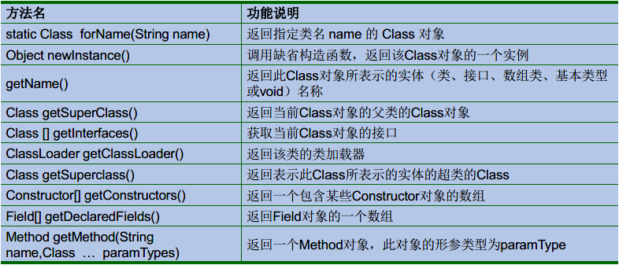
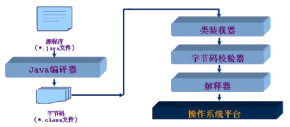
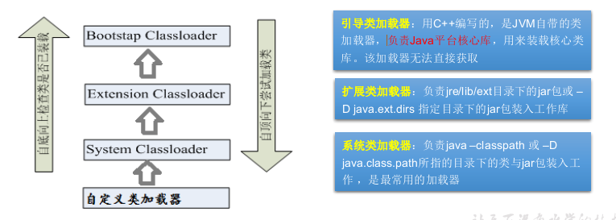

# 1 Java反射机制概述

- 反射是被视为动态语言的关键，反射机制允许程序在执行期借助于Reflection API取得任何类的内部信息，并能直接操作任意对象的内部属性及方法
- 加载完类之后，在堆内存的方法区中就产生了一个Class类型的对象（一个类只有一个Class对象），这个对象就包含了完整的类的结构信息。我们可以通过这个对象看到类的结构，好似镜子，故名反射

# 2 理解Class类并获取Class的实例

## 2.1 Class类的常用方法



## 2.2 获取Class类的实例（四种方法）

1. 前提：若已知具体的类，通过类的class属性获取，该方法最为安全可靠，
   程序性能最高
   - 实例：Class clazz = String.class;
   - 多用于参数的传递
2. 前提：已知某个类的实例，调用该实例的getClass()方法获取Class对象
   - 实例：Class clazz = “www.atguigu.com”.getClass();
   - 多用于对象的获取字节码的方式
3. 前提：已知一个类的全类名，且该类在类路径下，可通过Class类的静态方法forName()获取，可能抛出ClassNotFoundException
   - 实例：Class clazz = Class.forName(“java.lang.String”);
   - 多用于配置文件，将类名定义在配置文件中。读取文件，加载类
4. 其他方式(不做要求)
   - `ClassLoader cl = this.getClass().getClassLoader();
     `
   - `Class clazz4 = cl.loadClass(“类的全类名”);
     `

- 注意：同一个字节码文件(*.class)在一次程序运行过程中，只会被加载一次，不论通过哪一种方式获取的Class对象都是同一个

## 2.3 哪些类型可以有Class对象

- class：
  外部类，成员(成员内部类，静态内部类)，局部内部类，匿名内部类
- interface：接口
- []：数组
- enum：枚举
- annotation：注解@interface
- primitive type：基本数据类型
- void

# 3 类的加载与ClassLoader的理解

## 3.1 类的加载过程

### 3.1.1 类的加载

- 将class文件字节码内容加载到内存中，并将这些静态数据转换成方法区的运行时数据结构，然后生成一个代表这个类的java.lang.Class对象，作为方法区中类数据的访问入口（即引用地址）。所有需要访问和使用类数据只能通过这个Class对象。这个加载的过程需要类加载器参与

### 3.1.2 类的链接

- 将Java类的二进制代码合并到JVM的运行状态之中的过程
  - 验证：确保加载的类信息符合JVM规范，例如：以cafe开头，没有安全方面的问题
  - 准备：正式为类变量（static）分配内存并设置类变量默认初始值的阶段，这些内存都将在方法区中进行分配
  - 解析：虚拟机常量池内的符号引用（常量名）替换为直接引用（地址）的过程

### 3.1.3 类的初始化

- 执行类构造器<clinit>()方法的过程。类构造器<clinit>()方法是由编译期自动收集类中所有类变量的赋值动作和静态代码块中的语句合并产生的。（类构造器是构造类信息的，不是构造该类对象的构造器）
- 当初始化一个类的时候，如果发现其父类还没有进行初始化，则需要先触发其父类的初始化
- 虚拟机会保证一个类的<clinit>()方法在多线程环境中被正确加锁和同步

## 3.2 什么时候会发生类初始化

- 类的主动引用（一定会发生类的初始化）
  - 当虚拟机启动，先初始化main方法所在的类
  - new一个类的对象
  - 调用类的静态成员（除了final常量）和静态方法
  - 使用java.lang.reflect包的方法对类进行反射调用
  - 当初始化一个类，如果其父类没有被初始化，则先会初始化它的父类
- 类的被动引用（不会发生类的初始化）
  - 当访问一个静态域时，只有真正声明这个域的类才会被初始化
  - 当通过子类引用父类的静态变量，不会导致子类初始化
  - 通过数组定义类引用，不会触发此类的初始化
  - 引用常量不会触发此类的初始化（常量在链接阶段就存入调用类的常
    量池中了）

## 3.3 类加载器



### 3.3.1 作用

- 类加载的作用：将class文件字节码内容加载到内存中，并将这些静态数据转换成方法区的运行时数据结构，然后在堆中生成一个代表这个类的java.lang.Class对象，作为方法区中类数据的访问入口
- 类缓存：标准的JavaSE类加载器可以按要求查找类，但一旦某个类被加载到类加载器中，它将维持加载（缓存）一段时间。不过JVM垃圾回收机制可以回收这些Class对象



# 4 创建运行时类的对象

- 有了Class对象，可以创建类的对象：调用Class对象的newInstance()方法
  - 要求1：类必须有一个无参数的构造器
  - 要求2：类的构造器的访问权限需要足够
- 难道没有无参的构造器就不能创建对象了吗？
  - 不是！只要在操作的时候明确的调用类中的构造器，并将参数传递进去之后，才可以实例化操作
  - 步骤如下
    1. 通过Class类的`getDeclaredConstructor(Class … parameterTypes)`取得本类的指定形参类型的构造器
    2. 向构造器的形参中传递一个对象数组进去，里面包含了构造器中所需的各个参数
    3. 通过Constructor实例化对象

```java
//1.根据全类名获取对应的Class对象
String name = “atguigu.java.Person";
Class clazz = null;
clazz = Class.forName(name);
//2.调用指定参数结构的构造器，生成Constructor的实例
Constructor con = clazz.getConstructor(String.class,Integer.class);
//3.通过Constructor的实例创建对应类的对象，并初始化类属性
Person p2 = (Person) con.newInstance("Peter",20);
System.out.println(p2);
```

# 5 获取运行时类的完整结构

1. 获取父类
    - public Class<? Super T> getSuperclass()
2. 获取接口
    - public Class<?>[] getInterfaces()
3. 获取构造方法
    - Constructor<?>[] getConstructors()  
    - Constructor<T> getConstructor(类<?>... parameterTypes)  
    - Constructor<T> getDeclaredConstructor(类<?>... parameterTypes)  
    - Constructor<?>[] getDeclaredConstructors()  
4. 获取成员方法
    - Method[] getMethods()  
    - Method getMethod(String name, 类<?>... parameterTypes)  
    - Method[] getDeclaredMethods()  
    - Method getDeclaredMethod(String name, 类<?>... parameterTypes)  
5. 获取成员变量
    * Field[] getFields() ：获取所有public修饰的成员变量
    * Field getField(String name)   获取指定名称的 public修饰的成员变量
    * Field[] getDeclaredFields()  获取所有的成员变量，不考虑修饰符
    * Field getDeclaredField(String name)  
6. 获取注解
    - get Annotation(Class<T> annotationClass)
    - getDeclaredAnnotations()
7. 获取泛型
    - 获取父类泛型类型：Type getGenericSuperclass()
    - 泛型类型：ParameterizedType
    - 获取实际的泛型类型参数数组：getActualTypeArguments()
8. 获取类所在的包
    - Package getPackage()
9. 获取全类名	
    - String getName()  

# 6 调用运行时类的指定结构

## 6.1 Method：方法对象

 * 执行方法：Object invoke(Object obj, Object... args)
      * Object 对应原方法的返回值，若原方法无返回值，此时返回null
      * 若原方法若为静态方法，此时形参Object obj可为null
      * 若原方法形参列表为空，则Object[] args为null
      * 若原方法声明为private,则需要在调用此invoke()方法前，显式调用方法对象的setAccessible(true)方法，将可访问private的方法
* 取得全部的返回值：public Class<?> getReturnType()
* 取得全部的参数：public Class<?>[] getParameterTypes()
* 取得修饰符：public int getModifiers()
* 取得异常信息：public Class<?>[] getExceptionTypes()
* 取得方法名称：String getName()

## 6.2 Field：成员变量

 * 设置值：void set(Object obj, Object value)  
 * 获取值：get(Object obj) 
 * 以整数形式返回此Field的修饰符：public int getModifiers() 
 * 得到Field的属性类型：public Class<?> getType() 
 * 返回Field的名称：public String getName() 

## 6.3 Constructor：构造方法

- 创建对象：
  T newInstance(Object... initargs)
  - 如果使用空参数构造方法创建对象，操作可以简化：Class对象的newInstance方法
- 取得修饰符: public int getModifiers();
- 取得方法名称: public String getName();
- 取得参数的类型：public Class<?>[] getParameterTypes();

## 6.4 setAccessible(true)：暴力反射

- 忽略访问权限修饰符的安全检查
- Method和Field、Constructor对象都有setAccessible()方法
- 参数值为true则指示反射的对象在使用时应该取消Java语言访问检查
  - 提高反射的效率。如果代码中必须用反射，而该句代码需要频繁的被调用，那么请设置为true
  - 使得原本无法访问的私有成员也可以访问
- 参数值为false则指示反射的对象应该实施Java语言访问检查

# 7
反射的应用：动态代理

## 7.1 代理设计模式原理

- 使用一个代理将对象包装起来, 然后用该代理对象取代原始对象
- 任何对原始对象的调用都要通过代理
- 代理对象决定是否以及何时将方法调用转到原始对象上、

## 7.2 动态代理定义

- 动态代理是指客户通过代理类来调用其它对象的方法，并且是在程序运行时根据需要动态创建目标类的代理对象
- 动态代理使用场合
  - 调试
  - 远程方法调用
- 动态代理相比于静态代理的优点：
  抽象角色中（接口）声明的所有方法都被转移到调用处理器一个集中的方法中
  处理，这样，我们可以更加灵活和统一的处理众多的方法

## 7.3 Java动态代理相关API

- Proxy：专门完成代理的操作类，是所有动态代理类的父类。通过此类为一
  个或多个接口动态地生成实现类
- 提供用于创建动态代理类和动态代理对象的静态方法
  - `static Class<?> getProxyClass(ClassLoader loader, Class<?>... interfaces) `创建一个动态代理类所对应的Class对象
  - `static Object newProxyInstance(ClassLoader loader, Class<?>[] interfaces,
    InvocationHandler h)` 直接创建一个动态代理对象

## 7.4 动态代理步骤

1. 创建一个实现接口InvocationHandler的类，它必须实现invoke方法，以完成代理的具体操作

   ```java
   public Object invoke(Object theProxy, Method method, Object[] params)
   throws Throwable{
   	try{
   		Object retval = method.invoke(targetObj, params);
   		// Print out the result
   		System.out.println(retval);
   		return retval;
   	}catch (Exception exc){}
   }
   ```

2. 创建被代理的类以及接口

3. 通过Proxy的静态方法`newProxyInstance(ClassLoader loader, Class[] interfaces, InvocationHandler h) `创建
   一个Subject接口代理

   ```java
   RealSubject target = new RealSubject();
   // Create a proxy to wrap the original implementation
   DebugProxy proxy = new DebugProxy(target);
   // Get a reference to the proxy through the Subject interface
   Subject sub = (Subject) Proxy.newProxyInstance(
   Subject.class.getClassLoader(),new Class[] { Subject.class }, proxy);
   ```

4. 通过Subject代理调用RealSubject实现类的方法

## 7.5 动态代理与AOP

- 使用Proxy生成一个动态代理时，往往并不会凭空产生一个动态代理，这样没有太大的意义。通常都是为指定的目标对象生成动态代理
- 这种动态代理在AOP中被称为AOP代理，AOP代理可代替目标对象，AOP代理包含了目标对象的全部方法。但AOP代理中的方法与目标对象的方法存在差异：
  AOP代理里的方法可以在执行目标方法之前、之后插入一些通用处理

```java
public interface Dog{
	void info();
	void run();
}

public class HuntingDog implements Dog{
	public void info(){
		System.out.println("我是一只猎狗");
	}
	public void run(){
		System.out.println("我奔跑迅速");
	}
}

public class DogUtil{
	public void method1(){
		System.out.println("=====模拟通用方法一=====");
	}
	public void method2(){
		System.out.println("=====模拟通用方法二=====");
	}
}

public class MyInvocationHandler implements InvocationHandler{
	// 需要被代理的对象
	private Object target;
	public void setTarget(Object target){
		this.target = target;
    }
	// 执行动态代理对象的所有方法时，都会被替换成执行如下的invoke方法
	public Object invoke(Object proxy, Method method, Object[] args) throws Exception{
		DogUtil du = new DogUtil();
		// 执行DogUtil对象中的method1。
		du.method1();
		// 以target作为主调来执行method方法
		Object result = method.invoke(target , args);
		// 执行DogUtil对象中的method2。
		du.method2();
		return result;
    }
}

public class MyProxyFactory{
	// 为指定target生成动态代理对象
	public static Object getProxy(Object target) throws Exception{
		// 创建一个MyInvokationHandler对象
		MyInvokationHandler handler = new MyInvokationHandler();
		// 为MyInvokationHandler设置target对象
		handler.setTarget(target);
		// 创建、并返回一个动态代理对象
		return Proxy.newProxyInstance(target.getClass().getClassLoader(), target.getClass().getInterfaces() , handler);
	}
}

public class Test{
	public static void main(String[] args) throws Exception{
		// 创建一个原始的HuntingDog对象，作为target
		Dog target = new HuntingDog();
		// 以指定的target来创建动态代理
		Dog dog = (Dog)MyProxyFactory.getProxy(target);
		dog.info();
		dog.run();
	}
}
```

