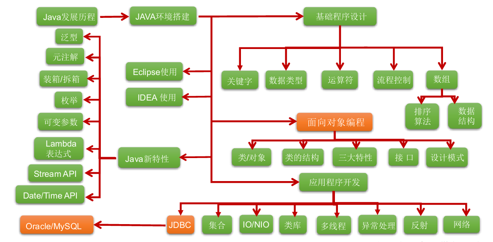

# 一 Java语言概述

## 1.1 Java技术体系平台

- **JavaSE**：标准版，提供了完整的Java核心API
- **JavaEE**：企业版，针对Web应用程序开发
- **JavaME**：小型版，支持Java程序运行在移动终端
- **Java Card**：支持Java程序运行在小内存设备

## 1.2 Java的三大特点

1. **面向对象**
   - 两个基本概念：类、对象
   - 三大特性：封装、继承、多态
2. **健壮性**：提供了一个相对安全的内存管理和访问机制
3. **跨平台性**：JVM

## 1.3 Java基础知识图解

# 2 Java核心机制

## 2.1 Java虚拟机：JVM

- **JVM**：它是一个虚拟的计算机，具有指令集并使用不同的存储区域，负责执行指令，管理数据、内存、寄存器
- **跨平台**：实现了”一次编译，到处运行“

## 2.2 垃圾收集机制

- 在Java程序运行过程中自动进行，程序员无法精确控制和干预
- **注意**：Java程序还是会出现内存泄漏和内存溢出问题

# 3 Java环境搭建

## 3.1 JDK和JRE的定义

- JDK：Java开发工具包，包括了JRE和开发工具集（编译工具javac.exe、打包工具jar.exe）
- JRE：Java运行环境，包括了JVM和JavaSE标准类库

## 3.2 环境变量Path的作用

- 保证javac等开发工具可以在任意目录下运行

# 4 Java开发体验：HelloWorld

## 4.1 Java程序的开发流程

1. **编写**java源程序(.java)
2. 通过javac命令**编译**生成.class字节码文件
3. 通过java命令**运行**.class文件

## 4.2 常见问题

1. 一个程序的执行需要一个起始点或者入口：`public static void
   main(String[] args){ }`
2. 一个".java"源文件中可以包括多个类（不是内部类），但只能有一个public的类，并且类名必须与文件名一致
3. Java语言严格区分大小写
