# 1 注释

- 单行注释    `// 注释文字`
- 多行注释   `/* 注释文字 */`
- 文档注释（Java特有） `/** 注释文字 */`

# 2 关键字和保留字

## 2.1 关键字

1. 定义：被Java赋予特定含义的单词
2. 特点：全部小写

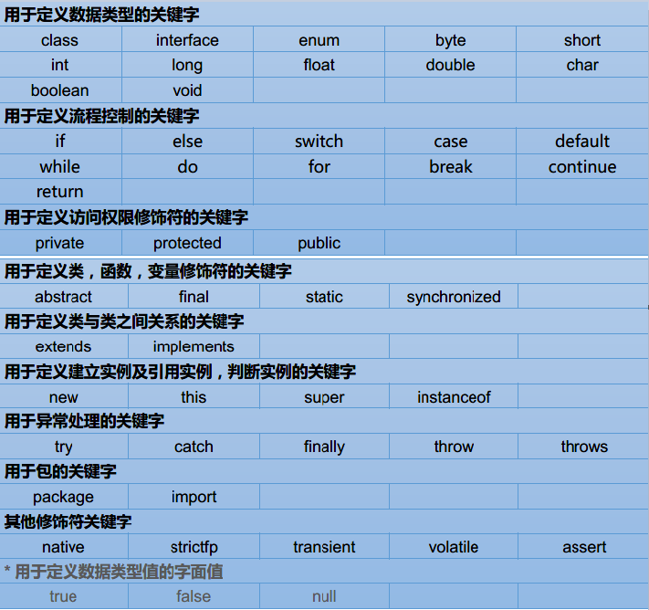

## 2.2 保留字

- goto、const

# 3 标识符

## 3.1 定义

- 对各种变量、方法、类和接口等命名的字符序列

## 3.2 命名规则：硬性要求

- 由英文大小写字母、数字、_或$组成
- 不能以数字开头
- 不可以使用关键字和保留字
- 区分大小写
- 长度无限制
- **注意**：不能包含空格，但支持使用中文（不建议使用）

## 3.2 命名规范：软性建议-驼峰命名法

1. 包名
   - 单级包：小写，举例：liuyi、com
   -  多级包：小写，并用 . 隔开，举例：cn.itcast、com.baidu   
2. 类名、接口名
   - 一个单词：首字母大写，举例：Student、Demo
   - 多个单词：每个单词首字母大写，举例：HelloWorld、StudentName
3. 方法名、变量名
   - 一个单词：首字母小写，举例：name、main
   - 多个单词：从第二个单词开始，每个单词首字母大写，举例：studentAge、showAllNames()
4. 常量名
   - 一个单词：大写，举例：PI
   - 多个单词：大写，并用 _ 隔开，举例：STUDENT_MAX_AGE

# 4 常量

|    类型    |                   含义                   |         数据举例         |
| :--------: | :--------------------------------------: | :----------------------: |
|  整数常量  |                所有的整数                |      0，1，567，-9       |
|  小数常量  |                所有的小数                |     0.0，-0.1，2.55      |
|  字符常量  | 单引号引起来，只能写一个字符，必须有内容 |      'a'，' '，'好'      |
| 字符串常量 | 双引号引起来，可以写多个字符，也可以不写 | "A"，"Hello"，"你好"，"" |
|  布尔常量  |                只有两个值                |       true，false        |
|   空常量   |                只有一个值                |           null           |

# 5 变量

## 5.1 定义

- 内存中的一个存储区域
- 该区域的数据可以在同一类型范围内不断变化
- 变量是程序中最基本的存储单元，包含数据类型、变量名和存储的值

## 5.2 注意事项

- Java中每个变量必须先声明，后使用
- 使用变量名来访问这块区域的数据
- 变量的作用域：其定义所在的一对{ }内
- 变量只在其作用域内才有效
- 同一个作用域内，不能定义重名的变量

## 5.3 语法格式

1. `<数据类型> <变量名> = <初始化值>;`

2. `<数据类型> <变量名>;`

   `<变量名> = <初始化值>;`

## 5.4 分类

### 5.4.1 按数据类型

- Java是一种强类型语言，针对每种数据都提供了对应的数据类型

  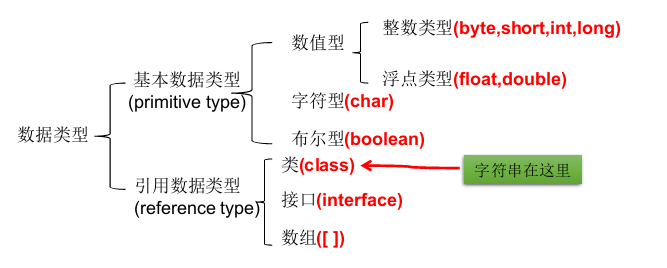

### 5.4.2 按声明位置

- 在方法体外，类体内声明的变量称为成员变量
- 在方法体内部声明的变量称为局部变量

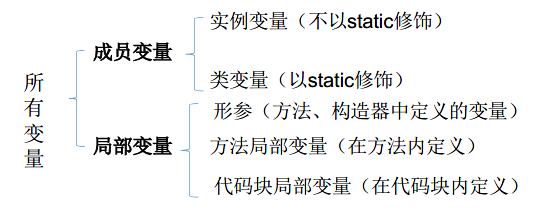

## 5.5 基本数据类型

### 5.5.1 整型

- java的整型常量默认为int
- 声明long型常量须后加‘l’或‘L’

| 类型  | 占用存储空间 / 字节 |        表数范围         |
| :---: | :-----------------: | :---------------------: |
| byte  |          1          |       -128 ~ 127        |
| short |          2          |     -2^15 ~ 2^15-1      |
|  int  |          4          | -2^31 ~ 2^31-1 (约21亿) |
| long  |          8          |      -263 ~ 263-1       |

### 5.5.2 浮点型

- 浮点型常量有两种表示形式：
  1. 十进制数形式，如：5.12、512.0f、.512 (必须有小数点）
  2. 科学计数法形式，如：5.12e2、512E2、100E-2
- Java的浮点型常量默认为double
- 声明float常量，须后加‘f’或‘F’
- 浮点型可能只是一个近似值，并非精确的值

|  类型  | 占用存储空间 / 字节 |                 表数范围                  |
| :----: | :-----------------: | :---------------------------------------: |
| float  |          4          | -3.403E38 ~ 3.403E38    精确到7位有效数字 |
| double |          8          |    -1.798E308 ~ 1.798E308    双倍精度     |

### 5.5.3 字符类型

- char型数据用来表示通常意义上“字符”

- Java中的所有字符都使用Unicode编码

- 字符型变量的三种表现形式：

  1. 字符常量是用单引号(‘ ’)括起来的单个字符。例如：`char c1 = 'a'; char c2
     = '中'; char c3 = '9';`

  2. Java中还允许使用转义字符‘\’来将其后的字符转变为特殊字符型常量。
     例如：`char c3 = ‘\n’; // '\n'表示换行符`

     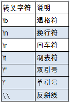

  3. 直接使用Unicode值来表示字符型常量：`'\uXXXX'`。其中，XXXX代表
     一个十六进制整数。如：\u000a 表示\n

- char类型是可以进行运算的，因为它都对应有Unicode码

#### 5.5.3.1 字节编码

1. ASCII码：128个符号，空格32、A65、a97
2. Unicode编码：只规定了符号的二进制码，没规定如何存储
3. UTF-8：互联网上使用最广的一种Unicode的实现方式。它是一种变长的编码方式，可以使用1-6个字节表示一个符号，根据不同的符号而变化字节长度

### 5.5.4 布尔型

- boolean类型数据只允许取值true和false，无null

## 5.6 数据类型转换

### 5.6.1 自动类型转换

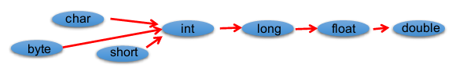

- 自动类型转换，从小到大
- 有多种类型的数据混合运算时，系统首先自动将所有数据转换成最大的那种数据类型，然后再进行计算
- boolean类型不参与转换
- byte、short、char之间不相互转换，直接转成int类型参与运算
- 当把任何基本数据类型的值和字符串(String)进行连接运算时(+)，基本数据类型的值将自动转化为字符串(String)类型

### 5.6.2 强制类型转换

- 自动类型转换的逆过程，将容量大的数据类型转换为容量小的数据类型
- 使用时要加上强制转换符()：`目标数据类型 变量名 = (目标数据类型) (被转换的数据);`
- 可能造成精度降低或溢出，格外要注意
- boolean类型不可以转换为其它的数据类型
- 通常，字符串不能直接转换为基本类型，但通过基本类型对应的包装类则可以实现把字符串转换成基本类型

### 5.6.3 练习题

1. 下面两种方式有区别吗？答：第二种强转有精度损失。

   ```java
   float f1 = 12.345f;
   float f2 = (float)12.345;
   ```

2. 下面的程序有问题吗，如果有，在哪里呢？答：第三句，自动转换位int型，赋值错误

   ```java
   byte b1 = 3;
   byte b2 = 4;
   byte b3 = b1 + b2;
   byte b4 = 3 + 4;
   ```

3. 下面的操作结果是什么呢？答：范围溢出

   ```java
   byte b = (byte)130;
   ```

4. 字符参与运算：是查找ASCII里面的值

   ```java
   System.out.println('a');     // a
   System.out.println('a' + 1);     // 98
   ```

5. 字符串参与运算：是字符串的连接

   ```java
   System.out.println("hello"+'a'+1);     // helloa1
   System.out.println('a'+1+"hello");     // 98hello
   System.out.println("5+5="+5+5);     // 5+5=55
   System.out.println(5+5+"=5+5");     // 10=5+5
   ```

## 5.7 进制

- 对于整数，有四种表示方式
  1. 二进制：由0，1组成。以0b开头
  2. 八进制：由0，1，...7组成。以0开头
  3. 十进制：由0，1，...9组成。整数默认是十进制
  4. 十六进制：由0，1，...9,a,b,c,d,e,f(大小写均可)组成。以0x开头

- 计算机以二进制补码的形式保存所有的整数

# 6 运算符

## 6.1 算术运算符

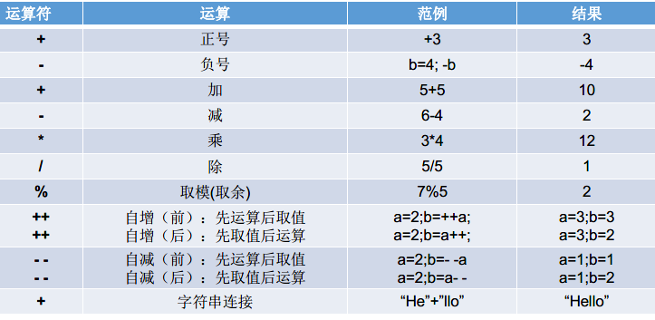

- 自增、自减单独使用：放在操作数据的前面和后面效果一样，a++或者++a效果一样

## 6.2 赋值运算符

- 符号：=
  - 当“=”两侧数据类型不一致时，可以使用自动类型转换或使用强制类型转换原则进行处理
  - 支持连续赋值，定义变量时不支持
- 扩展赋值运算符：+=、-=、*=、/=、%=

- 练习题： 请问下面面的代码哪个有问题？答：2

```java
short s = 1;
s = s + 1;
short s = 1;
s += 1;
```

## 6.3 比较运算符

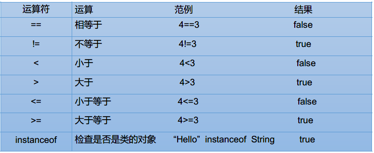

- 无论运算符两端简单还是复杂最终结果是boolean类型

## 6.4 逻辑运算符

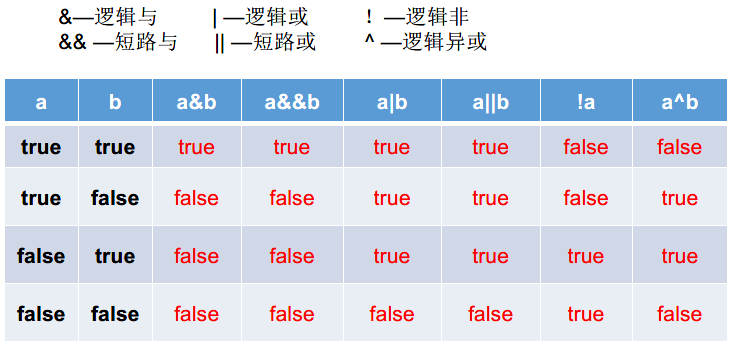

- 逻辑运算符用于连接boolean类型的式子
- &&和||：有短路效果，左边是false，右边不执行；&和|：没有

## 6.5 位运算符

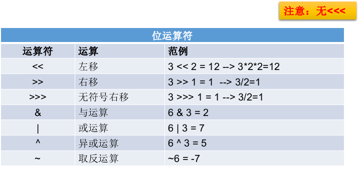

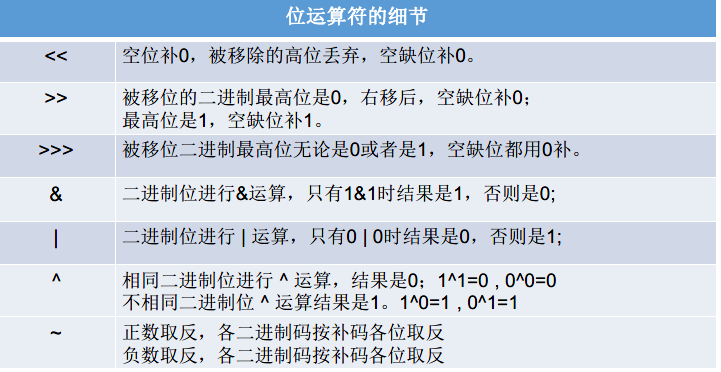

- ^的特殊用法：一个数据针对另一个数据位异或两次，该数不变

- 实现两个变量的交换
  - 方法一：采用第三方变量
  - 方法二：用位异或运算符：a = a^b;     b = a^b;     a = a^b;
- 请用最有效率的方式计算出2乘以8的结果：2<<3

## 6.6 三元运算符

- 语法格式：`比较表达式?表达式1:表达式2`

## 6.7 运算符的优先级

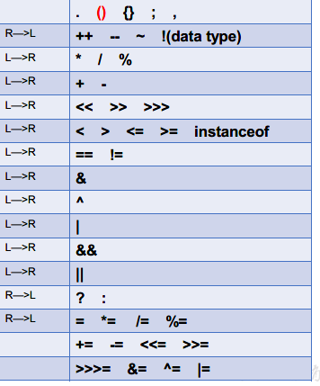

