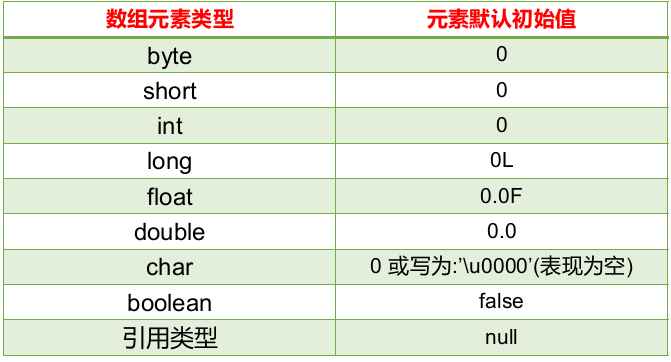
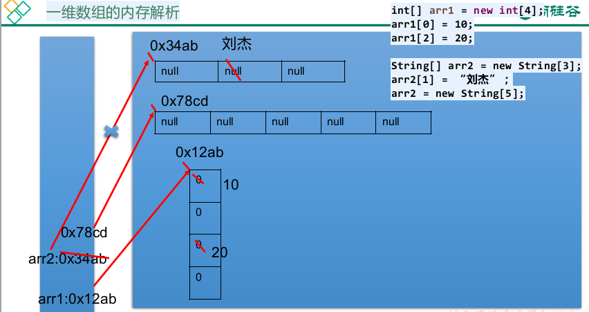
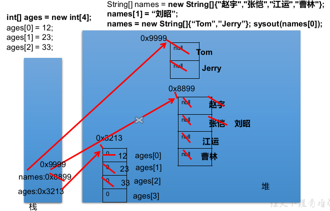
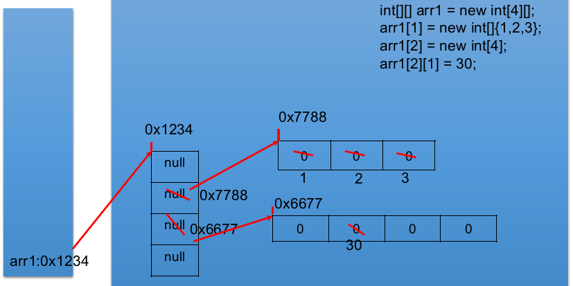
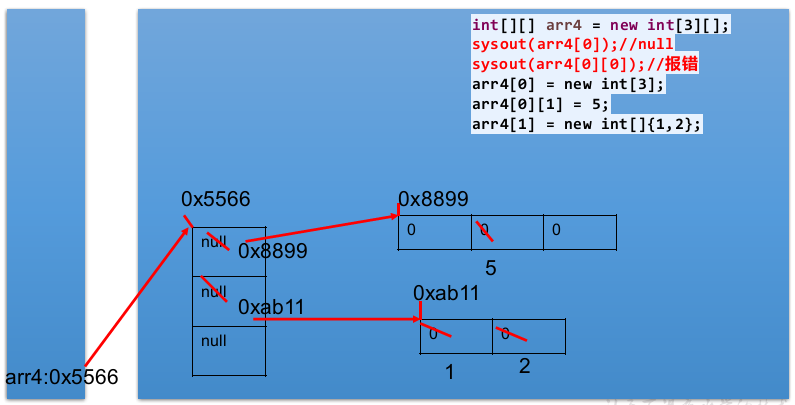

# 1 开发工具IntelliJ IDEA

## 1.1 概述

- IDEA是一个专门针对Java的集成开发工具(IDE)
- 由Java语言编写，所以需要有JRE运行环境并配置好环境变量

## 1.2 常用快捷键

|       快捷键       |                  功能                  |
| :----------------: | :------------------------------------: |
|     Alt+Enter      |          导入包，自动修正代码          |
|       Ctrl+Y       |          导入包，自动修正代码          |
|       Ctrl+D       | 复制光标所在行的内容，插入光标位置下面 |
|     Ctrl+Alt+L     |               格式化代码               |
|       Ctrl+/       |                单行注释                |
|    Ctrl+Shift+/    |  选中代码注释，多行注释，再按取消注释  |
|      Alt+Ins       | 自动生成代码，toString，get，set等方法 |
| Alt+Shift+上下箭头 |             移动当前代码行             |

# 2 方法

## 2.1 语法格式

```java
修饰符 返回值类型 方法名(参数列表){
	代码...   
	return ;
}
```

- 方法必须定义在一类中方法外，方法不能定义在另一个方法的里面
- 返回值类型，必须要和return语句返回的类型相同，否则编译失败

## 2.2 三种调用形式

1. 直接调用：直接写方法名调用，`    print();`
2. 赋值调用：调用方法，在方法前面定义变量，接收方法返回值，`int sum = getSum(5,6);`
3. 输出语句调用：不能用输出语句调用void类型的方法，因为方法执行后没有结果，也就打印不出任何内容，`System.out.println(getSum(5,6));`

## 2.3 方法重载

- **定义**：指在同一个类中，允许存在同名方法，只要它们的参数列表不同即可，与修饰符和返回值类型无关
- 参数列表不同：个数不同，数据类型不同，顺序不同
- 重载方法调用：JVM通过方法的参数列表，调用不同的方法

# 3 流程控制

## 3.1 顺序结构

- 程序从上到下逐行地执行，中间没有任何判断和跳转

## 3.2 分支结构

### 3.2.1 if-else结构

```java
// 第一种
if(条件表达式){
    ...
}

// 第二种
if(条件表达式){
    ...
} else{
    ...
}

// 第三种
if(条件表达式){
    ...
} else if(条件表达式){
    ...
} else{
    ...
}
```

- 条件表达式必须是布尔表达式（关系表达式或逻辑表达式）、布尔变量
- if-else语句结构，根据需要可以嵌套使用

### 3.2.2 switch-case结构

```java
switch(表达式){
    case 常量1:
        ...
        break;
    case 常量N:
        ...
        break;
    default:
        ...
        break;
}
```

- switch表达式的值必须是下述几种类型之一：byte、short、int、char、枚举(jdk5)、String(jdk7)
- case子句中的值必须是常量，不能是变量名或不确定的表达式值
- 同一个switch语句，所有case子句中的常量值互不相同
- break语句用来在执行完一个case分支后使程序跳出switch语句块；如果没有break，程序会顺序执行到switch结尾
- default子句是可选的，位置也是灵活的。当没有匹配的case时，
  执行default

## 3.3 循环结构

### 3.3.1 for循环

```java
for(1 初始化部分;2 循环条件部分;4 迭代部分){
    3 循环体部分;
}
```

- 执行过程：1234234234...2
- 2 循环条件部分为boolean类型表达式，当值为false时，退出循环
- 1 初始化部分可以声明多个变量，但必须是同一个类型，用逗号分隔
- 4 可以有多个变量更新，用逗号分隔

### 3.3.2 while循环

```java
1 初始化部分
while(2 循环条件部分){
    3 循环体部分;
    4 迭代部分;
}
```

- 执行过程：1234234234...2
- 注意不要忘记声明4 迭代部分。否则，循环将不能结束，变成死循环
- 最简单的死循环格式，可以编译通过
  1. while(true){...}
  2. for(;;){}
- for循环和while循环可以相互转换

### 1.3.3 do-while循环

```java
1 初始化部分
do{
    3 循环体部分;
    4 迭代部分;
}while(2 循环条件部分);
```

- 执行过程：134234234...2
- do-while循环至少执行一次循环体

## 3.4 控制跳转语句

### 3.4.1 break

```java
// break用于终止某个语句块的执行
{
    ...
    break;
    ...
}
// break出现在多层嵌套的语句块中时，可以通过标签指明要终止的时哪一层语句块
label1: {
    label2: {
        label3: {
            ...
            break label2;
            ...
        }
    }
}
```

### 3.4.2 continue

- continue只能使用在循环结构中，离开此应用场景无意义
- continue语句用于跳过其所在循环语句块的一次执行，继续下一次循环
- continue语句出现在多层嵌套的循环语句体中时，可以通过标签指明要跳过的是哪一层循环

### 3.4.3 return

- 并非专门用于结束循环的，它的功能是结束一个方法。
  当一个方法执行到一个return语句时，这个方法将被结束
- 与break和continue不同的是，return直接结束整个方法，不管这个return处于多少层循环之内
  

# 4 数组

## 4.1 概述

- 定义：数组是多个相同类型数据按一定顺序排列的集合容器，并使用一个名字命名，并通过编号的方式对这些数据进行统一管理

- 数组本身是引用数据类型，而数组中的元素可以是任何数据类型，包括基本数据类型和引用数据类型
- 创建数组对象会在内存中开辟一整块连续的空间，而数组名引用的是这块连续空间的首地址
- 数组的长度一旦确定，就不能修改
- 可以直接通过下标（或索引）的方式调用指定位置的元素，速度很快
- 数组的分类：
  1. 按照维度：一维数组、二维数组、三维数组、…
  2. 按照元素的数据类型分：基本数据类型元素的数组、引用数据类型元素的数组（即对象数组）

## 4.2 一维数组的使用

### 4.2.1 声明

- 声明方式

  ```java
  数据类型[] 数组名;     // 推荐
  数据类型 数组名[];
  ```

- Java语言中声明数组时不能指定其长度(数组中元素的数)，例如：int a[5]; //非法

### 4.2.2 初始化

#### 4.2.2.1 动态初始化

```java
数据类型[] 数组名字 = new 数据类型[长度];
```

- 数组声明且为数组元素分配空间与赋值的操作分开进行
- 数组是引用类型，它的元素相当于类的成员变量，因此数组一经分配空间，其中的每个元素也被按照成员变量同样的方式被隐式初始化，赋与默认值



#### 4.2.2.2 静态初始化

```java
数据类型[] 数组名 = new 数据类型[]{元素1,元素2,元素3...};
数据类型[] 数组名 = {元素1,元素2,元素3...};
```

- 在定义数组的同时就为数组元素分配空间并赋值
- 根据给出值，系统决定长度

### 4.2.3 元素访问

```java
数组名[索引]
```

### 4.2.4 数组长度

```java
数组名.length
```

- 属性length的执行结果是数组的长度，int类型结果
- 数组的最大索引值为数组名.length-1 

### 4.3.5 内存解析

#### 4.3.5.1 一个数组



#### 4.3.5.2 二个数组

                

## 4.3 多维数组的使用

### 4.3.1 初始化

```java
数据类型[][] 数组名 = new 数据类型[m][n];
数据类型[][] 数组名 = new 数据类型[m][]; // 二维数组中有m个一维数组。每个一维数组都是默认初始化值null
数据类型[][] 数组名 = new 数据类型[][]{{...},{...},{...}};
数据类型[][] 数组名 = {{...},{...},{...}};
非法：int[][] arr = new int[][3]; 
```

### 4.3.2 二维数组的内存解析





## 4.4 Arrays工具类的使用

- java.util.Arrays类即为操作数组的工具类，包含了排序和搜索的各种方法

|               方法                |                 注解                 |
| :-------------------------------: | :----------------------------------: |
|  boolean equals(int[] a,int[] b)  |         判断两个数组是否相等         |
|     String toString(int[] a)      |             输出数组信息             |
|    void fill(int[] a,int val)     |        将指定值填充到数组之中        |
|        void sort(int[] a)         |          对数组进行升序排序          |
| int binarySearch(int[] a,int key) | 对排序后的数组进行二分法检索指定的值 |

## 4.5 数组使用中的常见异常

- 数组脚标越界异常(ArrayIndexOutOfBoundsException)：访问了数组中的不存在的脚标时发生

  ```java
  int[] arr = new int[2];
  System.out.println(arr[2]);
  System.out.println(arr[-1]);
  ```

- 空指针异常(NullPointerException)：arr引用没有指向实体，却在操作实体中的元素时

  ```java
  int[] arr = null;
  System.out.println(arr[0]);
  ```
