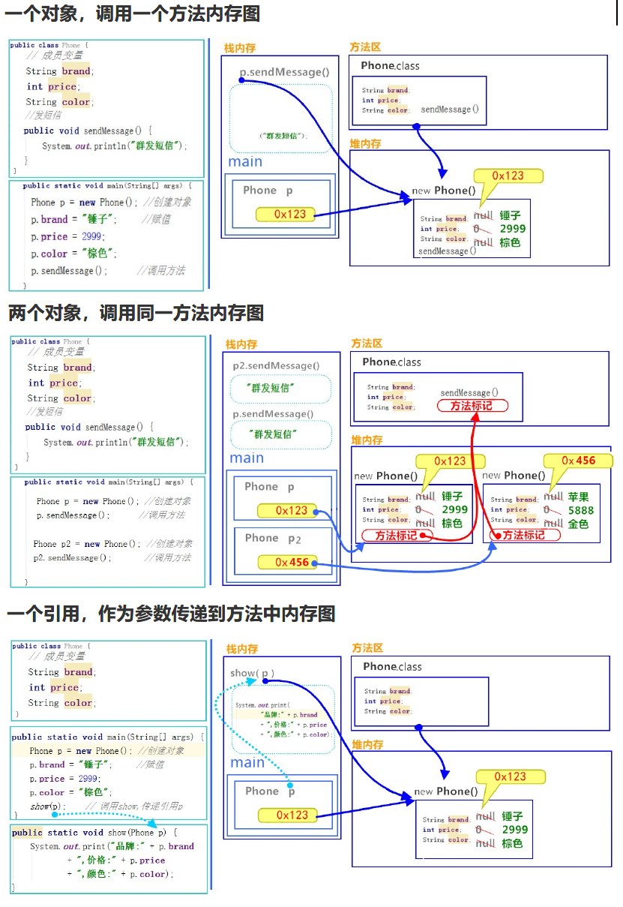
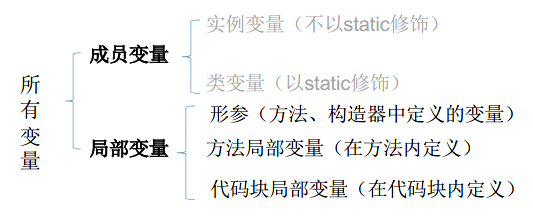

# 1 类和对象

## 1.1 类的构成

- 类是Java语言最基本的单位

- 类的成员构成：成员变量、成员方法、构造器、代码块、内部类

## 1.2 类的语法格式

```java
修饰符 class 类名{
    属性声明；
    方法声明；
}
```

## 1.3 对象的创建及使用

### 1.3.1 语法格式

- 创建对象语法格式：`类名 对象名 =  new 类名();`
- 访问对象成员（变量和方法）语法格式：`对象名.对象成员`

### 1.3.2 类的访问机制

- 在一个类中的访问机制：类中的方法可以直接访问类中的成员变量
  - 例外：static方法访问非static，编译不通过
- 在不同类中的访问机制：先创建要访问类的对象，再用对象访问类中定义的成员

### 1.3.3 内存解析



###  1.3.4 匿名对象

- 定义：不定义对象的句柄，而直接调用这个对象的方法，如：`new Person().shout();`
- 应用场景：
  1. 对一个对象只需要进行一次方法调用，可以使用
  2. 作为实参传递给一个方法调用

#  2 类的成员之一：成员变量

## 2.1 语法格式

```java
修饰符 数据类型 属性名 = 初始化值;
```

1. 修饰符
   - 常用的权限修饰符有：private、缺省、protected、public
   - 其他修饰符：static、final（暂不考虑）
2. 数据类型：任何基本数据类型（如int、boolean)或任何引用数据类型
3. 属性名：属于标识符，符合命名规则和规范即可

## 2.2 变量的分类：成员变量与局部变量

### 2.2.1 定义

- 成员变量：在方法体外，类体内声明的变量
- 局部变量：在方法体内，声明的变量



### 2.2.2 区别

|              |             成员变量             |                 局部变量                 |
| :----------: | :------------------------------: | :--------------------------------------: |
|  声明的位置  |          直接声明在类中          |   方法形参或内部、代码块内、构造器内等   |
|    修饰符    | private、public、Static、final等 |  不能用权限修饰符修饰，可以用final修饰   |
|   初始化值   |          有默认初始化值          | 没有默认初始化值，心须显式赋值，方可使用 |
| 内存加载位置 |         堆空间或静态域内         |                  栈空间                  |

# 3 类的成员之二：成员方法

## 3.1 语法格式

```java
修饰符 返回值类型 方法名(参数类型 形参1, 参数类型 形参2, ...){
    方法体程序代码
    return 返回值;
}
```

1. 修饰符：public、缺省、private、protected
2. 返回值类型：
   - 没有返回值：
     void
   - 有返回值，声明出返回值的类型
3. 方法名：属于标识符，命名时遵循标识符命名规则和规范
4. 形参列表：可以包含零个，一个或多个参数
5. 返回值：方法在执行完毕后返还给调用它的程序的数据

## 3.2 方法的重载(overload)

- 概念：同一个类中，允许存在一个以上的同名方法，只要参数个数、类型、顺序不同即可
- 特点：与返回值类型无关，只看参数列表，且参数列表必须不同(参数个数、参数类型、参数顺序)。调用时，根据方法参数列表的不同来区别
- 原理：因为编译器调用时看不见返回值，只能看见方法名和参数列表，称为静态绑定

## 3.3 可变个数的形参

- 定义格式：`方法名(参数的类型名...参数名)`
- 可变参数：方法参数部分指定类型的参数个数是可变多个：0个，1个或多个
- 可变个数形参的方法与同名的方法之间，彼此构成重载
- 可变参数方法的使用与方法参数部分使用数组是一致的
- 方法的参数部分有可变形参，需要放在形参声明的最后
- 在一个方法的形参位置，最多只能声明一个可变个数形参

## 3.4 方法参数的值传递机制

- Java里方法的参数传递方式只有一种：**值传递**。
  - 形参是基本数据类型：将实参基本数据类型变量的“数据值”传递给形参
  - 形参是引用数据类型：将实参引用数据类型变量的“地址值”传递给形参
- 类作为形式参数的问题，实际需要的是一个具体的对象

# 4 类的成员之三：构造器

## 4.1 特点

- 具有与类相同的名称
- 不声明返回值类型（与声明为void不同）
- 不能被static、final、synchronized、abstract、native修饰
- 不能有return语句返回值，但是可以`return;`

## 4.2 作用

- 创建对象时，给对象进行初始化

## 4.3 语法格式

```java
修饰符 类名(参数列表){
    初始化语句；
}
```

## 4.4 分类

- 隐式无参构造器（系统默认提供）
- 显式定义一个或多个构造器（无参、有参）

## 4.5 注意事项

- Java语言中，每个类都至少有一个构造器
- 默认构造器的修饰符与所属类的修饰符一致
- 一旦显式定义了构造器，则系统不再提供默认构造器
- 一个类可以创建多个重载的构造器
- 父类的构造器不可被子类继承

# 5 类的成员之四：代码块

## 5.1 定义

- 用{}括起来的代码

## 5.2 分类

1. 局部代码块：用于限定变量的生命周期，及早释放，提高内存利用率
2. 构造代码块：把多个构造方法中相同的代码可以放到这里，每个构造方法执行前，首先执行构造代码块
3. 静态代码块：用static修饰的代码块
   - 可以对类的属性、类的声明进行初始化操作
   - 不可以对非静态的属性初始化。即：不可以调用非静态的属性和方法
   - 若有多个静态的代码块，那么按照从上到下的顺序依次执行
   - 静态代码块的执行要先于非静态代码块
   - 静态代码块随着类的加载而加载，且只执行一次

## 5.3 执行顺序

1. 静态Fu变量初始化 < 静态代码块Fu
2. 静态Zi变量初始化 < 静态代码块Zi
3. Fu变量初始化 < Fu构造代码块 < Fu构造方法
4. Zi变量初始化< Zi构造代码块 < Zi构造方法

# 6 类的成员之五：内部类

## 6.1 定义

- 在Java中，允许一个类的定义位于另一个类的内部，前者称为内部类，后者称为外部类
- 内部类的名字不能与包含它的外部类类名相同

## 6.2 访问规则

- 可以直接访问外部类的成员，包括私有
- 外部类要想访问内部类成员，必须创建对象

## 6.3 分类

### 6.3.1 成员内部类

#### 6.3.1.1 定义

- 和外部类不同，内部类可以声明为private或protected
- 可以调用外部类的结构
- 可以声明为static的，但不能调用非static的成员
- 可以声明为abstract类，因此可以被其它的内部类继承
- 可以声明为final的
- 创建非静态的成员内部类：`外部类名.内部类名 对象名 = new 外部类名.new 内部类名();`
- 创建静态的成员内部类：`外部类名.内部类名 对象名 = new 外部类名.内部类名();`
- 编译以后生成OuterClass$InnerClass.class字节码文件（也适用于局部内部类）

#### 6.3.1.2 注意

- 非static的成员内部类中的成员不能声明为static的，只有在外部类或static的成员内部类中才可声明static成员
- 外部类访问成员内部类的成员，需要“内部类.成员”或“内部类对象.成员”的方式
- 成员内部类可以直接使用外部类的所有成员，包括私有的数据
- 当想要在外部类的静态成员部分使用内部类时，可以考虑内部类声明为静态的

### 6.3.2 局部内部类

- 局部内部类访问局部变量必须加final修饰
- 原因：局部变量使用完毕就消失，而堆内存的数据并不会立即消失。堆内存仍用该变量，而变量已经没有了。为了让该值还存在，就加final修饰
- 通过反编译工具我们看到了，加入final后，堆内存直接存储的是值，而不是变量名
- 局部内部类和局部变量地位类似，不能使用public、protected、缺省、private
- 局部内部类不能使用static修饰，因此也不能包含静态成员

### 6.3.3 匿名内部类

#### 6.3.3.1 注意

- 匿名内部类必须继承父类或实现接口
- 匿名内部类只能有一个对象
- 匿名内部类对象只能使用多态形式引用

#### 6.3.3.2 语法格式

```java
new 父类构造器(实参列表)|实现接口() {
 	重写方法;
}
```

#### 6.3.3.3 使用场景

- 在开发的时候，如果抽象类，或者接口作为参数，且该方法仅仅调用一次，就可以使用匿名内部类的格式简化