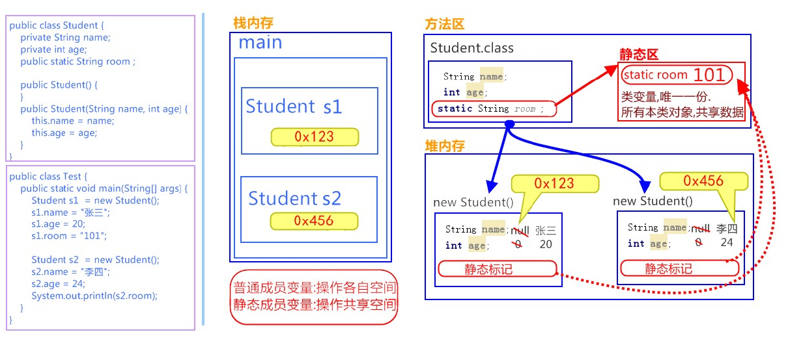

# 1 关键字：package、import

## 1.1 关键字package

- package语句作为Java源文件的第一条语句，指明该文件中定义的类所在的包（若缺省该语句，则指定为无名包）
- 语法格式为：
  `package 顶层包名.子包名;`
- 包对应于文件系统的目录，package语句中，用“.”来指明包（目录）的层次
- 包通常用小写单词标识，通常使用所在公司域名的倒置

## 1.2 包的作用

- 包帮助管理大型软件系统：将功能相近的类划分到同一个包中。比如：MVC的设计模式
- 包可以包含类和子包，划分项目层次，便于管理
- 解决类命名冲突的问题
- 控制访问权限

## 1.3 关键字import

- 为使用定义在不同包中的Java类，需用import语句来引入指定包层次下所需要的类或全部类(.*)。
- 语法格式：
  `import 包名. 类名;`

# 2 关键字：this

## 2.1 定义

- 它在方法内部使用，即这个方法所属对象的引用
- 它在构造器内部使用，表示该构造器正在初始化的对象

## 2.2 作用

- this可以调用类的属性、方法和构造器

## 2.3 应用场景

- 当在方法内需要用到调用该方法的对象时，就用this
- 解决了局部变量隐藏成员变量的问题
- 可以在一个构造函数中调用本类的其它构造函数

## 2.4 注意

- 可以在类的构造器中使用"this(形参列表)"的方式，调用本类中重载的其他的构造器
- 明确：构造器中不能通过"this(形参列表)"的方式调用自身构造器
- 如果一个类中声明了n个构造器，则最多有n - 1个构造器中使用了
  "this(形参列表)"
- "this(形参列表)"必须声明在类的构造器的首行
- 在类的一个构造器中，最多只能声明一个"this(形参列表)"

# 3 关键字：super

## 3.1 作用

- 在Java类中使用super来调用父类中的指定操作

## 3.2 注意

- 尤其当子父类出现同名成员时，可以用super表明调用的是父类中的成员
- super的追溯不仅限于直接父类
- super和this的用法相像，this代表本类对象的引用，super代表父类的**内存空间的标识**
- 子类的每个构造方法中均有默认的super()，调用父类的空参构造，手动调用父类构造会覆盖默认的super()
- super() 和this() 都必须是在构造方法的第一行，所以不能同时出现

## 3.2 this和super的区别

|   区别点   |                             this                             |                  super                   |
| :--------: | :----------------------------------------------------------: | :--------------------------------------: |
|  访问属性  | 访问本类中的属性，如果本类没有此属性则从父类中继续查找直接访问父类中的属性 |           直接访问父类中的属性           |
|  调用方法  |    访问本类中的方法，如果本类没有此方法则从父类中继续查找    |           直接访问父类中的方法           |
| 调用构造器 |             调用本类构造器，必须放在构造器的首行             | 调用父类构造器，必须放在子类构造器的首行 |

# 4 关键字：static

## 4.1 使用范围

- 在Java类中，可用static修饰属性、方法、代码块、内部类

## 4.2 特点

- 随着类的加载而加载，优先与对象存在
- 被类的所有对象共享
- 可以通过类名调用：既可以通过对象名调用，也可以通过类名调用，建议通过类名调用

## 4.3 内存图

## 4.4 注意事项

- 在静态方法中没有this对象：静态随class加载，比对象先存在；也不能有super 
- 静态只能访问静态：在static方法内部只能访问类的static修饰的属性或方法，不能访问类的非static的结构
- static修饰的方法不能被重写

# 5 关键字：final

## 5.1 特点

- 它修饰的类，不能被继承
- 它修饰的方法，不能被重写
- 它修饰的变量，是一个常量

## 5.2 注意

- 修饰局部变量只能赋值一次，不能再更改
- 常见的赋值时机：定义的时候(推荐)；构造方法中

- 基本类型值不能发生改变
- 引用类型地址值不能发生改变，但是对象的内容是可以改变

# 6 权限修饰符

|           | 本类 | 同一个包下 | 不同包下的子类 | 不同包下的无关类 |
| --------- | ---- | ---------- | -------------- | ---------------- |
| private   | Y    |            |                |                  |
| 默认      | Y    | Y          |                |                  |
| protected | Y    | Y          | Y              |                  |
| public    | Y    | Y          | Y              | Y                |

# 7 总结：常见的修饰符

## 7.1 分类

- 权限修饰符：private,默认,protected,public
- 状态修饰符：static,final
- 抽象修饰符：abstract

## 7.2 常见的搭配

- 类：默认,public,final,abstract
- 成员变量：private,默认,protected,public,static,final
- 构造方法：private,默认,protected,public
- 成员方法：private,默认,protected,public,static,final,abstract

 

 