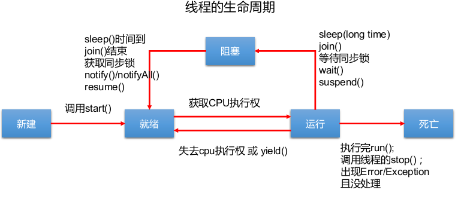

# 1 基本概念

## 1.1 程序、进程、线程

- **程序**：是为完成特定任务、用某种语言编写的一组指令集合，即指一段静态的代码
- **进程**：是程序的一次执行过程，或是正在运行的一个程序。是一个动态的过程，有它自身的生命周期，是资源分配和调用的独立单位，系统在运行时会为每个进程分配不同的内存区域
- **线程**：进程的执行单元，是一个程序内部的一条执行路径
  - 若一个进程同一时间并行执行多个线程，就是支持多线程的
  - 线程作为调度和执行的单位，每个线程拥有独立的运行栈和程序计数器(pc)，线程切换的开
    销小
  - 一个进程中的多个线程共享相同的内存单元/内存地址空间
  - 它们从同一堆中分配对象，可以访问相同的变量和对象。这就使得线程间通信更简便、高效。但多个线程操作共享的系统资源可能就会带来安全的隐患

## 1.2 JVM多线程

- 一个Java应用程序java.exe，其实至少有三个线程：main()主线程，gc()
  垃圾回收线程，异常处理线程。当然如果发生异常，会影响主线程

## 1.3 并行与并发

- 并行：多个CPU同时执行多个任务
- 并发：一个CPU(采用时间片)同时执行多个任务

# 2 线程的创建和使用

## 2.1 线程的创建和启动

### 2.1.1 Thread类的特性

- 每个线程都是通过某个特定Thread对象的run()方法来完成操作的，经常把run()方法的主体称为线程体
- 通过该Thread对象的start()方法来启动这个线程，而非直接调用run()

### 2.1.2 Thread类的构造器

- Thread()：创建新的Thread对象
- Thread(String threadName)：创建线程并指定线程实例名
- Thread(Runnable target)：指定创建线程的目标对象，它实现了Runnable接口中的run方法
- Thread(Runnable target, String name)：创建新的Thread对象

## 2.2 创建线程的两种方式

### 2.2.1 继承Thread类

- 流程
  1. 定义子类继承Thread类
  2. 子类中重写Thread类中的run方法
  3. 创建Thread子类对象，即创建了线程对象
  4. 调用线程对象start方法：启动线程，调用run方法
- 注意点
  1. 如果自己手动调用run()方法，那么就只是普通方法，没有启动多线程模式
  2. run()方法由JVM调用，什么时候调用，执行的过程控制都有操作系统的CPU调度决定
  3. 想要启动多线程，必须调用start方法
  4. 一个线程对象只能调用一次start()方法启动，如果重复调用了，则将抛出以上的异常“IllegalThreadStateException”

### 2.2.2 实现Runnable接口

1. 定义子类，实现Runnable接口
2. 子类中重写Runnable接口中的run方法
3. 通过Thread类含参构造器创建线程对象
4. 将Runnable接口的子类对象作为实际参数传递给Thread类的构造器中
5. 调用Thread类的start方法：开启线程，调用Runnable子类接口的run方法

### 2.2.3 区别

- 区别
  - 继承Thread：线程代码存放Thread子类run方法中
  - 实现Runnable：线程代码存在接口的子类的run方法
- 实现方式的好处
  - 避免了单继承的局限性
  - 多个线程可以共享同一个接口实现类的对象，非常适合多个相同线程来处理同一份资源

## 2.3 Thread类的有关方法

- void start()：启动线程，并执行对象的run()方法
- run()：线程在被调度时执行的操作
- String getName()：返回线程的名称
- void setName(String name)：设置该线程名称
- static Thread currentThread(): 返回当前线程，在Thread子类中就是this，通常用于主线程和Runnable实现类
- static void yield()：线程让步，暂停当前正在执行的线程，把执行机会让给优先级相同或更高的线程，若队列中没有同优先级的线程，忽略此方法
- join()：当某个程序执行流中调用其他线程的join() 方法时，调用线程将被阻塞，直到join()方法加入的join线程执行完为止，低优先级的线程也可以获得执行
- static void sleep(long millis)：(指定时间:毫秒)，令当前活动线程在指定时间段内放弃对CPU控制，使其他线程有机会被执行，时间到后重排队。
  抛出InterruptedException异常
- stop()：强制线程生命期结束，不推荐使用
- boolean isAlive()：返回boolean，判断线程是否还活着

## 2.4 线程的调度

- 调度策略：时间片、抢占式
- 线程的优先级等级
  - MAX_PRIORITY：10
  - MIN _PRIORITY：1
  - NORM_PRIORITY：5
- 涉及的方法
  - getPriority() ：返回线程优先值
  - setPriority(int newPriority) ：改变线程的优先级
- 说明
  - 线程创建时继承父线程的优先级
  - 低优先级只是获得调度的概率低，并非一定是在高优先级线程之后才被调用

## 2.5 线程的分类

- Java中的线程分为两类：一种是守护线程，一种是用户线程
- 守护线程是用来服务用户线程的，通过在start()方法前调用thread.setDaemon(true)可以把一个用户线程变成一个守护线程
- Java垃圾回收就是一个典型的守护线程
- 若JVM中都是守护线程，当前JVM将退出

# 3 线程的生命周期

1. 新建：当一个Thread类或其子类的对象被声明并创建时，新生的线程对象处于新建状态
2. 就绪：处于新建状态的线程被start()后，将进入线程队列等待CPU时间片，此时它已具备了运行的条件，只是没分配到CPU资源
3. 运行：当就绪的线程被调度并获得CPU资源时,便进入运行状态，run()方法定义了线程的操作和功能
4. 阻塞：在某种特殊情况下，被人为挂起或执行输入输出操作时，让出CPU 并临时中止自己的执行，进入阻塞状态
5. 死亡：线程完成了它的全部工作或线程被提前强制性地中止或出现异常导致结束



# 4 线程的同步

## 4.1 安全问题

- 当多条语句在操作同一个线程共享数据时，一个线程对多条语句只执行了一部分，还没有
  执行完，另一个线程参与进来执行。导致共享数据的错误
- 解决办法：同步机制

## 4.2 同步代码块

```java
synchronized (对象){
	// 需要被同步的代码；
}
```

## 4.3 同步方法

```java
public synchronized void show (String name){
	…
}
```

## 4.4 同步锁机制

### 4.4.1 synchronized的锁是什么

- 任意对象都可以作为同步锁。所有对象都自动含有单一的锁（监视器）
- 同步方法的锁：静态方法（类名.class）、非静态方法（this）
- 同步代码块：自己指定，很多时候也是指定为this或类名.class

### 4.4.2 注意

- 必须确保使用同一个资源的多个线程共用一把锁，这个非常重要，否则就无法保证共享资源的安全
- 一个线程类中的所有静态方法共用同一把锁（类名.class），所有非静态方法共用同一把锁（this），同步代码块（指定需谨慎）

### 4.4.3 释放锁的操作

- 当前线程的同步方法、同步代码块执行结束
- 当前线程在同步代码块、同步方法中遇到break、return终止了该代码块、
  该方法的继续执行
- 当前线程在同步代码块、同步方法中出现了未处理的Error或Exception，导致异常结束
- 前线程在同步代码块、同步方法中执行了线程对象的wait()方法，当前线
  程暂停，并释放锁

### 4.4.4 不会释放锁的操作

- 线程执行同步代码块或同步方法时，程序调用Thread.sleep()、
  Thread.yield()方法暂停当前线程的执行
- 线程执行同步代码块时，其他线程调用了该线程的suspend()方法将该线程挂起，该线程不会释放锁（同步监视器）
- 应尽量避免使用suspend()和resume()来控制线程

### 4.4.5 线程的死锁问题

- 死锁：不同的线程分别占用对方需要的同步资源不放弃，都在等待对方放弃
  自己需要的同步资源，就形成了线程的死锁
- 出现死锁后，不会出现异常，不会出现提示，只是所有的线程都处于阻塞状态，无法继续
- 解决方法
  - 专门的算法、原则
  - 尽量减少同步资源的定义
  - 尽量避免嵌套同步

## 4.5 Lock锁

- 从JDK5开始，Java提供了通过显式定义同步锁对象来实现同步
- 同步锁使用Lock对象充当
- java.util.concurrent.locks.Lock接口是控制多个线程对共享资源进行访问的工具
- 锁提供了对共享资源的独占访问，每次只能有一个线程对Lock对象加锁，线程开始访问共享资源之前应先获得Lock对象
- ReentrantLock类实现了Lock ，它拥有与synchronized相同的并发性和内存语义，在实现线程安全的控制中，比较常用的是ReentrantLock，可以显式加锁、释放锁

```java
class A{
	private final ReentrantLock lock = new ReenTrantLock();
	public void m(){
		lock.lock();
		try{
			//保证线程安全的代码;
		} finally{
			lock.unlock();
		}
	}
}
```

## 4.6 synchronized与Lock的对比

1. Lock是显式锁（手动开启和关闭锁，别忘记关闭锁），synchronized是隐式锁，出了作用域自动释放
2. Lock只有代码块锁，synchronized有代码块锁和方法锁
3. 使用Lock锁，JVM将花费较少的时间来调度线程，性能更好。并且具有更好的扩展性（提供更多的子类）
4. 优先使用顺序：
  Lock>同步代码块（已经进入了方法体，分配了相应资源）>同步方法
  （在方法体之外）

# 5 线程的通信

## 5.1 wait()与notify()和notifyAll()

- wait()：令当前线程挂起并放弃CPU、同步资源并等待，使别的线程可访问并修改共享资源，而当前线程排队等候其他线程调用notify()或notifyAll()方法唤醒，唤醒后等待重新获得对监视器的所有权后才能继续执行
- notify()：唤醒正在排队等待同步资源的线程中优先级最高者结束等待
- notifyAll ()：唤醒正在排队等待资源的所有线程结束等待
- 这三个方法只有在synchronized方法或synchronized代码块中才能使用，否则会报
  java.lang.IllegalMonitorStateException异常
- 因为这三个方法必须有锁对象调用，而任意对象都可以作为synchronized的同步锁，
  因此这三个方法只能在Object类中声明

## 5.2 wait() 方法

- 在当前线程中调用方法：对象名.wait()
- 使当前线程进入等待（某对象）状态，直到另一线程对该对象发出notify
  (或notifyAll) 为止
- 调用方法的必要条件：当前线程必须具有对该对象的监控权（加锁）
- 调用此方法后，当前线程将释放对象监控权，然后进入等待
- 在当前线程被notify后，要重新获得监控权，然后从断点处继续代码的执行

## 5.3 notify()/notifyAll()

- 在当前线程中调用方法：对象名.notify()
- 功能：唤醒等待该对象监控权的一个/所有线程
- 调用方法的必要条件：当前线程必须具有对该对象的监控权（加锁）

# 6 JDK5新增的线程创建和管理方式

## 6.1 新增创建方式一：实现Callable接口

- 与使用Runnable相比，Callable功能更强大些
  - 相比run()方法，可以有返回值
  - 方法可以抛出异常
  - 支持泛型的返回值
  - 需要借助FutureTask类，比如获取返回结果
- Future接口
  - 可以对具体Runnable、Callable任务的执行结果进行取消、查询是否完成、获取结果等
  - FutrueTask是Futrue接口的唯一的实现类
  - FutureTask 同时实现了Runnable、Future接口。它既可以作为
    Runnable被线程执行，又可以作为Future得到Callable的返回值

## 6.2 新增创建方式二：使用线程池

### 6.2.1 线程池相关API

#### 6.2.1.1 ExecutorService：真正的线程池接口

- 常见子类ThreadPoolExecutor
- void execute(Runnable command) ：执行任务/命令，没有返回值，一般用来执行
  Runnable
- <T> Future<T> submit(Callable<T> task)：执行任务，有返回值，一般又来执行
  Callable
- void shutdown() ：关闭连接池

#### 6.2.1.2 Executors：工具类、线程池的工厂类

- 用于创建并返回不同类型的线程池
- Executors.newCachedThreadPool()：创建一个可根据需要创建新线程的线程池
- Executors.newFixedThreadPool(n)：创建一个可重用固定线程数的线程池
- Executors.newSingleThreadExecutor() ：创建一个只有一个线程的线程池
- Executors.newScheduledThreadPool(n)：创建一个线程池，它可安排在给定延迟后运行命令或者定期地执行

## 6.3 新增管理方式一：线程组

- Java中使用ThreadGroup来表示线程组，它可以对一批线程进行分类管理，Java允许程序直接对线程组进行控制
- 默认情况下，所有的线程都属于主线程组
- public final ThreadGroup getThreadGroup()
- Thread(ThreadGroup group, Runnable target, String name)：给线程设置分组

 
