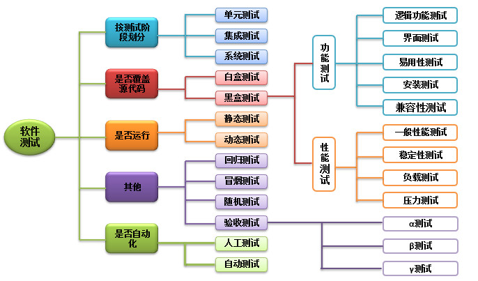

# 一、软件质量基础

## 1. 测试级别

软件的开发都会依据相应的开发模型， 测试级别指的就在这个模型当中我们人为定义的开发步骤。其中对于测试来说我们最常见的一种级别分类如下： 

1. **单元测试** [ UT unit test ]：在软件测试中单元指的就是组成软件最小的底层代码结构， 一般就是类、函数、组件（当下的软件测试行业，不会刻意要求测试人员对源代码进行测试）
2. **集成测试** [ IT system integration test ]：将多个单元模块组合在一起，然后验证它们之间沟通的"桥梁"是否能正常工作（接口测试）
3. **系统测试** [ ST system test ]：这是当前行业做的最多的一种测试。由测试人员充当用户，然后对软件的功能主体进行测试
4. **验收测试**
   - α测试 ---- 内测 
   - β测试 ---- 公测 
   - UAT测试 [ user acceptance test ] ---- 由客户派出对于业务非常精通的人员来使用该软件，从而对功能进行测试
   - 验收测试的核心就是让用户为当前软件"买单" 

## 2. 系统测试分类 

1. 功能测试：验证当前的软件主体功能是否可用

2. 兼容性测试：验证当前软件在不同的环境下是否还可以使用

3. 安全测试：验证软件是否只是能授权用户提供功能使用

4. 性能测试：相对于当前软件消耗的资源，检验它的产出能力

## 3. 常见的系统测试方法 

### 3.1. 按测试对象进行分类 

1. 白盒测试：这种测试的主体就是软件的底层代码，不会在意外在的界面是否OK ，只要求底层功能实现，同时逻辑正确
2. 黑盒测试：这种测试就是指测试软件外在主体功能是否可用
3. 灰盒测试：介于二者之间（接口测试） 
4. 上述三种方法当中的"盒"指的就是被测对象

### 3.2. 按测试对象是否执行分类 

1. 静态测试：指的就是测试不执行
2. 动态测试：将软件运行在真实的使用环境中进行测试

### 3.3. 按测试手段进行分类 

1. 手工测试：由测试人员手动的对被测对象进行验证，优点就是可以灵活的改变测试操作及环境
2. 自动化测试：所谓自动化主要有二种形，一种是自已写测试脚本，另外一种就是通过第三方的工具对被测对象进行测试。优点就是可以高效率的去执行一些人工无法实现的操作

## 4. 软件测试流程 

### 4.1. 需求分析 

1. 当前阶段的核心目的就是梳理清楚我们需要设计的点是什么
2. 需求的来源：需求规格说明书、API 文档、竟品分析、个人经验 

### 4.2. 设计用例

1. 用例就是用户为了测试软件的某个功能而执行的操作过程
2. 设计用例是有方法的（等价类、边界值、判定表......） 

### 4.3. 评审用例

对当前的用例进行添加或者删除

### 4.4. 配置环境

环境分类：操作系统 + 服务器软件 + 数据库 + 软件底层代码的执行环境

### 4.5. 执行用例

1. 冒烟测试：一般在执行用例之前执行，核心就是快速的对当前软件的核心功能或者主体执行流程进行验证。如果冒烟测试阶段有问题，则可以将此版本回退给开发
2. 如果冒烟测试通过那么才会开展示全面的测试。 

### 4.6. 回归测试及缺陷跟踪 

1. 回归测试：指的就是当我们将某个缺陷提交给开发修复，修复完成之后需要测试人员再次对其进行测试
2. 缺陷跟踪：指的就是当测试人员发现某个缺陷之后需要一直对其进行状态的跟踪

### 4.7. 输出测试报告 

将当前的测试过程中产生的数据进行可视化的输出。方便其它人去查看 

### 4.8. 测试结束 

当将整个测试过程中产生的一些文档进行整理归档，方便后续版本使用

# 二、开发模型

## 1. 瀑布模型

优点：开发阶段，各个阶段比较清晰；强调早期计划及需求调查；适合稳定需求的产品开发

改良：每个阶段都可以融入小的迭代工作

## 2. 快速原型模型

实现一个基本原型，让用户对原型进行评价，逐步调整，使其满足用户最终需求

优点：适合不能确定需求的软件

缺点：不适合开发大型系统

## 3. 螺旋模型

将开发过程分为几个螺旋周期，每个螺旋周期大致和瀑布模型相符合

优点：是一种风险驱动的方法体系，因为在每个阶段之前及经常发生的循环之前，都必须首先进行风险评估

缺点：如果未能够及时标识风险，势必造成重大损失。过多的迭代次数会增加开发成本，延迟提交时间

# 三、测试模型

## 1. V模型

流程：需求分析、概要设计、详细设计、编码、单元测试、集成测试、系统测试、验收测试

- 单元测试：又称模块测试，针对单一的程序模块进行的测试
- 集成测试：又叫组装测试，在单元测试的基础上，对所有模块进行测试。
- 系统测试：将整个软件看做一个整体来进行测试，包括功能、性能、兼容性
- 验收测试：
  - 内测版（alpha）内部交流版本，可能存在很多bug，不建议用户安装
  - 公测版（beta）面向所有用户，通过用户的反馈再去修改细节
  - 候选版（gamma）与正式软件相差无几
- 优点：包含了底层测试（单元测试）和高层测试（系统测试）；清楚的标识了开发和测试的各个阶段；自上而下逐步求精，每个阶段分工明确，便于整体项目的把控
- 缺点：自上而下的顺序导致了，测试工作在编码之后，就导致错误不能及时的进行修改；实际工作中，需求经常变化，导致v模型步骤，反复执行，返工量很大，灵活度较低
- 改良：每个步骤都可以进行小的迭代工作

## 2. W模型

由开发一个V，测试一个V对应组合而成（w模型也叫双v模型）；测试伴随着整个软件开发周期，并且测试的对象不仅仅是程序，需求和设计同样要测试

开发流程：需求分析、概要设计、详细设计、编码、集成、实施、交付

测试流程：验收/系统测试设计、基础测试设计、单元测试设计、单元测试、集成测试、系统测试、验收测试

- 优点：开发和测试伴随着整个开发周期，需求和设计同样要测试；更早的介入测试，可以发现初期的缺陷，修复成本低；分阶段工作，方便项目整体管理
- 缺点：开发和测试依然是线性的关系，需求的变更和调整，依然不方便；如果没有文档，根本无法执行w模型；对于项目组成员的技术要求更高

## 3. H模型

将测试活动完全独立出来，形成一个完全独立的流程，同时将测试准备和测试执行也清晰表现出来

- 测试准备：所有测试执行活动的准备；判断是否到测试就绪点
- 测试就绪点：测试准入准则，即是否可以开始执行测试的条件
- 测试执行：具体的执行测试的程序

## 4. 总结

v模型适用于中小企业

w模型适用于中大型企业（因为人员要求高）

h模型人员要求非常高，很少有公司使用

# 四、软件测试分类

# 五、测试用例

## 1. 等价类划分法

属于黑盒测试，它将不能穷举的测试过程进行分类，从而保证完整性和代表性

思考步骤：

1. 确定有效等价类和无效等价类
2. 有效等价类划分（题目条件，还要注意边界值（极值），中间再随意找个值）
3. 无效等价类划分（跟有效等价类相反，其它特殊情况（中文、英文、特殊符号、空格、空））

等价类细节：输入长度、输入类型、组成规则、是否为空、是否区分大小写、是否重复、是否去除空格

## 2. 边界值

在测试过程中，一定要小心边界值（极值），因为在程序中这些边界最容易出问题

具体测试用例书写思路：找到边界值和它两端的值，分别进行测试

**总结**：边界值思想应该是选到边界和刚超过的值，来进行测试，也要根据实际情况来选择；边界值和等价类是相辅相成的关系，配合使用的

## 3. 因果图

因：输入条件；果：输出条件、出结果

适用于输入条件之间有相互制约、相互依赖的情况

因果图中的符号：

1. 恒等—：有因就有果，没有因就没有果
2. 非~：因没有果，没有因有果
3. 或∨：条件有一个是真，结果就是真，条件都是假，结果才是假
4. 与^：条件都为真，结果才是真，一个条件为假，结果就是假

## 4. 判定表

根据因果图来制作判定表（因果图可以不画）

组成部分：

- 条件桩：所有条件
- 动作桩：所有结果
- 条件项：针对条件桩的取值
- 动作项：针对动作桩的取值

书写步骤：

1. 列出所有条件和动作桩
2. 填写条件和动作桩中的项目
3. 简化判定表

**注意**：如果出现“-“代表此选项不影响最终结果

## 5. 场景法

主要用来测试业务流程；分为基本流（正确流程）和备选流（错误流程）

**注意**：还要补充一些异常情况；在冒烟测试中主要采用场景法来测试

## 6. 流程分析法

适用于有先后顺序的测试；常用于业务流程、安装流程等等。每个流程就是一条测试用例，它只是在测试整体流程是否正确，细节还需要使用等价类、边界值等方法进行完善

## 7. 错误推断法

凭着直觉和经验来设计测试用例，它是根据之前项目相关的bug数据总结来的

## 8. 正交表

从全面试验中挑选出有代表性的点进行测试（均匀分散，整齐可比）；高效率、快速、经济的方法

### 8.1. 正交表使用方法

1. 根据控件和取值数选择一个合适的正交表
2. 列举取值并编号，生成取值表
3. 把取值表与选择的正交表进行映射

### 8.2. 混合正交表工具

使用步骤：

1. 制作取值表（不需要编号，列出数据即可）
2. 复制表格中的数据放在一个新建的txt文本文档中，保存到allpairs文件夹中（例如：test2.txt）
3. Win+r再输入cmd进入控制台界面
4. 使用控制台代码进入allpairs文件夹中
5. 再输入allpairs.exe test2.txt>chenggong.txt

## 9. 测试用例方法的选择

1. 如果测试功能和流程，要使用场景法
2. 需要输入数据的地方，我们要使用等价类划分法，要注意配合边界值法来做详细测试
3. 如果有条件组合的情况，我们要使用因果图制作出判定表
4. 配置类软件，组合比较多的，我们要使用正交表来科学的选择测试用例
5. 如果没有达到覆盖标准，就要增加一些测试用例
6. 依靠经验追加一些测试用例（错误推断法）

# 六、软件缺陷

定义：缺陷就是软件的问题，最终表现为没有满足用户的需求

## 1. 软件缺陷的严重程度划分

1. Low：表面性错误，如错别字
2. Medium：影响一个相对独立功能、仅仅发生再特定条件上、与需求定义不一致、断断续续出问题
3. High：功能点没有实现、不符合用户需求、导致数据丢失
4. VeryHigh：频繁死机、大部分功能不能使用
5. Critical：系统瘫痪、异常退出、死循环、严重的计算错误

## 2. 事故等级

1. P0 核心业务重要功能不可用且大面积影响用户； 响应时间：立即
2. P1 核心业务重要功能不可用，但影响用户有限，如仅影响内部用户； 响应时间：小于15分钟
3. P2 核心业务周边功能不可用，持续故障将大面积影响用户体验； 响应时间：小于15分钟
4. P3 周边业务功能不可用，轻微影响用户体验； 响应时间：小于4小时
5. P4 周边业务功能不可用，但基本不影响用户正常使用；响应时间：小于6小时

## 3. 软件测试优先级

1. Low：时间和资源允许的情况下修复
2. Medium：不会延迟发布，会在以后修复
3. High：会制约开发和测试的进行，需要在发布之前修复
4. VeryHigh：影响系统，产生严重影响
5. Urgent：导致系统几乎不可用