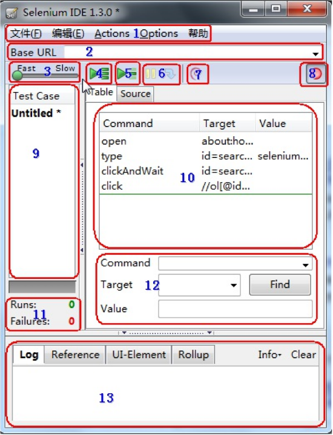

# 一、自动化测试概述

## 1. 自动化测试的意义

1. 解决-回归测试：项目在发新版本之后对项目之前的功能进行验证
2. 解决-压力测试：可以理解多用户同时去操作软件，统计软件服务器处理多用户请求的能力
3. 解决-兼容性测试：不同浏览器（IE、Firefox、Chrome）等等
4. 提高测试效率，保证产品质量

## 2. 自动化测试分类

1. Web-(UI)自动化测试
2. 接口-自动化测试
3. 移动(app)-自动化测试
4. 单元测试-自动化测试

# 二、Web自动化测试

## 1. 什么Web项目适合做自动化测试？

1. 需求变动不频繁
2. 项目周期长
3. 项目需要回归测试

## 2. 如何进行Web自动化测试？(主流测试-工具)

1. QTP（收费）：QTP是商业的功能测试工具，收费，支持web，桌面自动化测试
2. Selenium（开源）：Selenium是开源的web自动测试工具，免费，主要做功能测试
3. Jmeter（开源、Web、接口、性能）：Jmeter是由Apache公司使用Java平台开发的一款测试工具，支持（Web、接口测试、性能测试）；Web测试在通信层(无UI界面)
4. Loadrunner（收费、Web、性能）：Loadrunner是商业性能测试工具，收费，功能强大，适合做复杂场景的性能测试
5. Robot framework
    Robot Framework：一个基于Python可扩展地（关键字驱动）的测试自动化框架

### 2.1. 主流工具-汇结

- Web自动化测试：selenium、robot framework
- App端自动化测试：Appium、Monkeyrunner、UIautomation
- PC客户端（win32）自动化测试：QTP
- 接口自动化测试：Jmeter、Postman、httpUnit、RESTClient
- 云测平台：Testin Testbird
- 性能测试：Jmeter、LoadRunner

## 3. Selenium特点

1. 开源软件：源代码开放可以根据需要来增加工具的某些功能
2. 跨平台：linux 、windows 、mac
3. 核心功能：就是可以在多个浏览器上进行自动化测试
4. 多语言：Java、Python、C#、JavaScript、Ruby等
5. 成熟稳定：目前已经被google , 百度，腾讯等公司广泛使用
6. 功能强大：能够实现类似商业工具的大部分功能，因为开源性，可实现定制化功能

## 4. Selenium IDE安装与运行

### 4.1. Selenium IDE 是什么？

是一个Firefox插件，用于记录和播放用户与浏览器的交互（录制Web操作脚本）

### 4.2. 安装方式

1. 官网安装插件：https://addons.mozilla.org/en-GB/firefox/addon/selenium-ide/versions/
2. 附加组件管理器：搜索selenium IDE
  - 提示：IDE前面有个空格
  - 附加组件管理器启动方式：工具菜单->附加组件或者Ctrl+Shift+A
3. 离线安装
  - 下载：https://github.com/SeleniumHQ/selenium-ide/releases
  - 下载后直接拖入浏览器安装

### 4.3. Selenium IDE运行

1. Ctrl+Alt+S
2. 工具栏—>Selenium IDE

### 4.4. Selenium IDE界面



1. 文件：创建、打开和保存测试案例和测试案例集

     编辑：复制、粘贴、删除、撤销和选择测试案例中的所有命令

     Options : 用于设置seleniunm IDE

2. 用来填写被测网站的地址

3. 速度控制：控制案例的运行速度

4. 运行所有：运行一个测试案例集中的所有案例

5. 运行：运行当前选定的测试案例

6. 暂停/恢复：暂停和恢复测试案例执行

7. 单步：可以运行一个案例中的一行命令

8. 录制：点击之后，开始记录你对浏览器的操作

9. 案例集列表

10. 测试脚本：

     - table标签：用表格形式展现命令及参数
     - source标签：用原始方式展现，默认是HTML语言格式，
       也可以用其他语言展示

11. 查看脚本运行通过/失败的个数

12. 当选中前命令对应参数

13. 日志/参考/UI元素/Rollup

### 4.5. 脚本转换成其他语言

文件菜单->Export Test Cast As..->python2/unittest/WebDriver

### 4.6. 脚本编辑与操作

1. 编辑一行命令：在Table标签下选中某一行命令，命令由command、Target、value三部分组成，可以对这三部分内容那进行编辑
2. 插入命令：在某一条命令上右击，选择“insert new command”命令，就可以插入一个空白，然后对空白行进程编辑
3. 插入注释：鼠标右击选择“insert new comment”命令插入注解空白行，本行内容不被执行，可以帮助我们更好的理解脚本，插入的内容以紫色字体显示
4. 移动命令：有时我们需要移动某行命令的顺序，我们只需要左击鼠标拖动到相应的位置即可
5. 删除命令：选择单个或多个命令，然后点击鼠标右键选择“Delete”
6. 命令执行：选定要执行的命令点击单个执行按钮即可，注意：有一些命令必须依赖于前面命令的运行结果才能成功执行，否则会导致执行失败

### 4.7. Selenium IDE常用命令

1. open(url)
   - 作用：打开指定的URL，URL可以为相对或是绝对URL
   - Target：要打开的URL；value值为空
     - 当Target为空，将打开Base URL中填写的页面
     - 当Target不为空且值为相对路径，将打开Base URL + Target页面
     - 当Target以http://开头时，将忽略Base URL，直接打开Target的网址
2. pause(waitTime)
   - 作用：暂停脚本运行
   - waitTime：等待时间，单位为ms
3. goBack()
   - 作用：模拟单击浏览器的后退按钮
   - 提示：由于没有参数，所以Target和Value可不填
4. refresh()
   - 作用：刷新当前页
   - 提示：由于没有参数，所以Target和Value可不填
5. click(locator)
   - 作用：单击一个链接、按钮、复选框或单选按钮
   - 提示：如果该单击事件导致新的页面加载，命令将会加上后缀“AndWait”，即“clickAnd Wait”，或“waitForPageToLoad”命令
6. type(locator,value)
   - 作用：向指定输入域中输入指定值；也可为下拉框、复选框和单选框按钮赋值
   - Target：元素的定位表达式
   - Value：要输入的值
7. close()
   - 作用：模拟用户单击窗口上的关闭按钮
   - 提示：由于没有参数，所以Target和Value可不填

## 5. WebDriver

###  5.1. 什么是WebDriver?

1. Webdriver (Selenium2）是一种用于Web应用程序的自动测试工具
2. 它提供了一套友好的API
3. Webdriver完全就是一套类库，不依赖于任何测试框架，除了必要的浏览器驱动

### 5.2. WebDriverAPI支持的浏览器

1. Firefox（FirefoxDriver）
2. IE（InternetExplorerDriver）
3. Opera（OperaDriver）
4. Chrome （ChromeDriver）
5. safari（SafariDriver）
6. HtmlUnit (HtmlUnit Driver)

### 5.3. WebDriverAPI支持的开发语言

1. Java
2. Python
3. PHP
4. JavaScript
5. Perl
6. Ruby
7. C#

### 5.4. 环境搭建

1. selenium安装
2. 火狐浏览器、谷歌浏览器
     
3. 浏览器的版本和驱动版本要一致！http://www.seleniumhq.org/download/
4. 浏览器驱动下载好后需要添加Path环境便令中

### 5.5. WebDriver-元素定位

#### 5.5.1. WebDriver 元素定位方式

id、name、class_name、tag_name、link_text、partial_link_text、Xpath、Css

定位方式分类-汇总：

1. id、name、class_name：为元素属性定位
2. tag_name：为元素标签名称
3. link_text、partial_link_text：为超链接定位(a标签)
4. Xpath：为元素路径定位
5. Css：为CSS选择器定位

#### 5.5.2. id定位

说明：HTML规定id属性在整个HTML中必须是唯一的，id定位就是通过元素的id属性来定位元素

前提：元素有id属性

id定位方法：find_element_by_id()

id定位实现步骤分析：

1. 导入selenium包--> from selenium import webdriver
2. 导入time包--> from time import sleep
3. 实例化火狐浏览器--> driver=webdriver.Firefox()
4. 打开注册A.html --> driver.get(url)
5. 调用id定位方法--> driver.find_element_by_id("")
6. 使用send_keys()方法发送数据--> .send_keys("admin")
7. 暂停3秒--> sleep(3)
8. 关闭浏览器--> quit()

案例：

```python
from selenium import webdriver
from time import sleep
driver=webdriver.Firefox()
url='E:\\测试\\课件\\Web自动化\\Web自动化课件\\02img\\注册A.html'
driver.get(url)
user=driver.find_element_by_id("userA")
user.send_keys("admin")
pwd=driver.find_element_by_id("passwordA")
pwd.send_keys("123456")
sleep(3)
driver.quit()
```
#### 5.5.3. name定位

说明：HTML规定name属性来指定元素名称，因此它的作用更像人名，name的属性值在当前文档中可以不是唯
一的，name定位就是根据元素name属性来定位

前提：元素有name属性

name定位方法：find_element_by_name()

name定位实现步骤分析：参考id定位

#### 5.5.4. class_name定位

说明：HTML规定了class来指定元素的类名，用法和name、id类似

前提：元素有class属性

class_name定位方法：find_element_by_class_name()

class_name定位实现步骤分析：参考id定位

#### 5.5.5. tag_name定位

说明：HTML本质就是由不同的tag(标签)组成，而每个tag都是指同一类，所以tag定位效率低，
一般不建议使用；tag_name定位就是通过标签名来定位

tag_name定位方法：find_element_by_tag_name()，返回：符合条件的第一个标签

tag_name定位实现步骤分析：参考id定位

#### 5.5.6. link_text定位

说明：link_text定位与前面4个定位有所不同，它专门用来定位超链接文本

link_text定位方法：find_element_by_link_text()

- 说明：需要传入a标签全部文本

link_text 步骤分析：参考id定位；点击--> click()

#### 5.5.7. partial_link_text定位

说明：partial_link_text定位是对link_text定位的补充，partial_like_text为模糊匹配；link_text全部匹配

partial_link_text定位方法：find_element_by_partial_link_text()

- 说明：需要传入a标签局部文本-能表达唯一性

partial_link_text 步骤分析：参考link_text定位

#### 5.5.8. find_element[s]_by_XXX()

作用：

1. 查找定位所有符合条件的元素
2. 返回的定位元素格式为数组(列表)格式

说明：列表数据格式的读取需要指定下标(下标从0开始)

操作说明：使用tag_name获取第二个元素(密码框)
代码：

```python
driver.find_elements_by_tag_name("input")[1].send_keys("123456")
```

