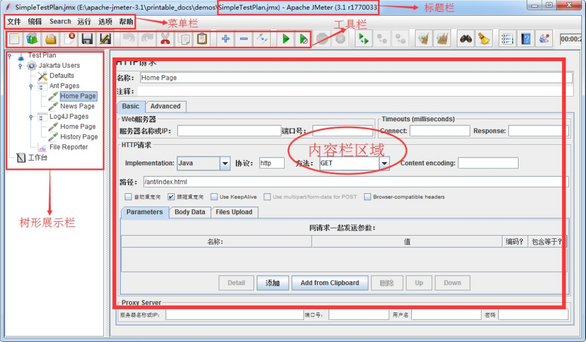
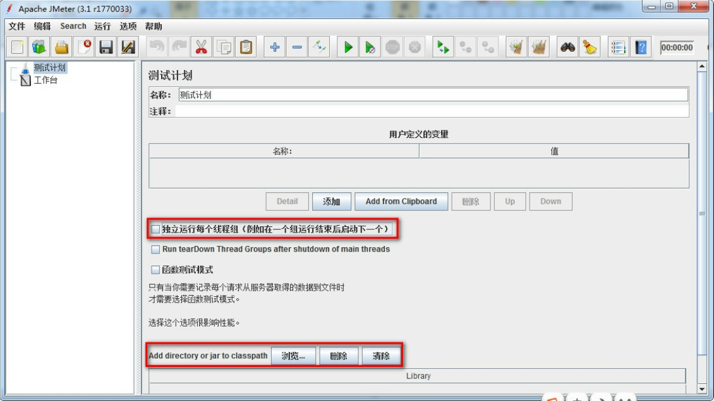
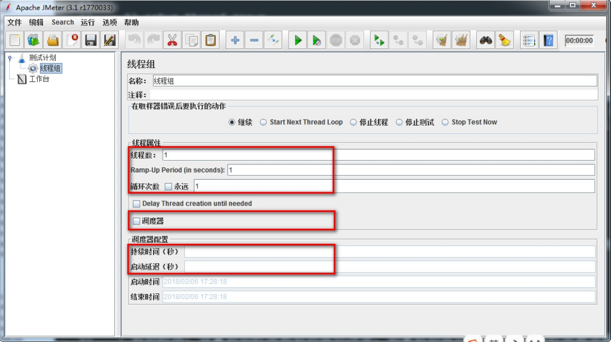
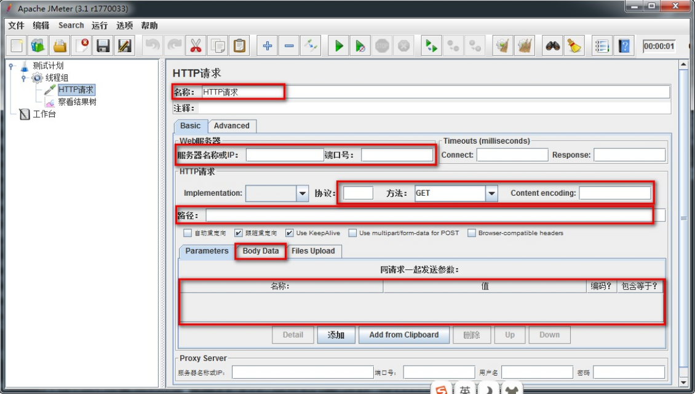
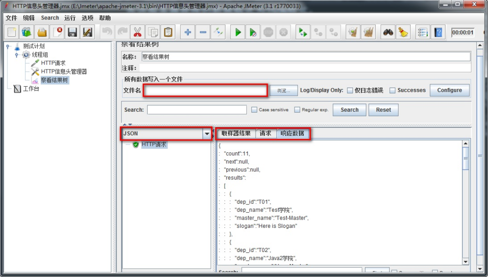
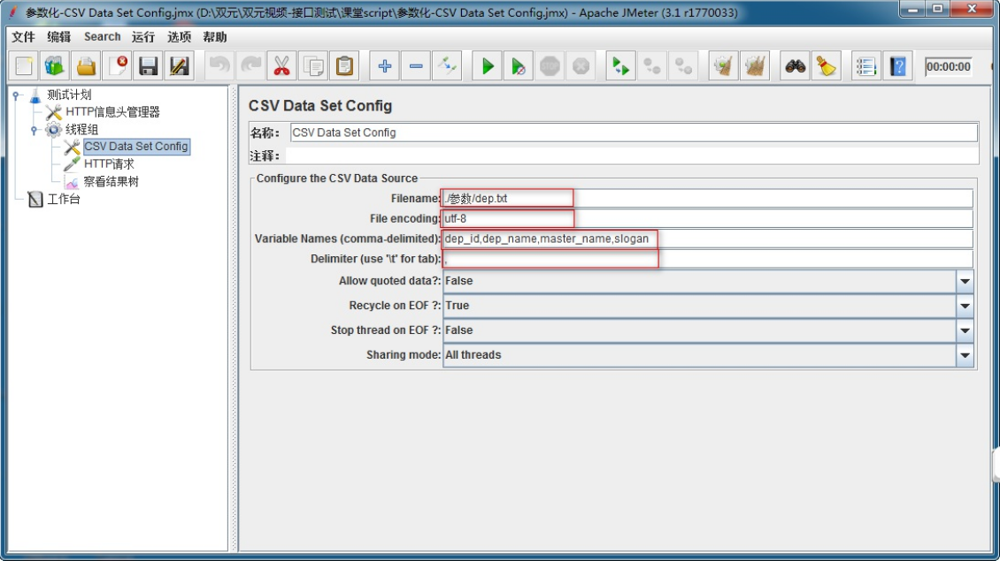
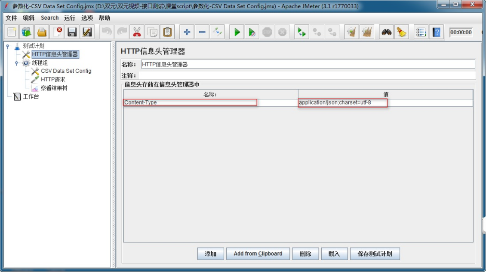

# 一、接口测试概述

## 1. 接口测试分类

1. Web接口测试
   - 服务器接口测试：浏览器与服务器的接口
   - 外部接口测试：第三方接口
2. 模块接口测试

## 2. 常用的接口测试工具

1. Postman
2. RESTClient

## 3. 接口架构RESTful

RESTful架构是一种接口设计架构风格，而不是标准，只是提供了一组设计原则

- http://服务器地址:端口号[/项目名称/版本]/资源集合[/单个资源]

- HTTP请求方法：GET（SELECT）、POST（CREATE）、PUT（UPDATE）、DELETE（DELETE）
- 响应状态
  - 201
    CREATED
    [POST/PUT/PATCH] 用户新建或修改数据成功
  - 202 Accepted [\*]
    表示一个请求已经进入后台排队（异步任务）
  - 204 NO
    CONTENT
    [DELETE] 用户删除数据成功
  - 400 INVALID
    REQUEST
    [POST/PUT/PATCH]
    用户发出的请求有错误，服务器没有进行新建或修改数据的操作，该操作是幂等的
  - 401
    Unauthorized
    [\*]
    表示用户没有权限（令牌、用户名、密
    码错误）
  - 403
    Forbidden
    [\*]
    表示用户得到授权（与401错误相对），
    但是访问是被禁止的
  - 404 NOT
    FOUND
    [\*]
    用户发出的请求针对的是不存在的记
    录，服务器没有进行操作，该操作是幂等的
  - 406 Not
    Acceptable
    [GET]
    用户请求的格式不可得（比如用户请求
    JSON格式，但是只有XML格式
  - 410 Gone [GET]
    用户请求的资源被永久删除，且不会再得到的
  - 422
    Unprocesable
    entity
    [POST/PUT/PATCH] 当创建一个对象时，发生一个验证错误
  - 500
    INTERNAL
    SERVER
    ERROR
    [\*]
    服务器发生错误，用户将无法判断发出的请求是否成功
- 对结果进行判断
  - GET collection：代码：200；数据：返回资源对象的列表（数组）
  - GET collection/resource：代码：200；数据：返回单个资源对象
  - POST collection：代码：200/201；数据：返回新生成的资源对象
  - PUT collection/resource：代码：200/201；数据：返回完整的资源对象
  - DELETE collection/resource：代码：204；数据：返回为空

# 二、Jmeter

## 1. 工具功能界面布局

- 独立运行每个线程组：
  线程组（多线程）的执行顺序是并行的。
  勾选：让本次测试计划中所有线程组保持从上到下顺序执行
- Add directory or jar to classpath：
  加载第三方jar包；比如：测试数据库时使用，加载数据库驱动jar包

- 线程属性
  - 线程数：虚拟用户数
  - Ramp-Up Period(in serconds)：启动虚拟全部用户数所需要的时间
  - 循环次数：指定次数或勾线永远
  - 调度器：勾选后，调度器配置才能使用
- 调度器配置
  - 持续时间（秒）：设置脚本压测持续时间
  - 启动延迟（秒）：启动延迟时间
- setup thread group：一种特殊线程组，测试计划运行之前首先执行，一般做初始化操作
- teardown thread group：一种特殊线程组，测试计划运行结束时运行，一般做收尾工作
- thread group(线程组) ：线程组，我们测试计划中场景创建和实现都是基于此线程组

1. 名称：本属性用于标识一个取样器，建议使用一个有意义的名称
2. 服务器名称或IP：HTTP请求发送的目标服务器名称或IP地址
3. 端口号：目标服务器的端口号，默认值为80 
4. 协议：向目标服务器发送HTTP请求时的协议,可以是http或者是https ,默认值为http 
5. 方法：发送HTTP请求的方法，可用方法包括GET、POST、PUT、DELETE
6. Content encoding：内容的编码方式，默认值为iso8859；一般设置【UTF-8】
7. 路径：目标URL路径（不包括服务器地址和端口）
8. 同请求一起发送参数：请求时需要传递参数
9. Body Data【注意】：新增和更新时传入报文也需要设置Content-Type:application/json
  告诉服务器我传的数据格式为JSON格式

1. 文件名：存放服务器响应后的状态信息；如：e:\查询所有response.txt
2. 取样结果：服务器响应的信息头信息；比如：响应代码，响应数据大小
3. 请求：查看向服务器请求时的信息；比如：请求地址、方法、数据等
4. 响应数据：查看服务器响应的数据；比如：获取资源时，返回的JSON

## 2. Jmeter各元件中需要掌握元件

1. 配置元件（config Element）
  - CSV Data Set Config
  - HTTP请求默认值
  - HTTP信息头管理器
2. 前置处理器（Per Processors）
  - 用户参数
3. 定时器（Timer）
  - Synchronizing Timer
4. 取样器（sample）
  - HTTP请求
  - JDBC Request
  - Debug Sampler
5. 后置处理器（Post Processors）
  - 正则表达式提取器
  - XPath Extractor
6. 断言（Assertions）
  - 响应断言
7. 监听器（Listener）
  - 察看结果树
  - 聚合报告
  - 断言结果
8. 逻辑控制器
  - 如果（If）控制器
  - ForEach控制器
  - 循环控制器

## 3. Jmeter参数化

概念：根据需求动态获取数据并进行赋值的过程

在Jmeter中参数化常用方式：

- CSV Data Set Config
- 用户参数
- 用户定义的变量
- 函数

### 3.1. CSV Data Set Config（数据集配置）

- 实施方案分析
  1. 基于测试计划->线程组
  2. 基于线程组->配置元件->CSV Data Set Config
  3. 基于线程组->Sampler->HTTP请求
  4. 基于测试计划->HTTP信息头管理器
  5. 基于测试计划->监听器->察看结果树

- 组件要点分析
  1. 线程组:循环次数10
  2. CSV Data Set Config 读取变量配置
  3. HTTP请求：Body Data填写(JSON报文) 方法(POST)
  4. 参数化引用格式：${参数名} 如：${dep_id}
  5. HTTP信息头管理器：Content-Type:application/json;charset=utf-8

1. Filename:文件路径+文件名+后缀名如：d:/a.txt;
2. File Encoding:文件编译字符编码，一般设置utf-8;
3. Vaiable Names:读取参数后保存的变量名称;
4. Delimiter:如文件中使用的是逗号分隔，则填写逗号；如使用的是TAB，则填写\t;

1. Content-Type:指定请求信息格式-类型名称
2. application/json:指定请求信息为-JSON格式
3. charset=utf-8:字符编码